# 链表
## 线性表和单链表对比
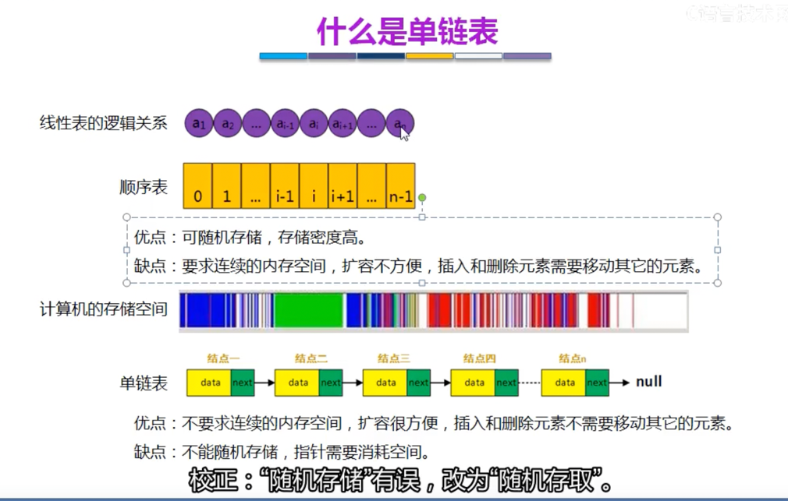

## 单链表分类
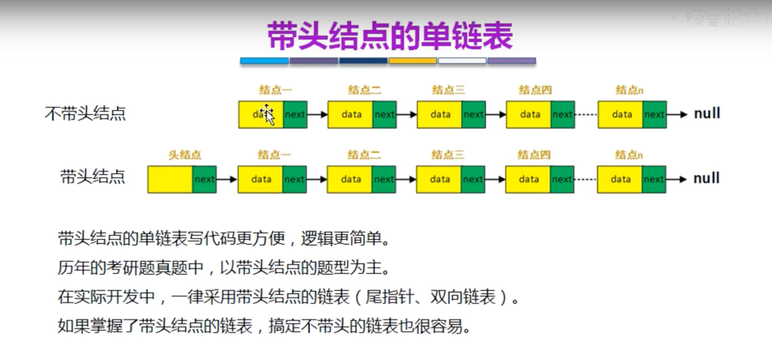
- 带头节点
- 不带头节点

## 单链表代码
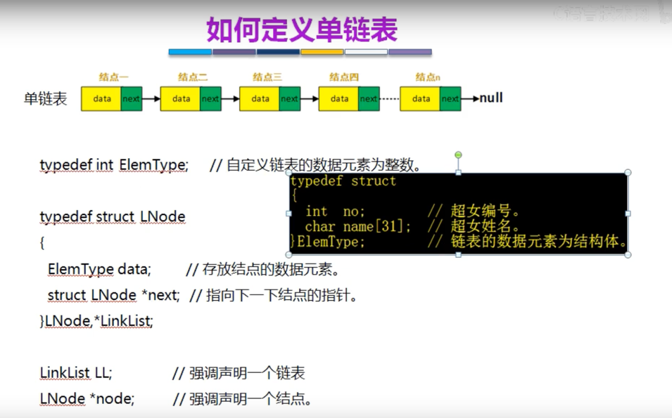
这边别名注释：
LNode为结构体，LinkList是结构体指针

- LinkList LL ; 强调声明一个链表
- LNode *node ; 强调声明一个结点

### 创建和销毁
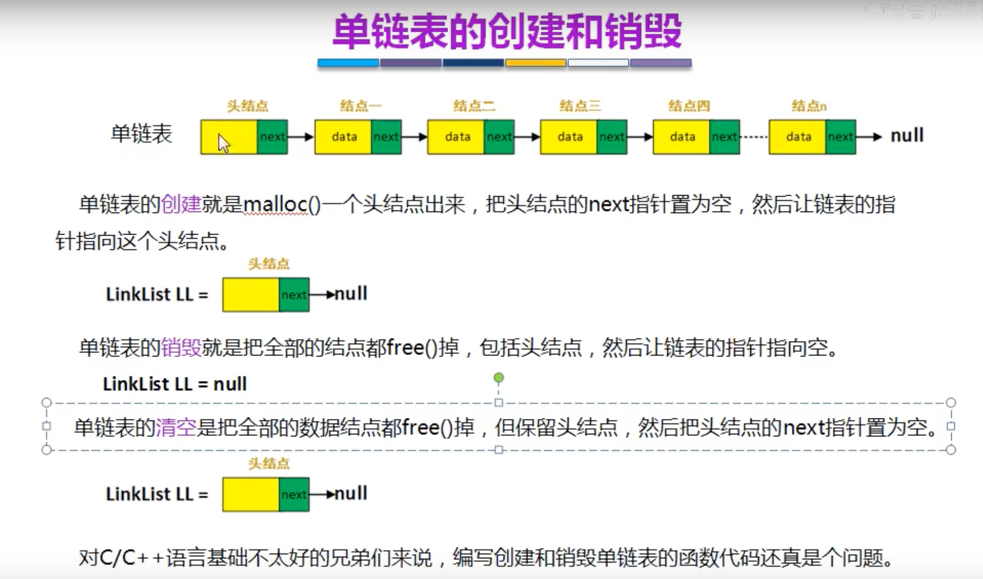

### 单链表的插入与删除(按位序---下标索引)
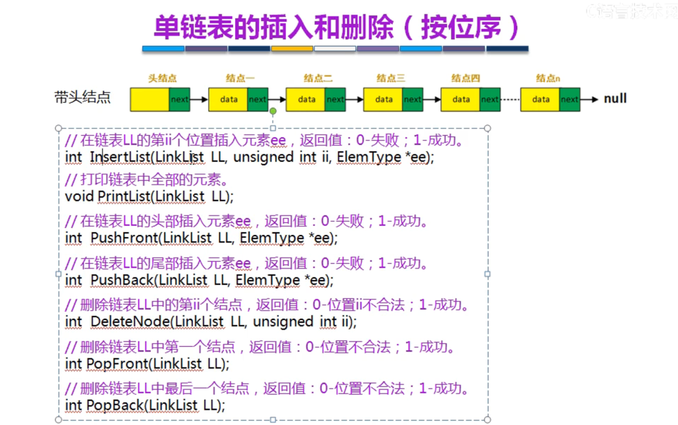

#### 插入
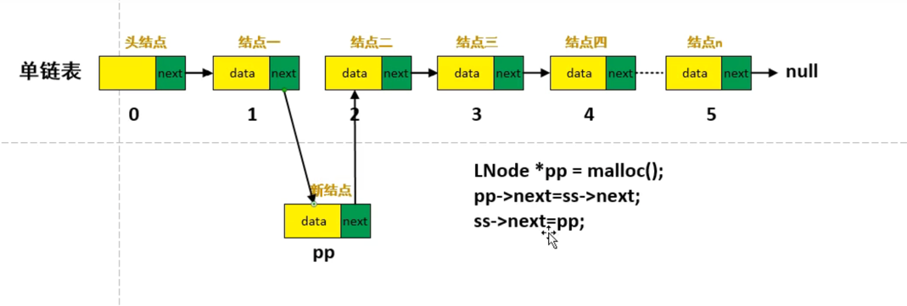
Note: 写法顺序不能反

#### 删除
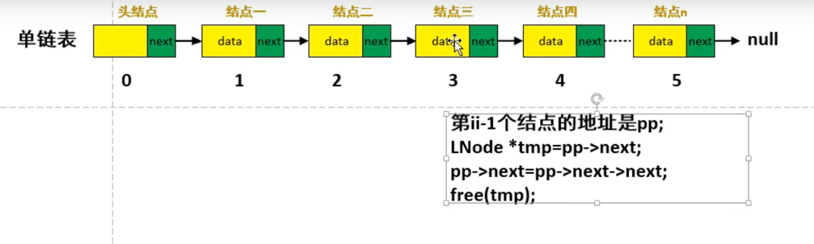

### 查找
- 按位序
- 按元素

### 单链表的插入与删除(按结点)
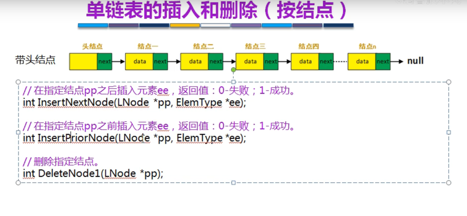

## 单链表的排序
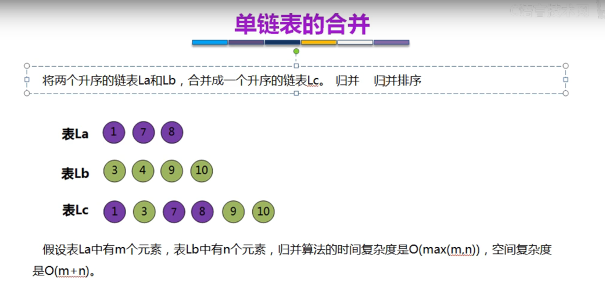

## 单链表的反转
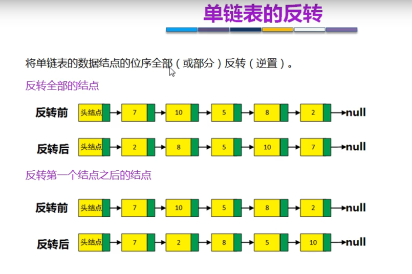
- 反转部分
- 反转全部

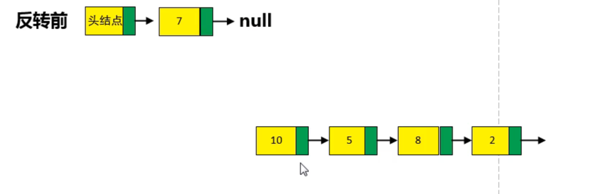
方式一：原地反转链表流程
1. 取出所有数据
2. 然后一个一个插数据

方式二：新空间反转链表流程
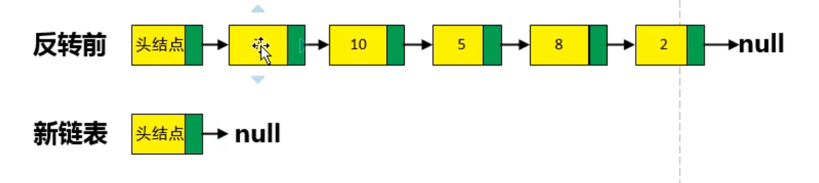

## 双链表
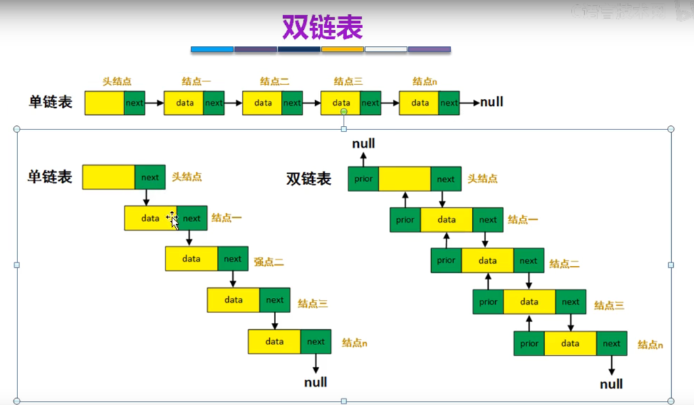

## 循环单链表
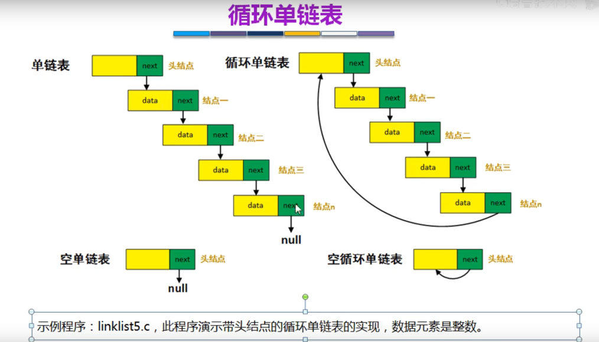

## 循环双链表
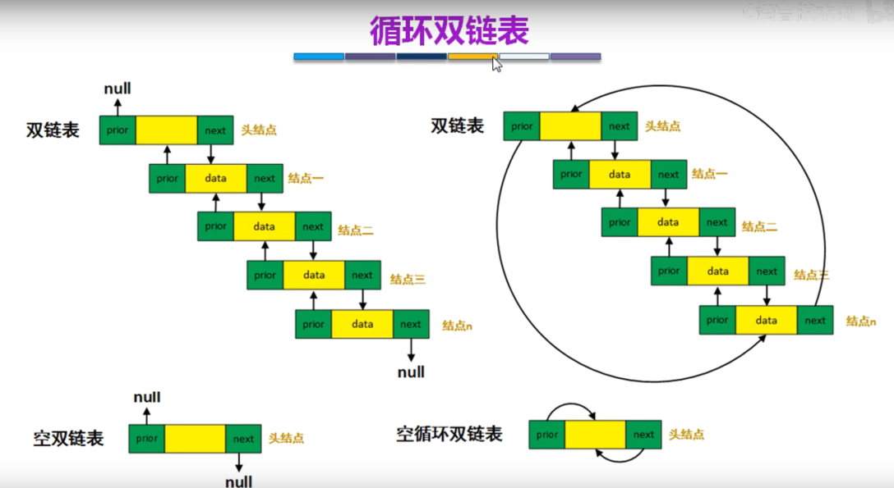