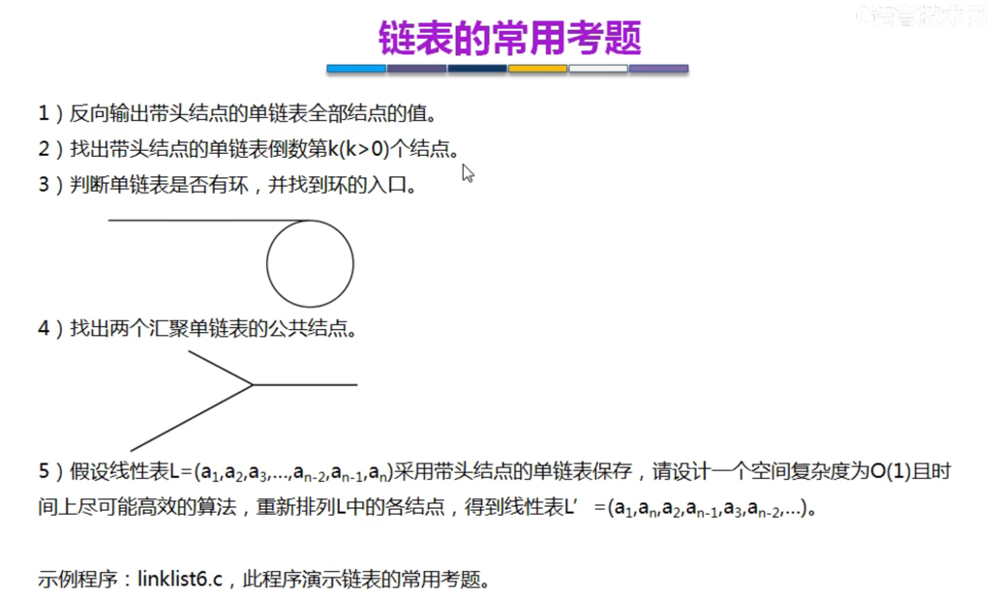
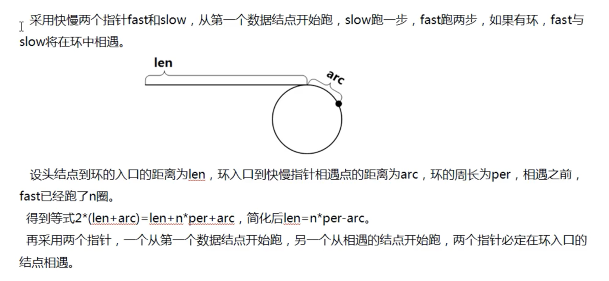

<!-- START doctoc generated TOC please keep comment here to allow auto update -->
<!-- DON'T EDIT THIS SECTION, INSTEAD RE-RUN doctoc TO UPDATE -->
**Table of Contents**  *generated with [DocToc](https://github.com/thlorenz/doctoc)*

- [链表常见考题](#%E9%93%BE%E8%A1%A8%E5%B8%B8%E8%A7%81%E8%80%83%E9%A2%98)
  - [代码参考](#%E4%BB%A3%E7%A0%81%E5%8F%82%E8%80%83)

<!-- END doctoc generated TOC please keep comment here to allow auto update -->

# 链表常见考题

1. 反向输出带头节点的单链表全部节点的值(递归)

2. 两个指针一起跑

3. 找环
   

## [代码参考](03_dataStructure/02_link_list/linklist6.c)
