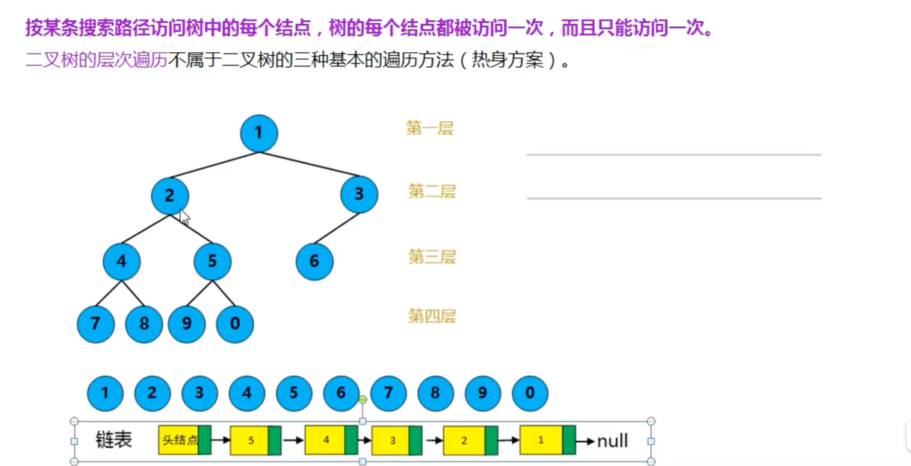
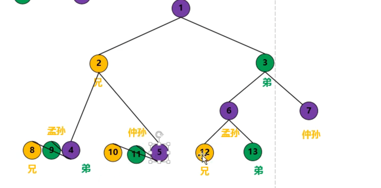
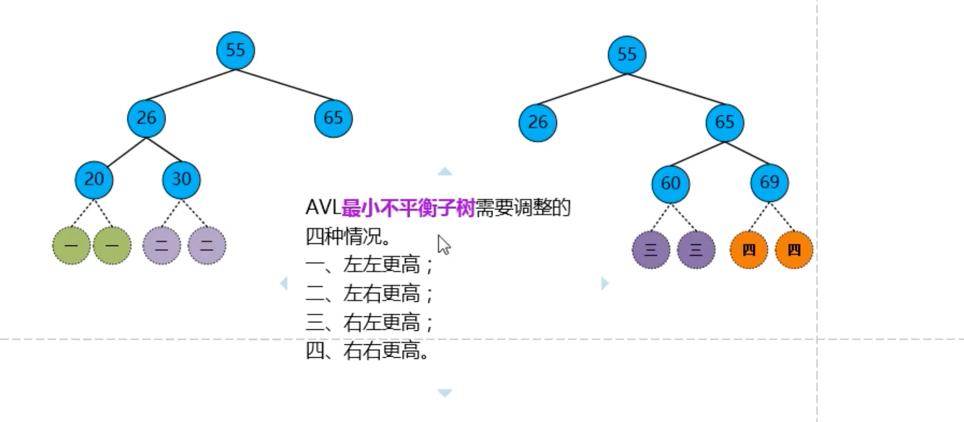
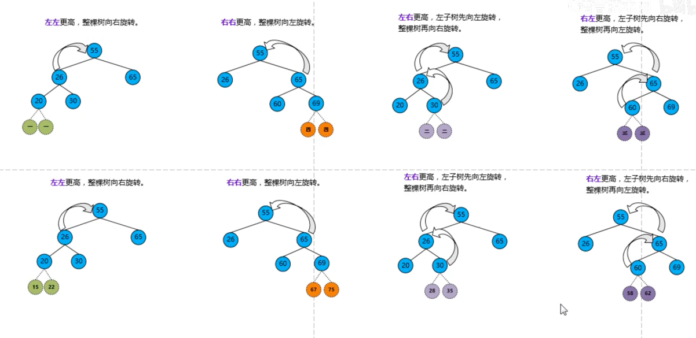
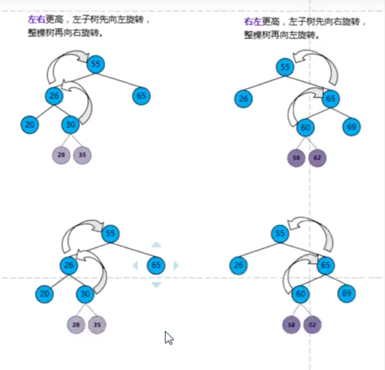

# 树

## 基本术语

## 树的性质

## binary_tree二叉树

### 性质

## 二叉树和度为2的树的区别

### 满二叉树

### 完全二叉树

### 二叉排序树

## 二叉树的存储结构

### 完全二叉树的顺序存储

用顺序存储的方法普通二叉树容易造成空间的浪费

### 二叉树的链式存储

## 二叉树的遍历

### 层次遍历

借助队列，出队时，帮左右子元素入队。

#### 过程

1. 使用辅助队列，根节点1入队
   

2. 来个循环，出个节点1，把他的所有子节点2，3，4入队
   

3. 同理，出队2，把2的子节点5，6入队，直到队列为空
   

### 三种遍历方式

1. 先序遍历
   
   
   

2. 中序遍历
   
   

3. 后序遍历
   
   

#### 遍历方式代码实现

递归方案实现先序遍历

递归方案实现中序遍历

递归方案实现后序遍历

栈的方式实现中序遍历

## 二叉树的遍历

由遍历序列构造二叉树

先序+中序遍历 构造二叉树

层次+中序遍历

## 线索二叉树

线索二叉树，可以理解是用了二叉树中的空指针。

二叉树线索化

### 线索二叉树数据结构

### 线索二叉树求前继和后继

#### 先序线索二叉树求后继

#### 中序线索二叉树求前继和后继

## 树的存储结构

### 1. 孩子兄弟表示法----主要

### 2. 双亲表示法

### 3. 孩子表示法

## 二叉排序（搜索）树(binary sort tree)

中序遍历---升序

### 查找,插入,创建,删除

二叉排序树的节点删除

### 二叉排序树的查找效率分析

查找成功 的平均查找长度（ASL average search length）

查找失败 的平均查找长度（ASL average search length）

## 平衡二叉树 ---代码实现过于复杂

### 插入和删除 数据后不平衡

调整方式：调整最小不平衡子树，如70是最小的

从最小不平衡子树出发   

1. 左左更高
   
   向右旋转，然后30放在右侧左子树
   
   

2. 左右更高
   
   
   向左旋转, 向右旋转
   
   
   
   

总结：  

### 树高和节点关系

### 哈夫曼huffman树（最优二叉树）

在通信上广泛应用

把经常访问放在跟根结点最近的地方

二进制表示:书写简单，不容易泄密

1. 浪费空间
2. 人物长度固定

1. 长度不固定
2. 长度短

#### huffman概念

#### 构造huffman树

#### huffman编码

## B树

### 多叉排序树

n个关键字--分为n+1个区间，注意线画在关键字中间

### 5阶B树特性

### 5阶B树插入和删除

#### 插入

#### 删除

1. 删除69
   

2. 删除50,向左向右都可以借，但是不是直接借，需要通过父节点中转
   
   

3. 删除28
   
   
   
   
   

4. 删除70
   
   

## B+树----B树变形树

1. 查找:可以从根节点通过分块查找，也可以通过叶节点采用顺序查找
2. 索引是是子树最大值,线连在子树中间

关键字和记录是分开的

数据比较多，增加索引表

### b+树考题

## B树 V B+树

