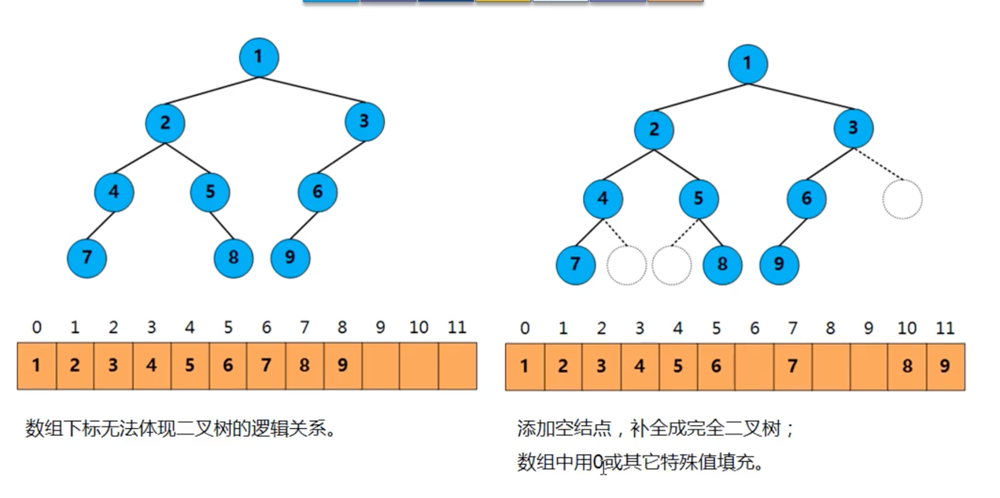
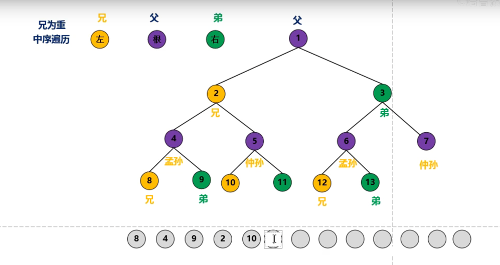
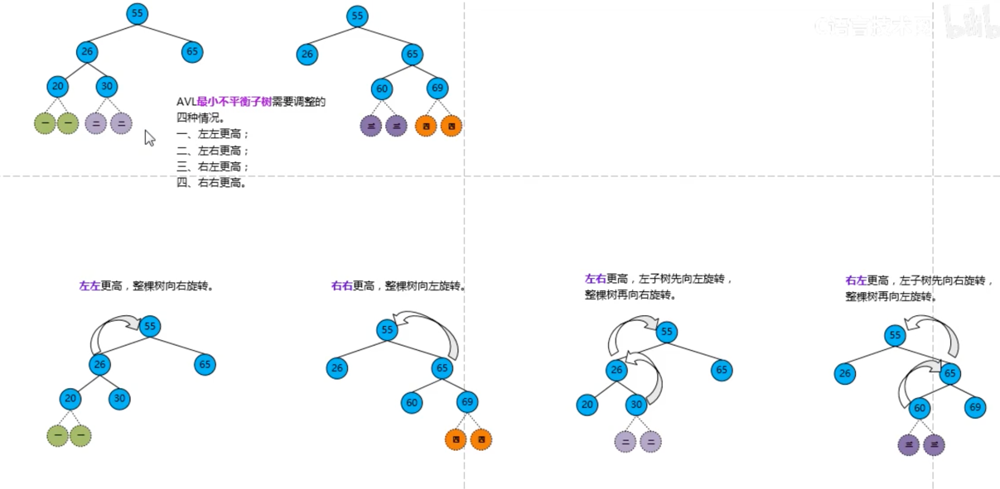
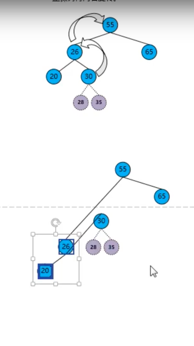
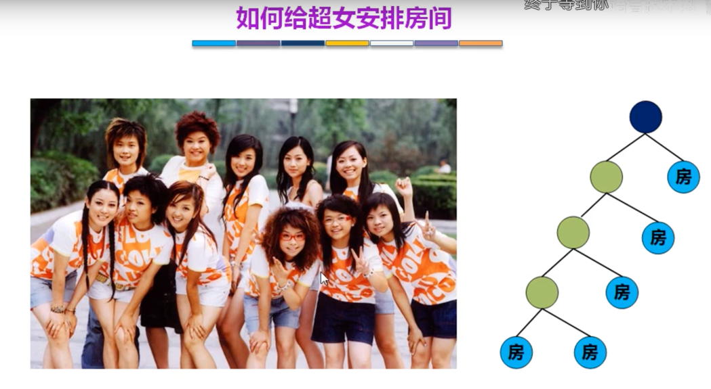
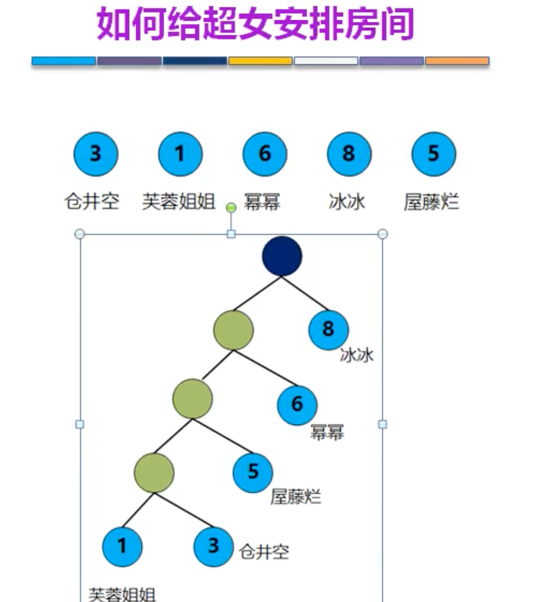

<!-- START doctoc generated TOC please keep comment here to allow auto update -->
<!-- DON'T EDIT THIS SECTION, INSTEAD RE-RUN doctoc TO UPDATE -->
**Table of Contents**  *generated with [DocToc](https://github.com/thlorenz/doctoc)*

- [树](#%E6%A0%91)
  - [基本术语](#%E5%9F%BA%E6%9C%AC%E6%9C%AF%E8%AF%AD)
  - [树的性质](#%E6%A0%91%E7%9A%84%E6%80%A7%E8%B4%A8)
  - [binary_tree二叉树](#binary_tree%E4%BA%8C%E5%8F%89%E6%A0%91)
    - [性质](#%E6%80%A7%E8%B4%A8)
  - [二叉树和度为2的树的区别](#%E4%BA%8C%E5%8F%89%E6%A0%91%E5%92%8C%E5%BA%A6%E4%B8%BA2%E7%9A%84%E6%A0%91%E7%9A%84%E5%8C%BA%E5%88%AB)
    - [满二叉树](#%E6%BB%A1%E4%BA%8C%E5%8F%89%E6%A0%91)
    - [完全二叉树](#%E5%AE%8C%E5%85%A8%E4%BA%8C%E5%8F%89%E6%A0%91)
    - [二叉排序树](#%E4%BA%8C%E5%8F%89%E6%8E%92%E5%BA%8F%E6%A0%91)
  - [二叉树的存储结构](#%E4%BA%8C%E5%8F%89%E6%A0%91%E7%9A%84%E5%AD%98%E5%82%A8%E7%BB%93%E6%9E%84)
    - [完全二叉树的顺序存储](#%E5%AE%8C%E5%85%A8%E4%BA%8C%E5%8F%89%E6%A0%91%E7%9A%84%E9%A1%BA%E5%BA%8F%E5%AD%98%E5%82%A8)
    - [二叉树的链式存储](#%E4%BA%8C%E5%8F%89%E6%A0%91%E7%9A%84%E9%93%BE%E5%BC%8F%E5%AD%98%E5%82%A8)
  - [二叉树的遍历](#%E4%BA%8C%E5%8F%89%E6%A0%91%E7%9A%84%E9%81%8D%E5%8E%86)
    - [层次遍历](#%E5%B1%82%E6%AC%A1%E9%81%8D%E5%8E%86)
      - [过程](#%E8%BF%87%E7%A8%8B)
    - [三种遍历方式](#%E4%B8%89%E7%A7%8D%E9%81%8D%E5%8E%86%E6%96%B9%E5%BC%8F)
      - [遍历方式代码实现](#%E9%81%8D%E5%8E%86%E6%96%B9%E5%BC%8F%E4%BB%A3%E7%A0%81%E5%AE%9E%E7%8E%B0)
  - [二叉树的遍历](#%E4%BA%8C%E5%8F%89%E6%A0%91%E7%9A%84%E9%81%8D%E5%8E%86-1)
  - [线索二叉树](#%E7%BA%BF%E7%B4%A2%E4%BA%8C%E5%8F%89%E6%A0%91)
    - [线索二叉树数据结构](#%E7%BA%BF%E7%B4%A2%E4%BA%8C%E5%8F%89%E6%A0%91%E6%95%B0%E6%8D%AE%E7%BB%93%E6%9E%84)
    - [线索二叉树求前继和后继](#%E7%BA%BF%E7%B4%A2%E4%BA%8C%E5%8F%89%E6%A0%91%E6%B1%82%E5%89%8D%E7%BB%A7%E5%92%8C%E5%90%8E%E7%BB%A7)
      - [先序线索二叉树求后继](#%E5%85%88%E5%BA%8F%E7%BA%BF%E7%B4%A2%E4%BA%8C%E5%8F%89%E6%A0%91%E6%B1%82%E5%90%8E%E7%BB%A7)
      - [中序线索二叉树求前继和后继](#%E4%B8%AD%E5%BA%8F%E7%BA%BF%E7%B4%A2%E4%BA%8C%E5%8F%89%E6%A0%91%E6%B1%82%E5%89%8D%E7%BB%A7%E5%92%8C%E5%90%8E%E7%BB%A7)
  - [树的存储结构](#%E6%A0%91%E7%9A%84%E5%AD%98%E5%82%A8%E7%BB%93%E6%9E%84)
    - [1. 孩子兄弟表示法----主要](#1-%E5%AD%A9%E5%AD%90%E5%85%84%E5%BC%9F%E8%A1%A8%E7%A4%BA%E6%B3%95----%E4%B8%BB%E8%A6%81)
    - [2. 双亲表示法](#2-%E5%8F%8C%E4%BA%B2%E8%A1%A8%E7%A4%BA%E6%B3%95)
    - [3. 孩子表示法](#3-%E5%AD%A9%E5%AD%90%E8%A1%A8%E7%A4%BA%E6%B3%95)
  - [二叉排序（搜索）树(binary sort tree)](#%E4%BA%8C%E5%8F%89%E6%8E%92%E5%BA%8F%E6%90%9C%E7%B4%A2%E6%A0%91binary-sort-tree)
    - [查找,插入,创建,删除](#%E6%9F%A5%E6%89%BE%E6%8F%92%E5%85%A5%E5%88%9B%E5%BB%BA%E5%88%A0%E9%99%A4)
    - [二叉排序树的查找效率分析](#%E4%BA%8C%E5%8F%89%E6%8E%92%E5%BA%8F%E6%A0%91%E7%9A%84%E6%9F%A5%E6%89%BE%E6%95%88%E7%8E%87%E5%88%86%E6%9E%90)
  - [平衡二叉树 ---代码实现过于复杂](#%E5%B9%B3%E8%A1%A1%E4%BA%8C%E5%8F%89%E6%A0%91----%E4%BB%A3%E7%A0%81%E5%AE%9E%E7%8E%B0%E8%BF%87%E4%BA%8E%E5%A4%8D%E6%9D%82)
    - [插入和删除 数据后不平衡](#%E6%8F%92%E5%85%A5%E5%92%8C%E5%88%A0%E9%99%A4-%E6%95%B0%E6%8D%AE%E5%90%8E%E4%B8%8D%E5%B9%B3%E8%A1%A1)
    - [树高和节点关系](#%E6%A0%91%E9%AB%98%E5%92%8C%E8%8A%82%E7%82%B9%E5%85%B3%E7%B3%BB)
    - [哈夫曼huffman树（最优二叉树）](#%E5%93%88%E5%A4%AB%E6%9B%BChuffman%E6%A0%91%E6%9C%80%E4%BC%98%E4%BA%8C%E5%8F%89%E6%A0%91)
      - [huffman概念](#huffman%E6%A6%82%E5%BF%B5)
      - [构造huffman树](#%E6%9E%84%E9%80%A0huffman%E6%A0%91)
      - [huffman编码](#huffman%E7%BC%96%E7%A0%81)
  - [B树](#b%E6%A0%91)
    - [多叉排序树](#%E5%A4%9A%E5%8F%89%E6%8E%92%E5%BA%8F%E6%A0%91)
    - [5阶B树特性](#5%E9%98%B6b%E6%A0%91%E7%89%B9%E6%80%A7)
    - [5阶B树插入和删除](#5%E9%98%B6b%E6%A0%91%E6%8F%92%E5%85%A5%E5%92%8C%E5%88%A0%E9%99%A4)
      - [插入](#%E6%8F%92%E5%85%A5)
      - [删除](#%E5%88%A0%E9%99%A4)
  - [B+树----B树变形树](#b%E6%A0%91----b%E6%A0%91%E5%8F%98%E5%BD%A2%E6%A0%91)
    - [b+树考题](#b%E6%A0%91%E8%80%83%E9%A2%98)
  - [B树 V B+树](#b%E6%A0%91-v-b%E6%A0%91)

<!-- END doctoc generated TOC please keep comment here to allow auto update -->

# 树

## 基本术语

## 树的性质

## binary_tree二叉树

### 性质

## 二叉树和度为2的树的区别

### 满二叉树

### 完全二叉树

### 二叉排序树

## 二叉树的存储结构

### 完全二叉树的顺序存储

用顺序存储的方法普通二叉树容易造成空间的浪费

### 二叉树的链式存储

## 二叉树的遍历

### 层次遍历

借助队列，出队时，帮左右子元素入队。

#### 过程

1. 使用辅助队列，根节点1入队
   

2. 来个循环，出个节点1，把他的所有子节点2，3，4入队
   

3. 同理，出队2，把2的子节点5，6入队，直到队列为空
   

### 三种遍历方式

1. 先序遍历
   
   
   

2. 中序遍历
   
   

3. 后序遍历
   
   

#### 遍历方式代码实现

递归方案实现先序遍历

递归方案实现中序遍历

递归方案实现后序遍历

栈的方式实现中序遍历

## 二叉树的遍历

由遍历序列构造二叉树

先序+中序遍历 构造二叉树

层次+中序遍历

## 线索二叉树

线索二叉树，可以理解是用了二叉树中的空指针。

二叉树线索化

### 线索二叉树数据结构

### 线索二叉树求前继和后继

#### 先序线索二叉树求后继

#### 中序线索二叉树求前继和后继

## 树的存储结构

### 1. 孩子兄弟表示法----主要

### 2. 双亲表示法

### 3. 孩子表示法

## 二叉排序（搜索）树(binary sort tree)

中序遍历---升序

### 查找,插入,创建,删除

二叉排序树的节点删除

### 二叉排序树的查找效率分析

查找成功 的平均查找长度（ASL average search length）

查找失败 的平均查找长度（ASL average search length）

## 平衡二叉树 ---代码实现过于复杂

### 插入和删除 数据后不平衡

调整方式：调整最小不平衡子树，如70是最小的

从最小不平衡子树出发   

1. 左左更高
   
   向右旋转，然后30放在右侧左子树
   
   

2. 左右更高
   
   
   向左旋转, 向右旋转
   
   
   
   

总结：  

### 树高和节点关系

### 哈夫曼huffman树（最优二叉树）

在通信上广泛应用

把经常访问放在跟根结点最近的地方

二进制表示:书写简单，不容易泄密

1. 浪费空间
2. 人物长度固定

1. 长度不固定
2. 长度短

#### huffman概念

#### 构造huffman树

#### huffman编码

## B树
B树的基本思想是保证每个节点至少填满一半的关键字，以达到较好的性能。其优点是对于大规模数据的插入和删除操作，它仍然能够保持较好的性能，但缺点是每个节点都需要存储一定数量的指针，导致存储空间的浪费。

### 多叉排序树

n个关键字--分为n+1个区间，注意线画在关键字中间

### 5阶B树特性

### 5阶B树插入和删除

#### 插入

#### 删除

1. 删除69
   

2. 删除50,向左向右都可以借，但是不是直接借，需要通过父节点中转
   
   

3. 删除28
   
   
   
   
   

4. 删除70
   
   

## B+树----B树变形树

B+树在B树的基础上进行了改进，将所有的关键字都存储在叶子节点中，非叶子节点只存储关键字和指向子节点的指针。
这种设计能够大大减少存储空间的浪费，并且能够通过叶子节点间的链表快速定位到某个范围内的数据。
B+树在磁盘等外部存储设备上的表现比B树更优，因此被广泛应用于数据库和文件系统中

1. 查找:可以从根节点通过分块查找，也可以通过叶节点采用顺序查找
2. 索引是是子树最大值,线连在子树中间

关键字和记录是分开的

数据比较多，增加索引表

### b+树考题

## B树 V B+树

