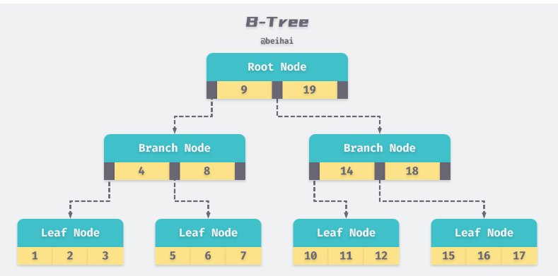

<!-- START doctoc generated TOC please keep comment here to allow auto update -->
<!-- DON'T EDIT THIS SECTION, INSTEAD RE-RUN doctoc TO UPDATE -->
**Table of Contents**  *generated with [DocToc](https://github.com/thlorenz/doctoc)*

- [Google B-Tree 实现- github.com/google/btree](#google-b-tree-%E5%AE%9E%E7%8E%B0--githubcomgooglebtree)
  - [B-tree 在不同著作中度的定义有一定差别](#b-tree-%E5%9C%A8%E4%B8%8D%E5%90%8C%E8%91%97%E4%BD%9C%E4%B8%AD%E5%BA%A6%E7%9A%84%E5%AE%9A%E4%B9%89%E6%9C%89%E4%B8%80%E5%AE%9A%E5%B7%AE%E5%88%AB)
    - [Introduction to Algorithms（《算法导论》）](#introduction-to-algorithms%E7%AE%97%E6%B3%95%E5%AF%BC%E8%AE%BA)
    - [The Art of Computer Programming （《计算机程序设计艺术》）](#the-art-of-computer-programming-%E8%AE%A1%E7%AE%97%E6%9C%BA%E7%A8%8B%E5%BA%8F%E8%AE%BE%E8%AE%A1%E8%89%BA%E6%9C%AF)
    - [清华大学出版社的《数据结构（C语言版）》（2007年版），编著者为严蔚敏，吴伟民](#%E6%B8%85%E5%8D%8E%E5%A4%A7%E5%AD%A6%E5%87%BA%E7%89%88%E7%A4%BE%E7%9A%84%E6%95%B0%E6%8D%AE%E7%BB%93%E6%9E%84c%E8%AF%AD%E8%A8%80%E7%89%882007%E5%B9%B4%E7%89%88%E7%BC%96%E8%91%97%E8%80%85%E4%B8%BA%E4%B8%A5%E8%94%9A%E6%95%8F%E5%90%B4%E4%BC%9F%E6%B0%91)
  - [数据抽象 item](#%E6%95%B0%E6%8D%AE%E6%8A%BD%E8%B1%A1-item)
  - [Strict Weak Ordering](#strict-weak-ordering)
  - [插入数据](#%E6%8F%92%E5%85%A5%E6%95%B0%E6%8D%AE)
  - [参考](#%E5%8F%82%E8%80%83)

<!-- END doctoc generated TOC please keep comment here to allow auto update -->

# Google B-Tree 实现- github.com/google/btree




实现了两个版本go1.18以上的范型版本和go1.18 以下的非范型版本


## B-tree 在不同著作中度的定义有一定差别

差异之一，关于 leaf 的定义并不统一。《计算机程序设计艺术》一书中主张 leaf 是包含数据的最底层结点的下一层，而《算法导论》一书与「论文」则主张最底层包含数据的结点即为 leaf。


差异之二，亦是问题中提到的疑问，关于 B-tree 的 Order，或翻译为「度」的定义并不统一.


从《计算机程序设计艺术》的属性来看，最小的树为3阶btree, 即2-3树（树的非叶子节点子节点个数为2，3），
从《算法导论》的 btree属性定义来看，最小的 树为2度树（4阶），即2-3-4树（树的非叶子节点个数可以为2，3，4）

Google的这个btree包从定义来看，是按照《算法导论》来定义的，即2-3-4树。
### Introduction to Algorithms（《算法导论》）


### The Art of Computer Programming （《计算机程序设计艺术》）


### 清华大学出版社的《数据结构（C语言版）》（2007年版），编著者为严蔚敏，吴伟民

《数据结构（C语言版）》的定义参考了《计算机程序设计艺术》的定义，所以它们可以归为同一个定义。


## 数据抽象 item 
```go
// Item是一个接口类型，含有一个Less方法，通过这个接口可以实现类似泛型的功能。
// items stores items in a node.
type items[T any] []T

// github.com/google/btree@v1.1.2/btree_generic.go
// Item represents a single object in the tree.
type Item interface {
	// Less tests whether the current item is less than the given argument.
	//
	// This must provide a strict weak ordering.
	// If !a.Less(b) && !b.Less(a), we treat this to mean a == b (i.e. we can only
	// hold one of either a or b in the tree).
	Less(than Item) bool
}

```

通过 interface 传值是对数据的一层抽象，进而实现不同数据类型的兼容性，而不是将数据序列化为 byte slice 进行存储。缺点在于每次读取值时需要进行类型断言与转换，


初始化创建一个度为2的树 tree := btree.New(2) ,并初始化一个独立的节点链表,默认长度32
```go

const (
    DefaultFreeListSize = 32
)
func NewG[T any](degree int, less LessFunc[T]) *BTreeG[T] {
	return NewWithFreeListG(degree, less, NewFreeListG[T](DefaultFreeListSize))
}


func NewFreeListG[T any](size int) *FreeListG[T] {
	return &FreeListG[T]{freelist: make([]*node[T], 0, size)}
}

var itemLess LessFunc[Item] = func(a, b Item) bool {
	return a.Less(b)
}

// New creates a new B-Tree with the given degree.
//
// New(2), for example, will create a 2-3-4 tree (each node contains 1-3 items
// and 2-4 children).
func New(degree int) *BTree {
	return (*BTree)(NewG[Item](degree, itemLess))
}
```


## Strict Weak Ordering
btree 中一个重要的概念是 Strict Weak Ordering：即如果!(a<b) && !(b<a)，那么就视为 a 和 b 是相等的。

在这里，相等并不意味着 a 和 b 是同一个对象实体或其值完全一致，而是只要满足表达式!(a<b) && !(b<a)就可以视为a == b。

```go
// find returns the index where the given item should be inserted into this
// list.  'found' is true if the item already exists in the list at the given
// index.
func (s items[T]) find(item T, less func(T, T) bool) (index int, found bool) {
	i := sort.Search(len(s), func(i int) bool {
		return less(item, s[i])
	})
	if i > 0 && !less(s[i-1], item) {
		return i - 1, true
	}
	return i, false
}
```
到 btree 的查询方法实现中，会利用二分查找找出第一个满足(item < s[i])条件的值，这也就说明(item < s[i-1])是不成立的（值为 false），这时再进行一次(s[i-1] < item)判断，
如果也不成立，那么就可以认为 item 与 s[i-1] 是相等的.


etcd 为了实现多版本并发控制，会将键值对的每个版本reversion都保存到 BoltDB 中。为了将客户端提供的原始键值对信息与 reversion 关联起来，etcd 使用 btree 维护 Key 与 reversion 之间的映射关系，然后再利用获取到的 reversion 去 BoltDB 中查找 value.


## 插入数据

```go
func (t *BTreeG[T]) ReplaceOrInsert(item T) (_ T, _ bool) {
	if t.root == nil {
        //如果是空树，则创建根后插入
		t.root = t.cow.newNode()
		t.root.items = append(t.root.items, item)
		t.length++
		return
	} else {
		t.root = t.root.mutableFor(t.cow)
		if len(t.root.items) >= t.maxItems() {
			item2, second := t.root.split(t.maxItems() / 2)
			oldroot := t.root
			t.root = t.cow.newNode()
			t.root.items = append(t.root.items, item2)
			t.root.children = append(t.root.children, oldroot, second)
		}
	}
	out, outb := t.root.insert(item, t.maxItems())
	if !outb {
		// 不是替换操作
		t.length++
	}
	return out, outb
}
```

跳转到node.insert部分代码
```go
func (n *node[T]) insert(item T, maxItems int) (_ T, _ bool) {
	i, found := n.items.find(item, n.cow.less)
	if found {
        // 当前节点中存在该条数据，更新数据
		out := n.items[i]
		n.items[i] = item
		return out, true
	}
	if len(n.children) == 0 {
        // 如果当前节点不存在该条数据，并且当前节点没有子节点，那么直接在当前节点中插入新数据
		n.items.insertAt(i, item)
		return
	}
	if n.maybeSplitChild(i, maxItems) {
		// 分裂了，导致当前node的变化，需要重新定位
		// 保证插入查询 能下沉到items符合范围的子树中
		inTree := n.items[i]
		switch {
		case n.cow.less(item, inTree):
            // 要插入的item比分裂产生的item小，i没改变
			// no change, we want first split node
		case n.cow.less(inTree, item):
			// 要插入的item比分裂产生的item大，i++
			i++ // we want second split node
		default:
			// 分裂升level的item和插入的item一致，替换
			out := n.items[i]
			n.items[i] = item
			return out, true
		}
	}
	// 如果当前节点不存在该条数据，并且当前节点含有子节点，那么递归调用子节点的insert方法
	return n.mutableChild(i).insert(item, maxItems)
}
```

分裂流程

```go
// split会修改原node,导致原node的items和children减半
// split splits the given node at the given index.  The current node shrinks,
// and this function returns the item that existed at that index and a new node
// containing all items/children after it.
func (n *node[T]) split(i int) (T, *node[T]) {
	item := n.items[i]
	next := n.cow.newNode()
	next.items = append(next.items, n.items[i+1:]...)
	n.items.truncate(i)
	if len(n.children) > 0 {
		next.children = append(next.children, n.children[i+1:]...)
		n.children.truncate(i + 1)
	}
	return item, next
}

// maybeSplitChild checks if a child should be split, and if so splits it.
// Returns whether or not a split occurred.
func (n *node[T]) maybeSplitChild(i, maxItems int) bool {
	if len(n.children[i].items) < maxItems {
		return false
	}
	first := n.mutableChild(i)
	// 如果其items已满，则进行一次分裂，将node.children[childIndex].items最中央的item取出, 
	// 插入到 node.items[childIndex]的位置
	// 同时将node.children[childIndex]中央以后的items和children组成一个新node，插入到node.children[childIndex]之后
	item, second := first.split(maxItems / 2)
	n.items.insertAt(i, item)
	n.children.insertAt(i+1, second)
	return true
}
```

## 参考

- [为什么 B-tree 在不同著作中度的定义有一定差别](https://www.zhihu.com/question/19836260)
- [由一个golang的B-Tree包展开-2(插入)](https://fsp1yjl.github.io/2018/12/25/201812btree-2/)
- [Google B-Tree 实现](https://wingsxdu.com/posts/data-structure/btree/)