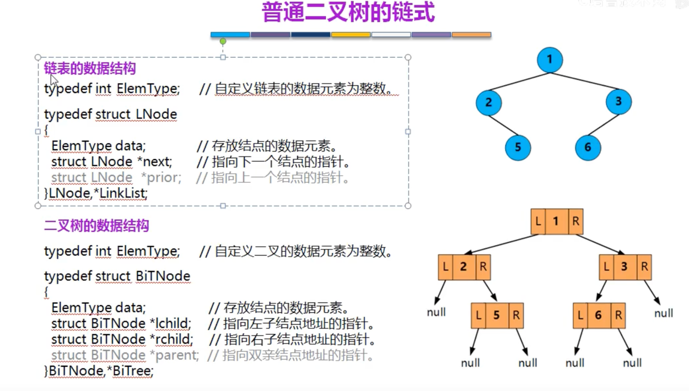
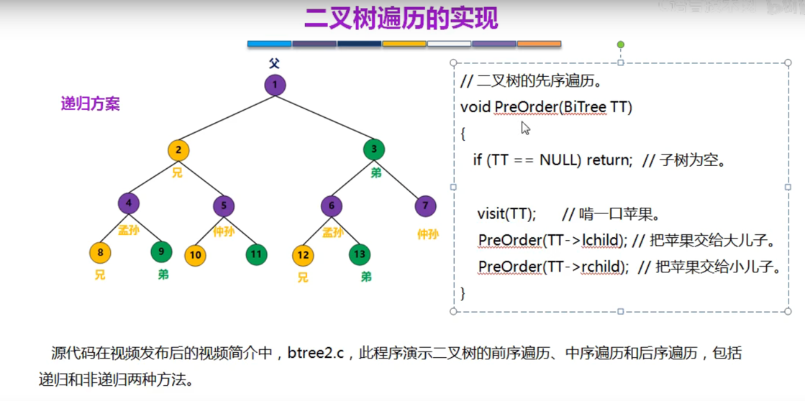
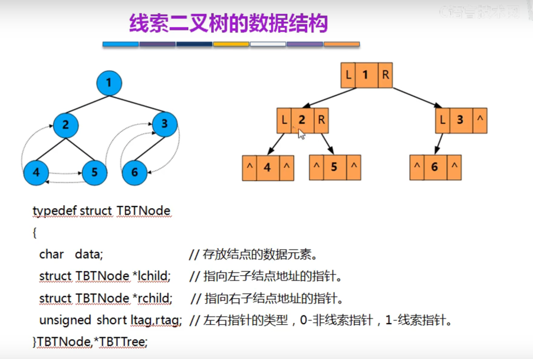
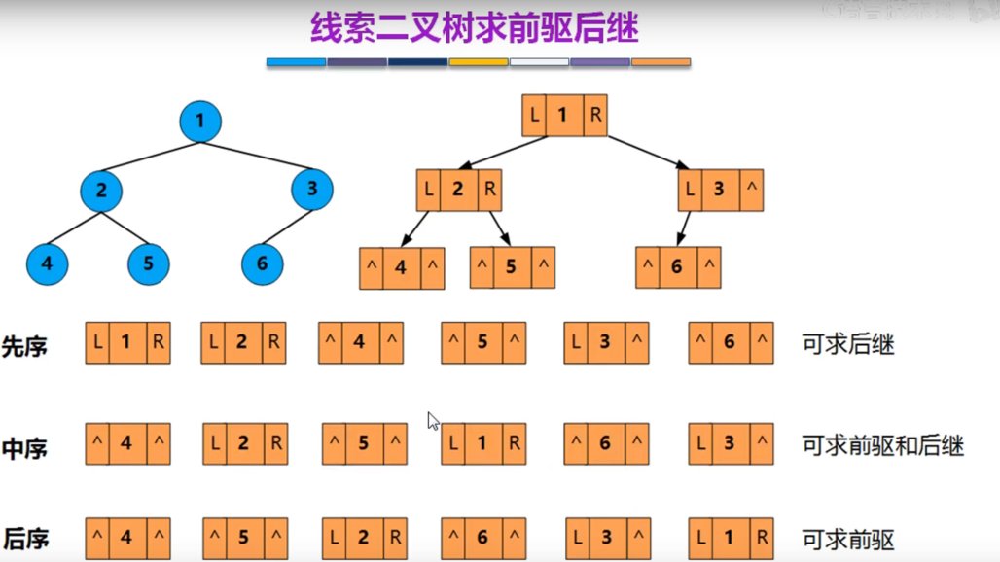
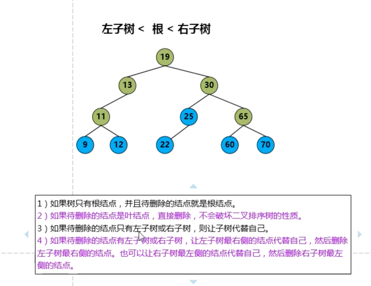
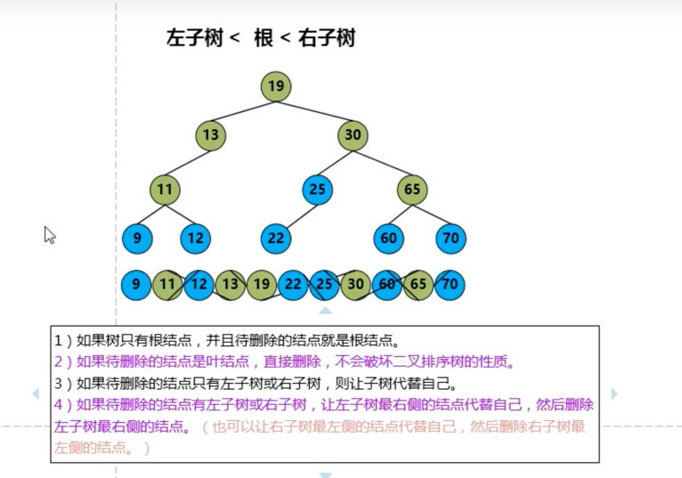
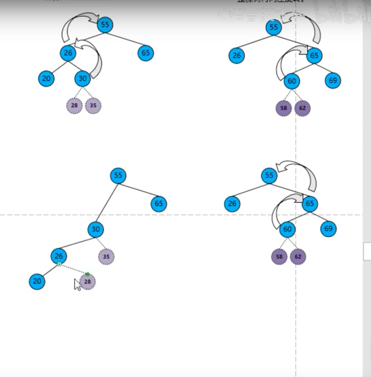
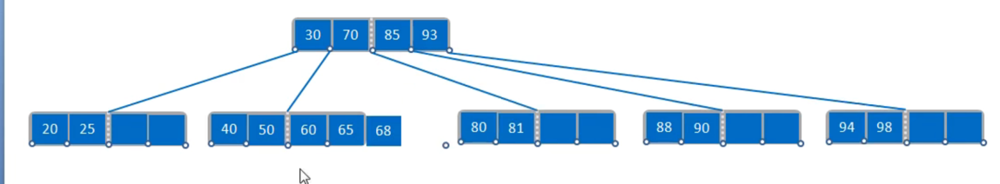

<!-- START doctoc generated TOC please keep comment here to allow auto update -->
<!-- DON'T EDIT THIS SECTION, INSTEAD RE-RUN doctoc TO UPDATE -->
**Table of Contents**  *generated with [DocToc](https://github.com/thlorenz/doctoc)*

- [树(Tree）](#%E6%A0%91tree)
  - [基本术语](#%E5%9F%BA%E6%9C%AC%E6%9C%AF%E8%AF%AD)
  - [树的性质](#%E6%A0%91%E7%9A%84%E6%80%A7%E8%B4%A8)
  - [binary_tree 二叉树](#binary_tree-%E4%BA%8C%E5%8F%89%E6%A0%91)
    - [性质](#%E6%80%A7%E8%B4%A8)
  - [二叉树和度为 2 的树的区别](#%E4%BA%8C%E5%8F%89%E6%A0%91%E5%92%8C%E5%BA%A6%E4%B8%BA-2-%E7%9A%84%E6%A0%91%E7%9A%84%E5%8C%BA%E5%88%AB)
  - [特殊的二叉树](#%E7%89%B9%E6%AE%8A%E7%9A%84%E4%BA%8C%E5%8F%89%E6%A0%91)
    - [1 满二叉树](#1-%E6%BB%A1%E4%BA%8C%E5%8F%89%E6%A0%91)
    - [2 完全二叉树](#2-%E5%AE%8C%E5%85%A8%E4%BA%8C%E5%8F%89%E6%A0%91)
    - [3 二叉排序树](#3-%E4%BA%8C%E5%8F%89%E6%8E%92%E5%BA%8F%E6%A0%91)
    - [4 平衡二叉树（Balanced Binary Tree）](#4-%E5%B9%B3%E8%A1%A1%E4%BA%8C%E5%8F%89%E6%A0%91balanced-binary-tree)
  - [二叉树的存储结构](#%E4%BA%8C%E5%8F%89%E6%A0%91%E7%9A%84%E5%AD%98%E5%82%A8%E7%BB%93%E6%9E%84)
    - [完全二叉树的顺序存储](#%E5%AE%8C%E5%85%A8%E4%BA%8C%E5%8F%89%E6%A0%91%E7%9A%84%E9%A1%BA%E5%BA%8F%E5%AD%98%E5%82%A8)
    - [二叉树的链式存储](#%E4%BA%8C%E5%8F%89%E6%A0%91%E7%9A%84%E9%93%BE%E5%BC%8F%E5%AD%98%E5%82%A8)
  - [二叉树的遍历](#%E4%BA%8C%E5%8F%89%E6%A0%91%E7%9A%84%E9%81%8D%E5%8E%86)
    - [层次遍历](#%E5%B1%82%E6%AC%A1%E9%81%8D%E5%8E%86)
      - [过程](#%E8%BF%87%E7%A8%8B)
    - [三种遍历方式](#%E4%B8%89%E7%A7%8D%E9%81%8D%E5%8E%86%E6%96%B9%E5%BC%8F)
      - [遍历方式代码实现](#%E9%81%8D%E5%8E%86%E6%96%B9%E5%BC%8F%E4%BB%A3%E7%A0%81%E5%AE%9E%E7%8E%B0)
    - [由遍历序列构造二叉树](#%E7%94%B1%E9%81%8D%E5%8E%86%E5%BA%8F%E5%88%97%E6%9E%84%E9%80%A0%E4%BA%8C%E5%8F%89%E6%A0%91)
  - [线索二叉树（Threaded BinaryTree）](#%E7%BA%BF%E7%B4%A2%E4%BA%8C%E5%8F%89%E6%A0%91threaded-binarytree)
    - [为什么需要线索二叉树？](#%E4%B8%BA%E4%BB%80%E4%B9%88%E9%9C%80%E8%A6%81%E7%BA%BF%E7%B4%A2%E4%BA%8C%E5%8F%89%E6%A0%91)
    - [线索二叉树数据结构](#%E7%BA%BF%E7%B4%A2%E4%BA%8C%E5%8F%89%E6%A0%91%E6%95%B0%E6%8D%AE%E7%BB%93%E6%9E%84)
    - [线索二叉树求前继和后继](#%E7%BA%BF%E7%B4%A2%E4%BA%8C%E5%8F%89%E6%A0%91%E6%B1%82%E5%89%8D%E7%BB%A7%E5%92%8C%E5%90%8E%E7%BB%A7)
      - [先序线索二叉树求后继](#%E5%85%88%E5%BA%8F%E7%BA%BF%E7%B4%A2%E4%BA%8C%E5%8F%89%E6%A0%91%E6%B1%82%E5%90%8E%E7%BB%A7)
      - [中序线索二叉树求前继和后继](#%E4%B8%AD%E5%BA%8F%E7%BA%BF%E7%B4%A2%E4%BA%8C%E5%8F%89%E6%A0%91%E6%B1%82%E5%89%8D%E7%BB%A7%E5%92%8C%E5%90%8E%E7%BB%A7)
  - [树的存储结构](#%E6%A0%91%E7%9A%84%E5%AD%98%E5%82%A8%E7%BB%93%E6%9E%84)
    - [1. 孩子兄弟表示法----主要](#1-%E5%AD%A9%E5%AD%90%E5%85%84%E5%BC%9F%E8%A1%A8%E7%A4%BA%E6%B3%95----%E4%B8%BB%E8%A6%81)
    - [2. 双亲表示法](#2-%E5%8F%8C%E4%BA%B2%E8%A1%A8%E7%A4%BA%E6%B3%95)
    - [3. 孩子表示法](#3-%E5%AD%A9%E5%AD%90%E8%A1%A8%E7%A4%BA%E6%B3%95)
  - [二叉排序（搜索）树(Binary Search Tree)](#%E4%BA%8C%E5%8F%89%E6%8E%92%E5%BA%8F%E6%90%9C%E7%B4%A2%E6%A0%91binary-search-tree)
    - [查找,插入,创建,删除](#%E6%9F%A5%E6%89%BE%E6%8F%92%E5%85%A5%E5%88%9B%E5%BB%BA%E5%88%A0%E9%99%A4)
      - [创建](#%E5%88%9B%E5%BB%BA)
      - [查找](#%E6%9F%A5%E6%89%BE)
      - [插入](#%E6%8F%92%E5%85%A5)
      - [删除](#%E5%88%A0%E9%99%A4)
    - [二叉排序树的查找效率分析](#%E4%BA%8C%E5%8F%89%E6%8E%92%E5%BA%8F%E6%A0%91%E7%9A%84%E6%9F%A5%E6%89%BE%E6%95%88%E7%8E%87%E5%88%86%E6%9E%90)
  - [平衡二叉树（Balanced Binary Tree） --- 代码实现过于复杂](#%E5%B9%B3%E8%A1%A1%E4%BA%8C%E5%8F%89%E6%A0%91balanced-binary-tree-----%E4%BB%A3%E7%A0%81%E5%AE%9E%E7%8E%B0%E8%BF%87%E4%BA%8E%E5%A4%8D%E6%9D%82)
    - [为什么要有平衡二叉树](#%E4%B8%BA%E4%BB%80%E4%B9%88%E8%A6%81%E6%9C%89%E5%B9%B3%E8%A1%A1%E4%BA%8C%E5%8F%89%E6%A0%91)
    - [插入和删除 数据后不平衡](#%E6%8F%92%E5%85%A5%E5%92%8C%E5%88%A0%E9%99%A4-%E6%95%B0%E6%8D%AE%E5%90%8E%E4%B8%8D%E5%B9%B3%E8%A1%A1)
    - [树高和节点关系](#%E6%A0%91%E9%AB%98%E5%92%8C%E8%8A%82%E7%82%B9%E5%85%B3%E7%B3%BB)
    - [哈夫曼 huffman 树（最优二叉树）](#%E5%93%88%E5%A4%AB%E6%9B%BC-huffman-%E6%A0%91%E6%9C%80%E4%BC%98%E4%BA%8C%E5%8F%89%E6%A0%91)
      - [huffman概念](#huffman%E6%A6%82%E5%BF%B5)
      - [构造huffman树](#%E6%9E%84%E9%80%A0huffman%E6%A0%91)
      - [huffman编码](#huffman%E7%BC%96%E7%A0%81)
  - [B 树 （B-tree）](#b-%E6%A0%91-b-tree)
    - [多叉排序树](#%E5%A4%9A%E5%8F%89%E6%8E%92%E5%BA%8F%E6%A0%91)
    - [5阶B树特性](#5%E9%98%B6b%E6%A0%91%E7%89%B9%E6%80%A7)
    - [5阶B树插入和删除](#5%E9%98%B6b%E6%A0%91%E6%8F%92%E5%85%A5%E5%92%8C%E5%88%A0%E9%99%A4)
      - [插入](#%E6%8F%92%E5%85%A5-1)
      - [删除](#%E5%88%A0%E9%99%A4-1)
  - [B+ 树----B树变形树](#b-%E6%A0%91----b%E6%A0%91%E5%8F%98%E5%BD%A2%E6%A0%91)
    - [b+树考题](#b%E6%A0%91%E8%80%83%E9%A2%98)
  - [B树 对比 B+树](#b%E6%A0%91-%E5%AF%B9%E6%AF%94-b%E6%A0%91)
  - [参考](#%E5%8F%82%E8%80%83)

<!-- END doctoc generated TOC please keep comment here to allow auto update -->

# 树(Tree）

树(Tree）是n（n>=0)个结点的有限集。n=0时称为空树。

在任意一棵非空树中：

（1）有且仅有一个特定的称为根（root）的结点。

（2）当n>1时，其余结点可分为m（m>0)个互不相交的有限集T1,T2,....,Tm, 其中每一个集合本身又是一棵树，并且称为根的子树（SubTree)

## 基本术语

- 结点：树中的一个独立单元。包含一个数据元素及若干指向其子树的分支
- 结点的度（Degree）：结点拥有的子树。度为0的结点称为叶结点（Leaf）或终端结点；度不为0的结点称为非终端结点或分支结点。例如，A的度为3，C的度为0，F的度为0。
- 阶（order）: 在树中，一个节点可以拥有的最大子树数量称为阶。
- 树的度： 是树内各结点的度的最大值。
- 结点的层次（Level)：从根开始定义起，根为第一层，根的孩子为第二层。其双亲在同一层的结点互为堂兄弟。
- 非终端结点：度不为0的结点称为非终端结点或分支结点。
- 双亲和孩子：结点的子树的根称为该结点的孩子，相应地，该结点称为孩子的双亲
- 树的阶数：描述树中每个节点所拥有的子节点的最大数量。例如B树。在B树中，’m阶’意味着每个节点最多可以包含m个子节点。

## 树的性质

1. 结点数=总度数+1
2. 度为m的树或m叉树，第i层至多有m^(i-1)个结点（i>=1）
3. 高度为h的m叉树至多有m^h-1/m-1个结点

## binary_tree 二叉树

有五种基本形态

### 性质

## 二叉树和度为 2 的树的区别

## 特殊的二叉树

### 1 满二叉树
除了叶子结点以外，所有分支结点的度数都是2。

### 2 完全二叉树
少了些叶子结点时，具有的编号都能和满二叉树一一对应上。

### 3 二叉排序树

- 左子树所有的关键字小于根结点的关键字
- 右子树所有的关键字大于根节点的关键字
- 左子树和右子树又各是一个二叉排序树

### 4 平衡二叉树（Balanced Binary Tree）

## 二叉树的存储结构

### 完全二叉树的顺序存储

用顺序存储的方法普通二叉树容易造成空间的浪费

### 二叉树的链式存储

## 二叉树的遍历

指对树中所有结点信息的访问，即依次对树中每个结点的访问一次且仅访问一次。

### 层次遍历

借助队列，出队时，帮左右子元素入队。

#### 过程

1. 使用辅助队列，根节点1入队
   

2. 来个循环，出个节点1，把他的所有子节点2，3，4入队
   

3. 同理，出队2，把2的子节点5，6入队，直到队列为空
   

### 三种遍历方式

1. 先序遍历：先访问根节点，然后访问左子树， 最后访问右子树
   
   
   

2. 中序遍历：先访问左子树，然后访问根节点， 最后访问右子树。
   
   

3. 后序遍历：先访问左子树，然后访问右子树， 最后访问根节点。
   
   

#### 遍历方式代码实现

递归方案实现先序遍历

递归方案实现中序遍历

递归方案实现后序遍历

栈的方式实现中序遍历

### 由遍历序列构造二叉树

1 先序+中序遍历 构造二叉树

2 层次+中序遍历

## 线索二叉树（Threaded BinaryTree）

对一棵二叉树中所有节点的空指针域按照某种遍历方式加线索的过程叫作线索化，被线索化了的二叉树称为线索二叉树。

### 为什么需要线索二叉树？
知道了“前驱”和“后继”信息，就可以把二叉树看作一个链表结构，从而可以像遍历链表那样来遍历二叉树，进而提高效率

### 线索二叉树数据结构

标识域：

- 如果ltag=0，表示指向节点的左孩子。如果ltag=1，则表示lchild为线索，指向节点的直接前驱
- 如果rtag=0，表示指向节点的右孩子。如果rtag=1，则表示rchild为线索，指向节点的直接后继

### 线索二叉树求前继和后继

#### 先序线索二叉树求后继

#### 中序线索二叉树求前继和后继

## 树的存储结构

### 1. 孩子兄弟表示法----主要

### 2. 双亲表示法

### 3. 孩子表示法

## 二叉排序（搜索）树(Binary Search Tree)

二叉查找树（Binary Search Tree），也称二叉搜索树。

- 若任意节点的左子树不空，则左子树上所有节点的值均小于它的根节点的值；
- 若任意节点的右子树不空，则右子树上所有节点的值均大于它的根节点的值；
- 任意节点的左、右子树也分别为二叉查找树；
- 没有键值相等的节点

### 查找,插入,创建,删除
#### 创建

#### 查找

#### 插入

#### 删除

### 二叉排序树的查找效率分析

查找成功 的平均查找长度（ASL average search length）

查找失败 的平均查找长度（ASL average search length）

## 平衡二叉树（Balanced Binary Tree） --- 代码实现过于复杂

平衡因子（BF,Balance Factor）： 某节点的左子树与右子树的高度(深度)差，

平衡二叉树中不存在平衡因子大于 1 的节点。
在一棵平衡二叉树中，节点的平衡因子只能取 0 、1 或者 -1 ，分别对应着左右子树等高，左子树比较高，右子树比较高。

### 为什么要有平衡二叉树
二叉搜索树的查找效率取决于树的高度，因此保持树的高度最小，即可保证树的查找效率。

### 插入和删除 数据后不平衡

插入的是68 导致不平衡。

最小失衡子树：在新插入的结点向上查找，以第一个平衡因子的绝对值超过 1 的结点为根的子树称为最小不平衡子树。也就是说，一棵失衡的树，是有可能有多棵子树同时失衡的。而这个时候，我们只要调整最小的不平衡子树，就能够将不平衡的树调整为平衡的树。

调整方式：平衡二叉树的失衡调整主要是通过旋转最小失衡子树来实现的，根据旋转的方向有两种处理方式，左旋 与 右旋。旋转的目的就是减少高度，通过降低整棵树的高度来平衡。哪边的树高，就把那边的树向上旋转。

右旋：针对左边高

- （1）节点的左孩子代表此节点 
- （2）节点的左孩子的右子树变为节点的左子树 
- （3）将此节点作为左孩子节点的右子树。

左旋：针对右边高

- （1）节点的右孩子替代此节点位置 
- （2）右孩子的左子树变为该节点的右子树 
- （3）节点本身变为右孩子的左子树

插入的是68，如70是最小失衡子树，调整最小不平衡子树

1. 左左更高

向右旋转，然后30放在右侧左子树

2. 左右更高

向左旋转, 向右旋转

总结：  

### 树高和节点关系

### 哈夫曼 huffman 树（最优二叉树）

在通信上广泛应用

把经常访问放在跟根结点最近的地方

二进制表示:书写简单，不容易泄密

1. 浪费空间
2. 人物长度固定

1. 长度不固定
2. 长度短

#### huffman概念

#### 构造huffman树

#### huffman编码

## B 树 （B-tree）
B-树，就是B树，B树的原英文名是B-tree,所以很多翻译为B-树,就会很多人误以为B-树是一种树、B树是另外一种树。其实，B-tree就是B树

B树的基本思想是保证每个节点至少填满一半的关键字，以达到较好的性能。其优点是对于大规模数据的插入和删除操作，它仍然能够保持较好的性能，但缺点是每个节点都需要存储一定数量的指针，导致存储空间的浪费。

B树属于多叉树又名平衡多路查找树.

### 多叉排序树

n个关键字--分为n+1个区间，注意线画在关键字中间

### 5阶B树特性

### 5阶B树插入和删除

#### 插入

#### 删除

1. 删除69
   

2. 删除50,向左向右都可以借，但是不是直接借，需要通过父节点中转
   
   

3. 删除28
   
   
   
   
   

4. 删除70
   
   

## B+ 树----B树变形树

B+树在B树的基础上进行了改进，主要对两个方面进行了提升，一方面是查询的稳定性，另外一方面是在数据排序方面更友好。

（1）B+树的非叶子节点不保存具体的数据，而只保存关键字的索引，而所有的数据最终都会保存到叶子节点。因为所有数据必须要到叶子节点才能获取到，所以每次数据查询的次数都一样，这样一来B+树的查询速度也就会比较稳定，而B树的查找过程中，不同的关键字查找的次数很有可能都是不同的（有的数据可能在根节点，有的数据可能在最下层的叶节点），所以在数据库的应用层面，B+树就显得更合适。

（2）B+树叶子节点的关键字从小到大有序排列，左边结尾数据都会保存右边节点开始数据的指针。因为叶子节点都是有序排列的，所以B+树对于数据的排序有着更好的支持。

1. 查找:可以从根节点通过分块查找，也可以通过叶节点采用顺序查找
2. 索引是是子树最大值,线连在子树中间

关键字和记录是分开的

数据比较多，增加索引表

### b+树考题

## B树 对比 B+树

## 参考
