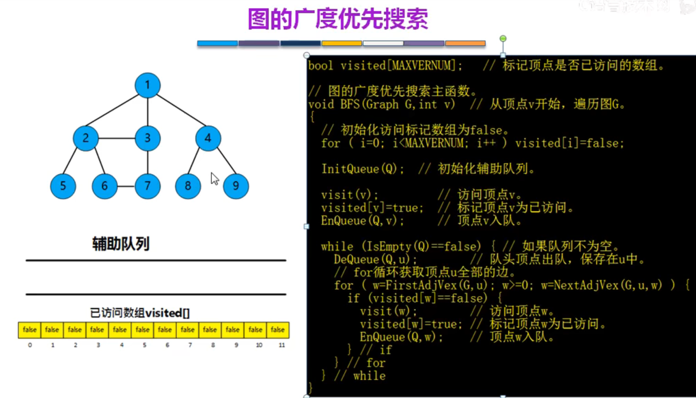

# 图

图（Graph）是由顶点的有穷非空集合和顶点之间边的集合组成，通常表示为：G（V，E），其中，G表示一个图，V是图G中顶点的集合，E是图G中边的集合。

线性表中可以没有元素，称为空表。树中可以没有结点，叫做空树。但是在图中不允许没有顶点，可以没有边。

无向边：若顶点Vi和Vj之间的边没有方向，称这条边为无向边（Edge），用（Vi，Vj）来表示。

有向边：若从顶点Vi到Vj的边有方向，称这条边为有向边，也称为弧（Arc），用<Vi, Vj>来表示，其中Vi称为弧尾（Tail），Vj称为弧头（Head）

## 种类

- 无向图（Undirected graphs）：图中任意两个顶点的边都是无向边。

- 有向图（Directed graphs）：图中任意两个顶点的边都是有向边。

- 简单图：不存在自环（顶点到其自身的边）和重边（完全相同的边）的图

- 无环图：没有环的图，其中，有向无环图有特殊的名称，叫做DAG(Directed Acyline Graph)（最好记住，DAG具有一些很好性质，比如很多动态规划的问题都可以转化成DAG中的最长路径、最短路径或者路径计数的问题）

- 无向完全图：无向图中，任意两个顶点之间都存在边。

- 有向完全图：有向图中，任意两个顶点之间都存在方向相反的两条弧。

- 稀疏图；有很少条边或弧的图称为稀疏图，反之称为稠密图。

- 权（Weight）：表示从图中一个顶点到另一个顶点的距离或耗费。

- 网：带有权重的图

## 边和顶点的两个重要关系

- 邻接(adjacency)：邻接是两个顶点之间的一种关系。如果图包含边(u,v)，则称顶点u与顶点v邻接。当然，在无向图中，这也意味着顶点与顶点邻接。
- 关联(incidence)：关联是边和顶点之间的关系。在有向图中，边(u,v)从顶点u开始关联到v，或者相反，从v关联到u。注意，有向图中，边不一定是对称的，有去无回是完全有可能的。细化这个概念，就有了顶点的入度(in-degree)和出度(out-degree)。无向图中，顶点的度就是与顶点相关联的边的数目，没有入度和出度。在有向图中，我们以下图为例，顶点10有2个入度，但是没有从10指向其它顶点的边，因此顶点10的出度为0

## 图的基本术语
度：与特定顶点相连接的边数；

出度、入度：有向图中的概念，出度表示以此顶点为起点的边的数目，入度表示以此顶点为终点的边的数目；

路径(path)：依次遍历顶点序列之间的边所形成的轨迹。注意，依次就意味着有序，先1后2和先2后1不一样;

简单路径：没有重复顶点的路径称为简单路径。说白了，这一趟路里没有出现绕了一圈回到同一点的情况，也就是没有环;

环：第一个顶点和最后一个顶点相同的路径；

简单环：除去第一个顶点和最后一个顶点后没有重复顶点的环；

连通的：无向图中每一对不同的顶点之间都有路径。如果这个条件在有向图里也成立，那么就是强连通的;

连通图：任意两个顶点都相互连通的图；

极大连通子图：包含竟可能多的顶点（必须是连通的），即找不到另外一个顶点，使得此顶点能够连接到此极大连通子图的任意一个顶点；

连通分量：极大连通子图的数量；

强连通图：此为有向图的概念，表示任意两个顶点a，b，使得a能够连接到b，b也能连接到a 的图；

最小生成树：此生成树的边的权重之和是所有生成树中最小的；

AOV网（Activity On Vertex Network ）：在有向图中若以**顶点**表示活动，有向边表示活动之间的先后关系

AOE网（Activity On Edge Network）：在带权有向图中若*以顶点表示事件，有向边表示活动*，边上的权值表示该活动持续的时间

## 图的存储

1. 邻接矩阵-->顺序存储（数组）

- 无向图 A的度，可以直接看行或则列，都为3   
- 有向图 A的出度看行中非0元素，为1，入度为2，度为出+入（1+2）
- 时间复杂度都是O(n)或则O(|V|)
  

  
2. 邻接表-->顺序存储+链式存储(数组➕链表)

 

以上两种结构对比

3. 十字链表-->适合处理有向图解决入度的问题

4. 邻接多重表-->适合处理无向图解决数据冗余的问题   

- 边链表的节点数是｜E｜
- 空间复杂度是O(|V|+|E|);邻接表O(|V|+2|E|)；

## 图的遍历：BFS和DFS算法
DFS和BFS是很多图算法的基础。不过，要获得效率更高的图的算法，深度优先算法DFS使用较多。
### BFS (Breadth First Search 广度优先遍历）-->树的层次遍历

- 连通图

- 非连通图

广度优先遍历（Breadth First Search，简称BFS），又称为广度优先搜索。这种搜索方法可以用队列实现。

遍历思想：首先，从图的某个顶点v0出发，访问了v0之后，依次访问与v0相邻的未被访问的顶点，然后分别从这些顶点出发，广度优先遍历，直至所有的顶点都被访问完。

#### 过程
1. 图可以从任意节点开始，

2. 这里先访问2，2入队，标记已经访问。

3. 每次出队一个顶点，比如2，找出他关联的顶点1，3，5，6，依次判断是否访问过，没有访问标记访问，并且入队。

4. 顶点5出队，与5关联的只有2，但是已经访问过。
5. 顶点6出队，与6相关的有2，7，只有7没有访问过，标记访问过，并入队。
6. 同理处理其他。
7. 最终结果

#### 非连通图处理

#### 效率分析
空间复杂度  

时间复杂度  

#### bfs生成树

### DFS (Depth First Search 深度优先搜索)-->树的先序遍历
 
深度优先遍历（Depth First Search，简称DFS），也被称为深度优先搜索。这种搜索方法可以用栈来实现，类似老鼠走迷宫。

遍历思想：首先从图中某个顶点v0出发，访问此顶点，然后依次从v相邻的顶点出发深度优先遍历，直至图中所有与v路径相通的顶点都被访问了；
若此时尚有顶点未被访问，则从中选一个顶点作为起始点，重复上述过程，直到所有的顶点都被访问

1. 从顶点3出发，所以3入栈

2. 与3相关的有1,2,4,7,8; 因为1在链表的前面，所以1入栈。

3. 与1相关的有2，4；因为2在链表的前面，所以2入栈。

4. 与2相关的有1，3，5，6；因为1，3被访问过，所以5入栈。

5. 与5相关的有2，但是2已经访问过，所以5可以出栈。

6. 与2相关的有1，3，5，6,但是1，3，5已经访问过，所以6入栈。

7. 与6相关的有2，7，但是2已经访问过，所以7入栈。

8. 与7相关的有3，6，但是都被访问过了，所以7出栈。同理6，2出栈。

9. 最终结果

#### 效率分析

#### dfs生成树

#### DFS案例
全排列：leetCode链接：https://leetcode-cn.com/problems/permutations/

## 最小生成树(MST)

- 无向连通图：生成树是指包含全部定点的的极小连通子图

案例

### Prim算法

- 生成树不唯一，但是权值之和唯一

### Kruskal算法

两者对比

## 最短路径

最短路径指两顶点之间经过的边上权值之和最少的路径，并且称路径上的第一个顶点为源点，最后一个顶点为终点。

### 单源最短路径算法
- BFS（无权图）

  
- Dijkstra（无权，有权图）

  
note:不适合权制为负数的图--场景入上下坡下车充电

### 顶点间最短路径
- Floyd算法（无权，有权图）

  
## 拓扑排序

## 关键路径
