# queue队列
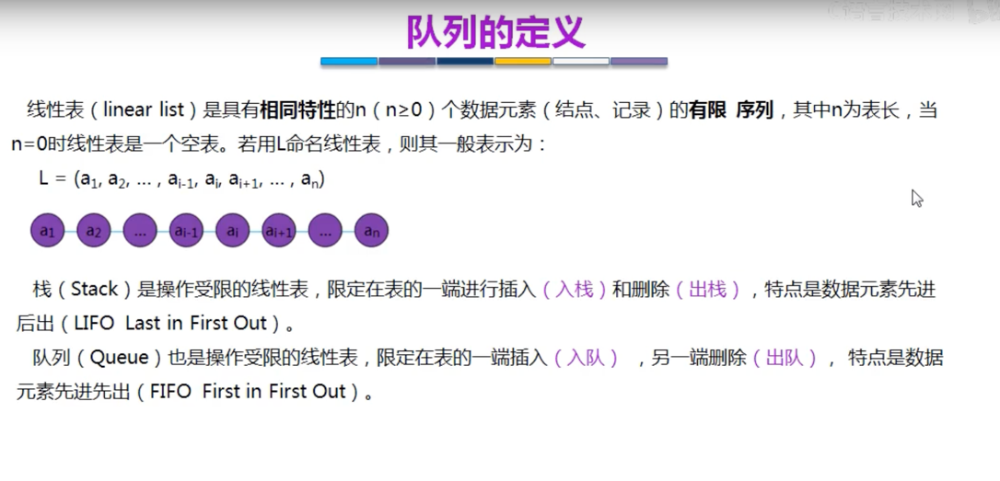

## 队列的顺序存储
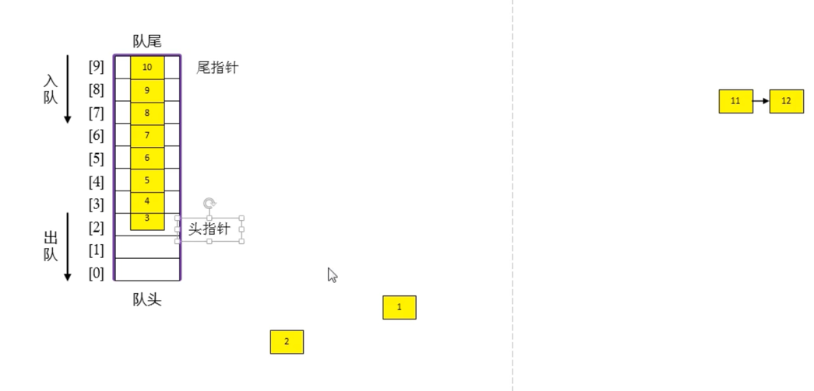
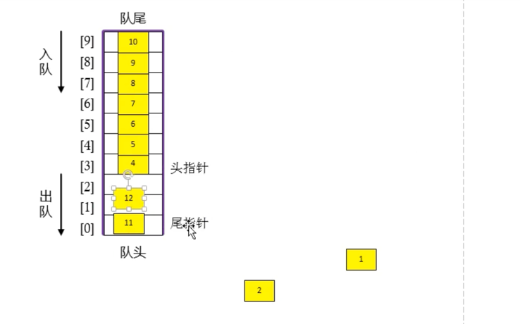
1. 出队，头指针往后移，从1-->3
2. 入队，尾指针往后移，可以从8-->9-->1

用数组实现的队列（循环队列）
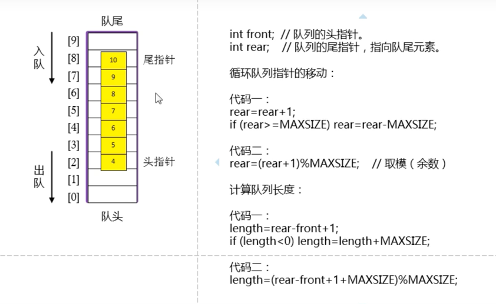

### 队空和队满判断
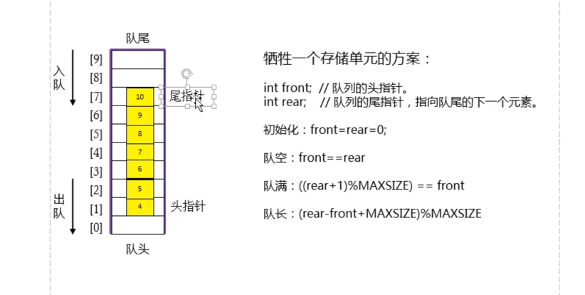
1. 通过牺牲一个存储单元

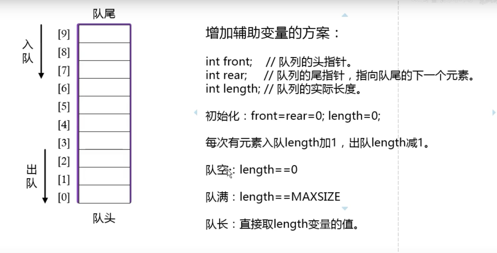
2. 增加辅助变量 

### 队列的顺序存储代码实现
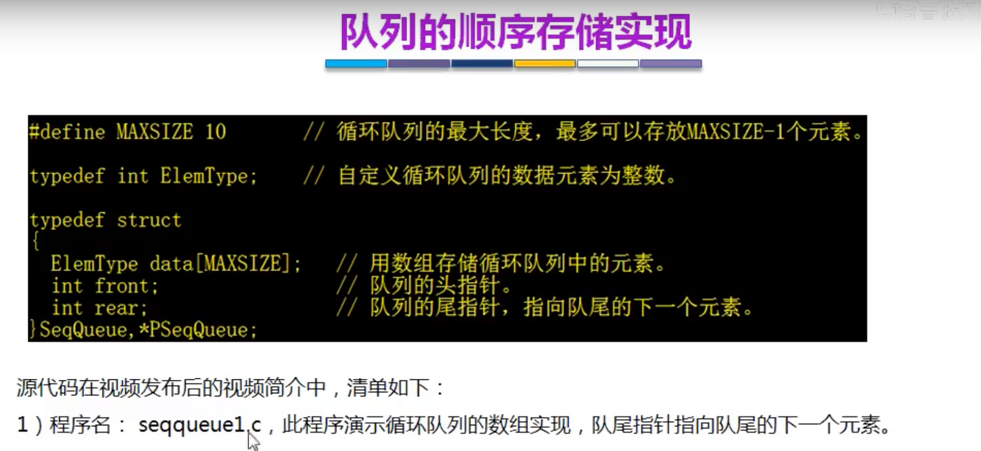
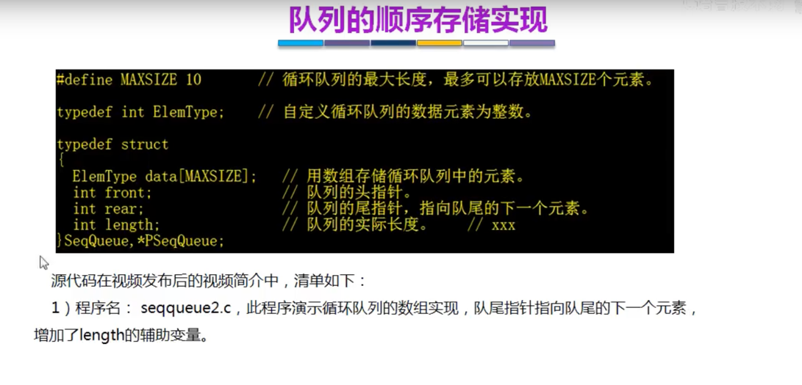
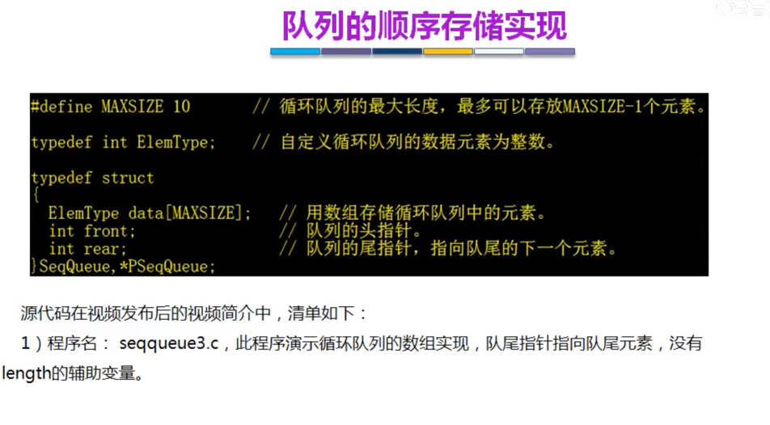

## 队列的链式存储
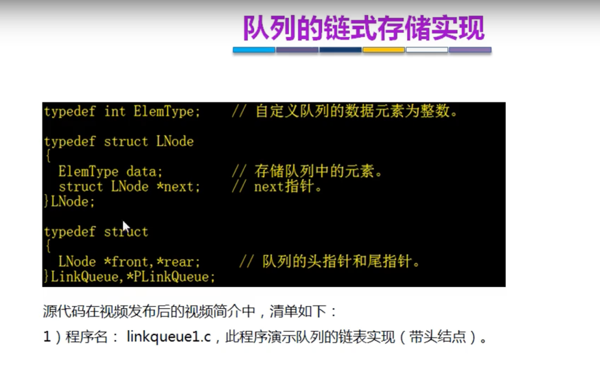

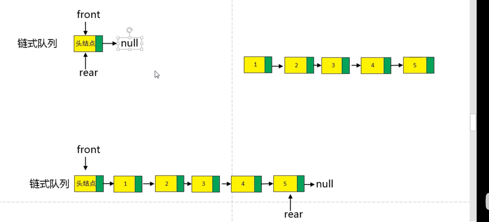

入队
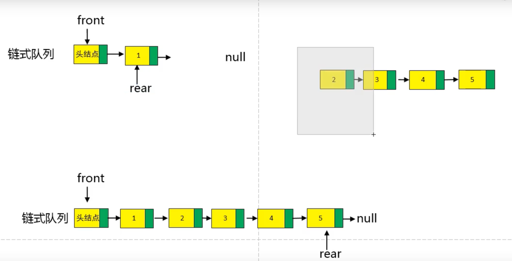

出队
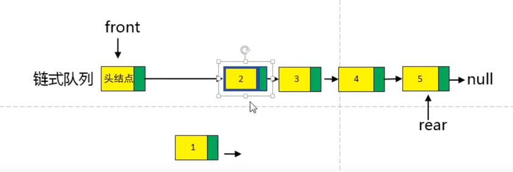

## 双端队列--实际没有什么价值
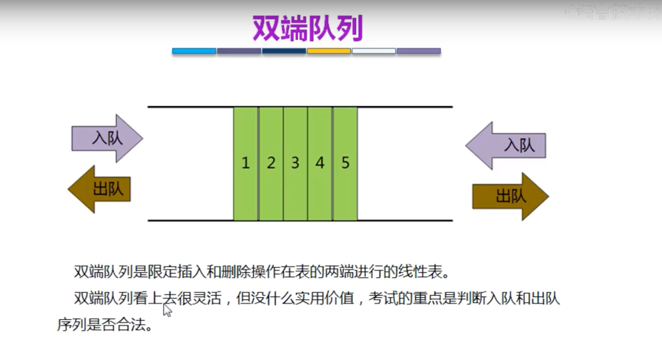

## 队列的应用
1. 树的层次应用
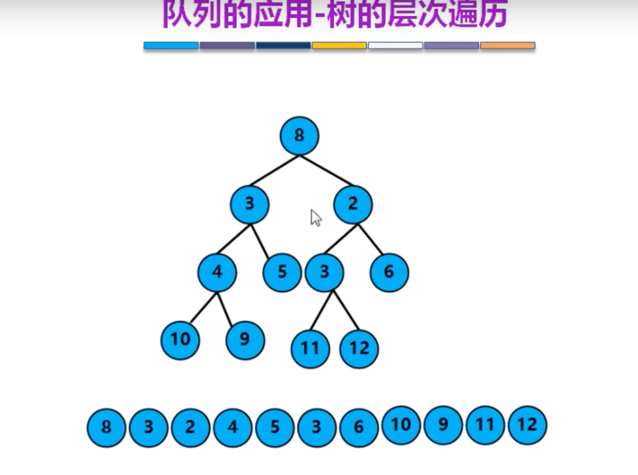
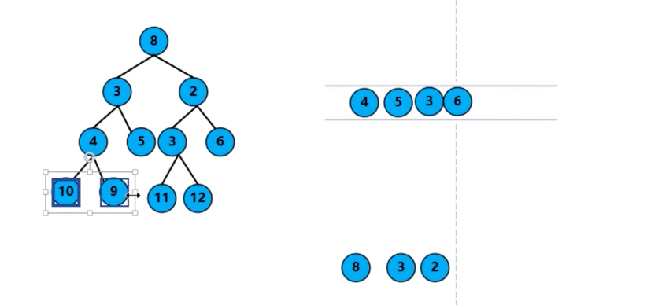

根节点8入队，把根节点的左右子节点3和2入队，然后根节点8出队。
把3节点的左右节点4和5入队，把3出队。把2节点的左右节点3和6入队等等

2. cpu的资源调度

3. 数据缓冲区
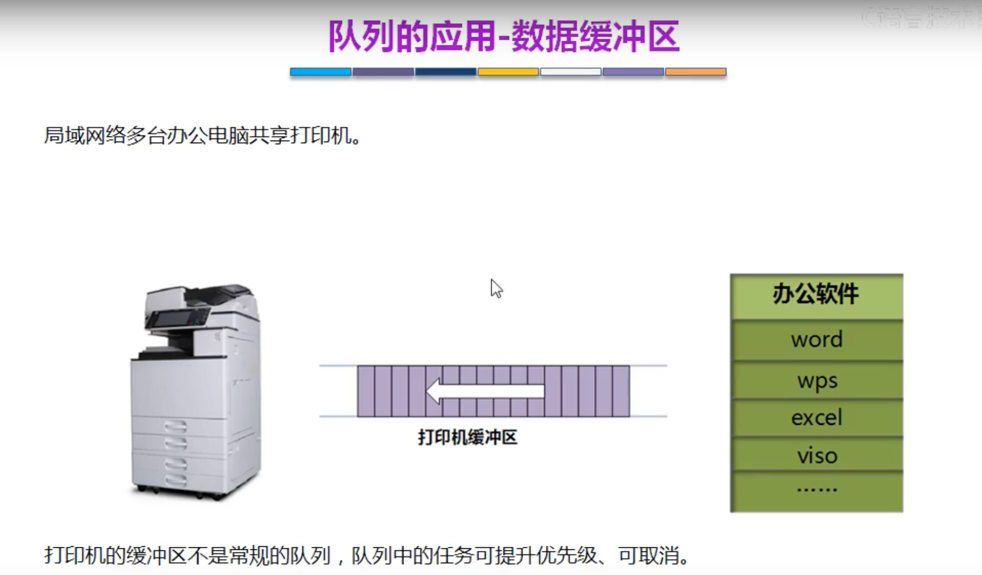