<!-- START doctoc generated TOC please keep comment here to allow auto update -->
<!-- DON'T EDIT THIS SECTION, INSTEAD RE-RUN doctoc TO UPDATE -->
**Table of Contents**  *generated with [DocToc](https://github.com/thlorenz/doctoc)*

- [排序](#%E6%8E%92%E5%BA%8F)
  - [3. 插入排序](#3-%E6%8F%92%E5%85%A5%E6%8E%92%E5%BA%8F)
  - [4. 希尔排序](#4-%E5%B8%8C%E5%B0%94%E6%8E%92%E5%BA%8F)
  - [5. 选择排序 (Selection Sort)](#5-%E9%80%89%E6%8B%A9%E6%8E%92%E5%BA%8F-selection-sort)
  - [4. 归并排序(Merge Sort)](#4-%E5%BD%92%E5%B9%B6%E6%8E%92%E5%BA%8Fmerge-sort)
  - [5. 堆排序(Heap Sort)](#5-%E5%A0%86%E6%8E%92%E5%BA%8Fheap-sort)
    - [分类](#%E5%88%86%E7%B1%BB)
    - [过程](#%E8%BF%87%E7%A8%8B)
  - [8 计数排序 (Counting Sort)](#8-%E8%AE%A1%E6%95%B0%E6%8E%92%E5%BA%8F-counting-sort)
  - [参考](#%E5%8F%82%E8%80%83)

<!-- END doctoc generated TOC please keep comment here to allow auto update -->

# 排序
所谓排序，就是使一串记录，按照其中的某个或某些关键字的大小，递增或递减的排列起来的操作

基本概念

* 稳定：如果 A 原本在 B 前面，而 A=B，排序之后 A 仍然在 B 的前面。
* 不稳定：如果 A 原本在 B 的前面，而 A=B，排序之后 A 可能会出现在 B 的后面。
* 内排序：所有排序操作都在内存中完成。
* 外排序：由于数据太大，因此把数据放在磁盘中，而排序通过磁盘和内存的数据传输才能进行。

稳定性：如果a=b，并且a在b的前面，排序后a一定在b的前面，那么称算法是稳定的，如果不一定在前面，那么称算法是不稳定的


```shell
序号  排序算法	时间复杂度(平均)	时间复杂度(最坏)	时间复杂度(最优)	空间复杂度           稳定性

1   冒泡排序	O(𝑛2)	        O(𝑛2)	        O(𝑛)	        O(1)                稳定
2   快速排序	O(nlogn)        O(𝑛2)	        O(nlogn)        O(nlogn)～O(n)      不稳定
3   插入排序	O(𝑛2)	        O(𝑛2)	        O(𝑛)	        O(1)                稳定
4   希尔排序	O(nlogn)~O(𝑛2)	O(𝑛2)	        O(𝑛1.3)	        O(1)                不稳定
5   选择排序	O(𝑛2)	        O(𝑛2)	        O(𝑛2)	        O(1)                稳定
6   堆排序	O(nlogn)        O(nlogn)        O(nlogn)        O(1)                不稳定
7   归并排序	O(nlogn)        O(nlogn)        O(nlogn)        O(n)	            稳定
8   计数排序	O(n+k)          O(n+k)          O(n+k)          O(k)                稳定
9   桶排序	O(n+k)          O(𝑛2)           O(𝑛2)           O(n+k)              稳定
10  基数排序	O(n*k)]         O(n*k)          O(n*k)          O(n+k)              稳定
```

## 3. 插入排序


对于未排序数据，在已排序序列由后向前扫描，找到相应位置并插入。如 玩纸牌

```go
func insertionSort(arr []int) {
    for i := 1; i < len(arr); i++ {
        current := arr[i]
        preIndex := i - 1
        for ; preIndex >= 0 && current < arr[preIndex]; preIndex-- {
            arr[preIndex+1] = arr[preIndex]
        }
        arr[preIndex+1] = current
    }
}
```

## 4. 希尔排序
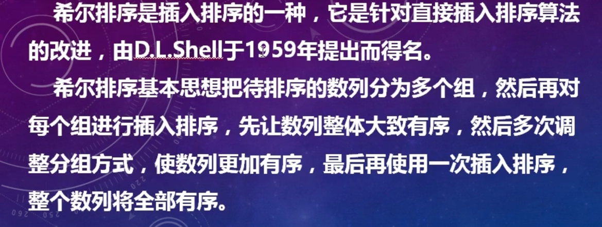

是插入排序的优化版

1. 分组
   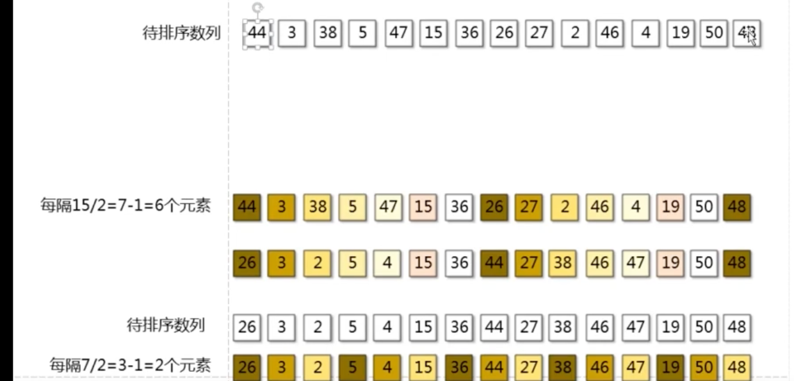
2. 取出数据进行插入排序
   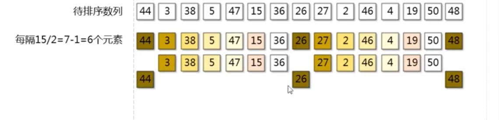
   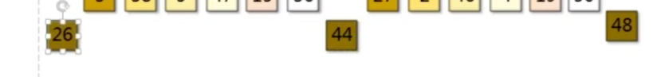

3. 分组间隔变小
   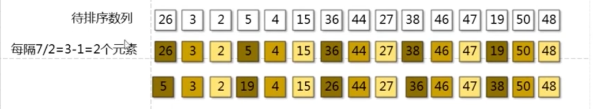
   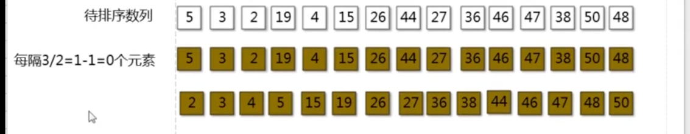

4. 最后插入排序
   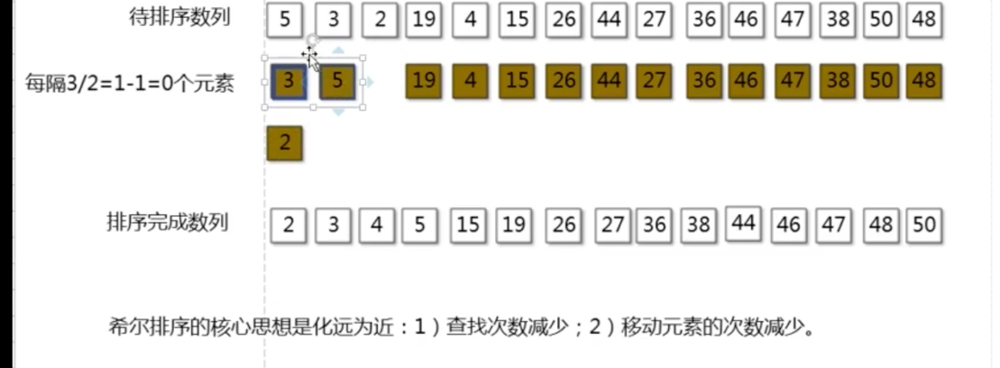

```go
// 希尔排序：是不稳定排序，时间复杂度：O(nlogn)，空间复杂度：O(1)
// 常见的增量序列：
// 1.最初Donald Shell提出的增量，即折半降低直到1。据研究，使用希尔增量，其时间复杂度还是O(n2)。
// 2.Hibbard增量：{1, 3, ..., 2k-1}，该增量序列的时间复杂度大约是O(n1.5)。
// 3.Sedgewick增量：(1, 5, 19, 41, 109,...)，其生成序列或者是94i - 92i + 1或者是4i - 3*2i + 1。
func shellSort(data []int) {
	size := len(data)
	if size <= 1 {
		return
	}
	for delta := size/2; delta >= 1; delta/=2 {
		for i := delta; i < size; i++ {
			for j := i; j >= delta && data[j] < data[j-delta]; j-=delta {
				data[j], data[j-delta] = data[j-delta], data[j]
			}
		}
	}
}
```

## 5. 选择排序 (Selection Sort)

   选择排序(Selection Sort)是一种简单直观的排序算法。它的工作原理是：首先在序列中找到最小元素，放在序列的首位，然后再从剩下的序列中寻找最小元素，放到已排序序列的末尾。

```go
func selectionSort(arr []int) {
    for i := 0; i < len(arr); i++ {
        min := i
        for j := i + 1; j < len(arr); j++ {
            if arr[j] < arr[min] {
                min = j
            }
        }
        arr[min], arr[i] = arr[i], arr[min]
    }
}
```


## 4. 归并排序(Merge Sort)


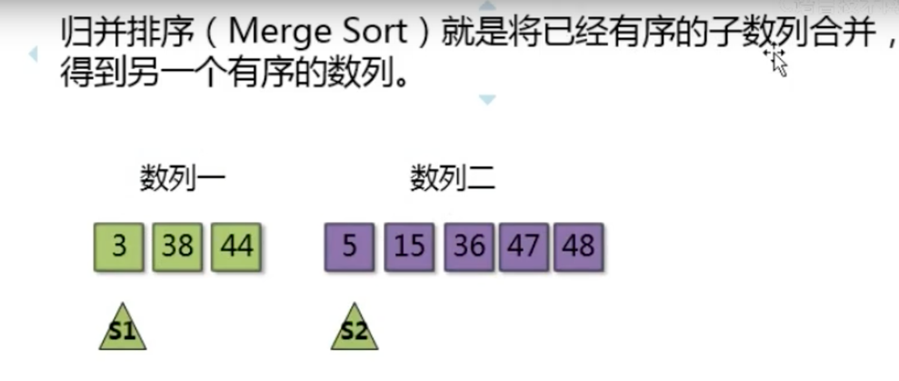

步骤
1. 切分成子序列：把长度为n的序列分为两个长度为n/2的子序列。
2. 两两排序：对这两个子序列分别采用归并排序。将两个排序好的子序列合并成一个最终的排序序列。
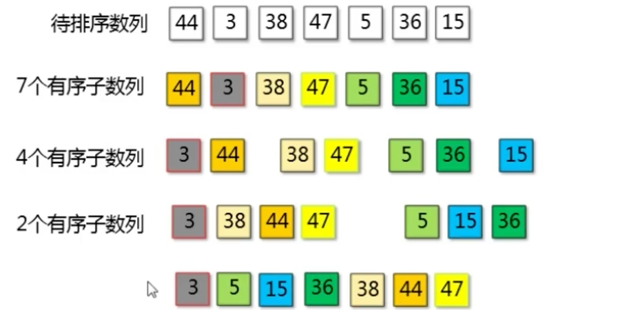

```go
func mergeSort(nums []int, start,end int) {
    if start < end {
        mid := (start+end)/2
        mergeSort(nums,start,mid) // 左边排序
        mergeSort(nums,mid+1,end) // 右边排序
        merge(nums,start,mid,end) // 合并数组
    }
}

func merge(nums []int, start, mid, end int) {
    i,j := start,mid+1
    ret := []int{}
    for i <= mid && j <= end {
        if nums[i] <= nums[j] {
            ret = append(ret, nums[i])
            i++
        } else {
            ret = append(ret, nums[j])
            j++
        }
    }
    ret = append(ret, nums[i:mid+1]...)
    ret = append(ret, nums[j:end+1]...)
    for k, v := range ret {
        nums[start+k] = v
    }
}
```

## 5. 堆排序(Heap Sort)
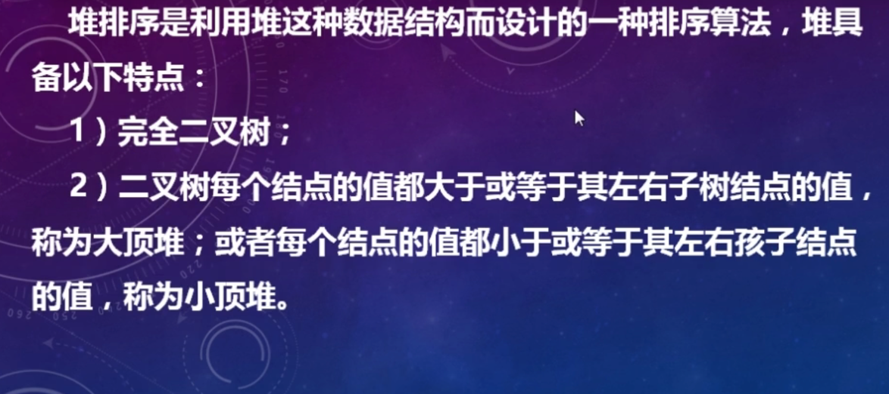

可以用数组下标表示
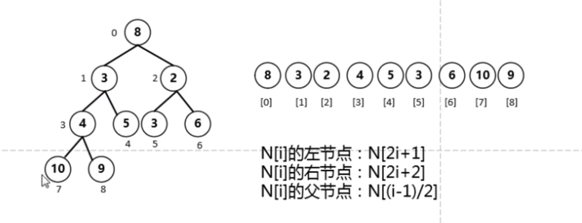


### 分类
大顶堆: 用于升序
小顶堆： 用于降序


### 过程

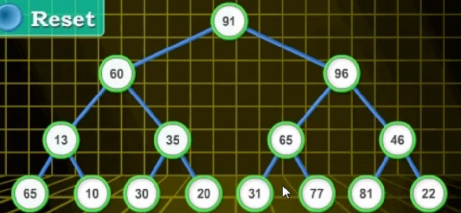
1. 从倒数第二层最后一个结点46开始
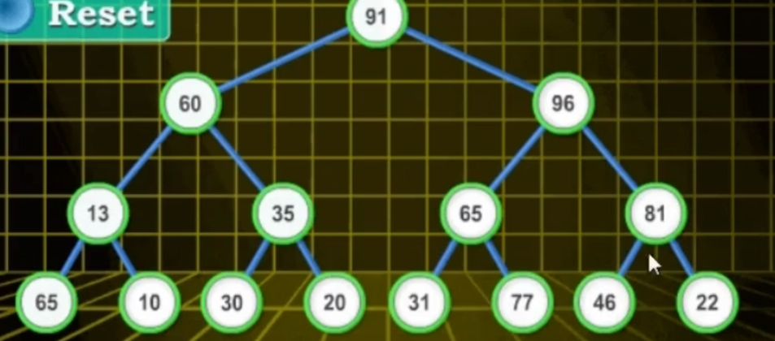
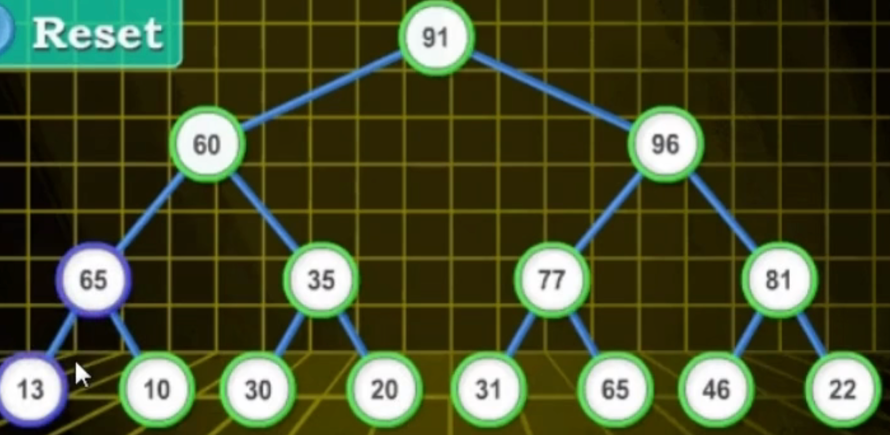

2. 从倒数第三层最后一个结点96开始
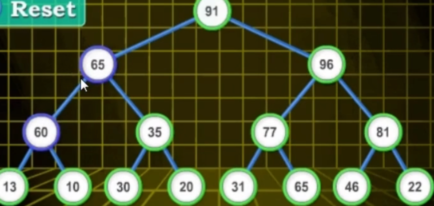

3. 轮到第一层
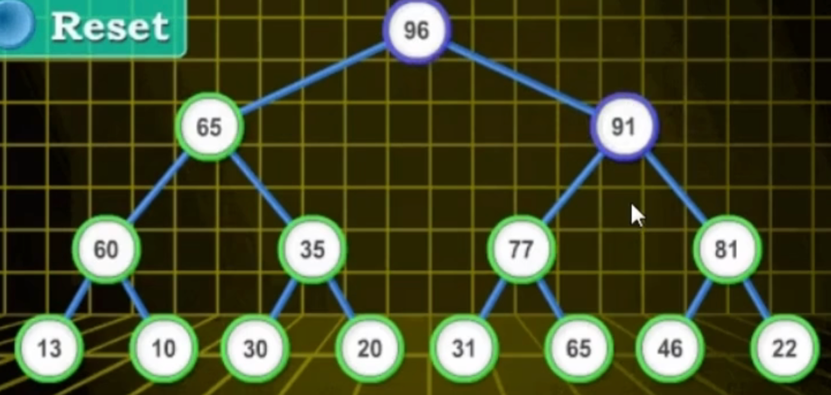

4. 第一个和最后一个，即96和22交换
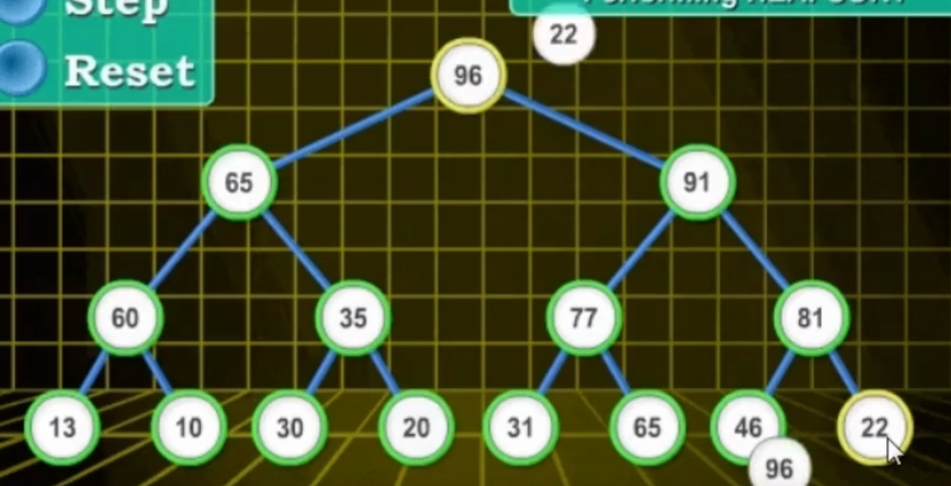

5. 拿走96，然后进行22元素的下沉(heapify--->理解为元素的下沉)
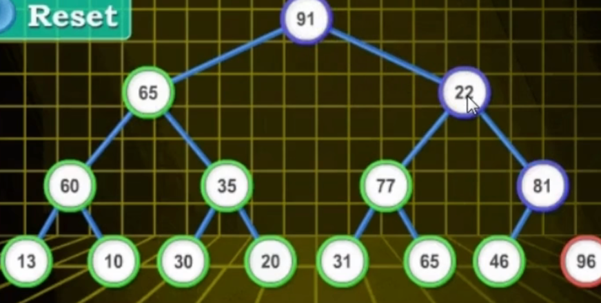
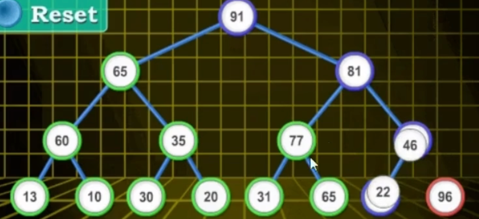

6. 91和22进行交换，重复5的操作进行下沉
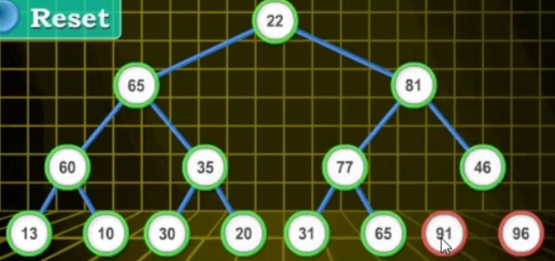
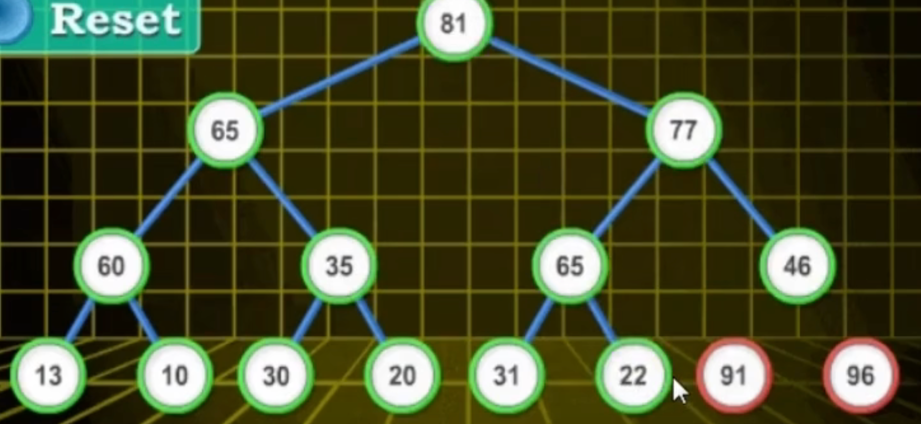

7. 最后结果


## 8 计数排序 (Counting Sort)

是插入排序的优化版，算法过程：

1. 找出待排序的数组中最大和最小的元素
2. 统计数组中每个值i出现的次数，存入计数数组的第i项
3. 反向填充目标数组：将每个元素i放在新数组的第C(i)项，每放一个元素就将C(i)减去1


## 参考
- [十大经典排序算法总结:java 实现](https://javaguide.cn/cs-basics/algorithms/10-classical-sorting-algorithms.html)