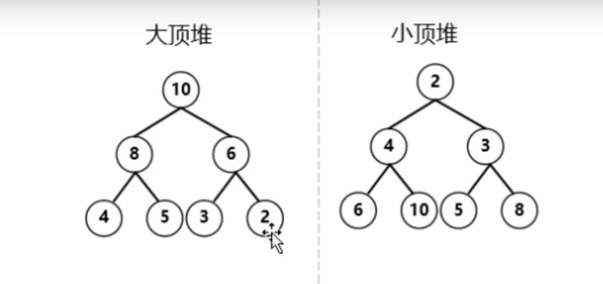
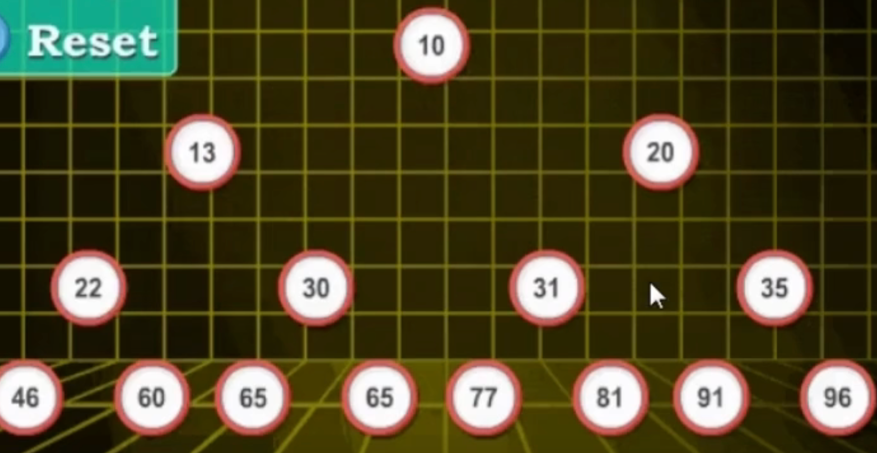

<!-- START doctoc generated TOC please keep comment here to allow auto update -->
<!-- DON'T EDIT THIS SECTION, INSTEAD RE-RUN doctoc TO UPDATE -->
**Table of Contents**  *generated with [DocToc](https://github.com/thlorenz/doctoc)*

- [排序](#%E6%8E%92%E5%BA%8F)
  - [1. 选择排序](#1-%E9%80%89%E6%8B%A9%E6%8E%92%E5%BA%8F)
  - [2. 插入排序](#2-%E6%8F%92%E5%85%A5%E6%8E%92%E5%BA%8F)
  - [3. 希尔排序](#3-%E5%B8%8C%E5%B0%94%E6%8E%92%E5%BA%8F)
  - [4. 归并排序](#4-%E5%BD%92%E5%B9%B6%E6%8E%92%E5%BA%8F)
  - [5. 堆排序](#5-%E5%A0%86%E6%8E%92%E5%BA%8F)
    - [分类](#%E5%88%86%E7%B1%BB)
    - [过程](#%E8%BF%87%E7%A8%8B)

<!-- END doctoc generated TOC please keep comment here to allow auto update -->

# 排序

## 1. 选择排序

## 2. 插入排序

## 3. 希尔排序

1. 分组

2. 取出数据进行插入排序

3. 分组间隔变小

4. 最后插入排序

## 4. 归并排序

1. 切分成子序列
2. 两两排序

## 5. 堆排序

可以用数组下标表示

### 分类
大顶堆: 用于升序
小顶堆： 用于降序

### 过程

1. 从倒数第二层最后一个结点46开始

2. 从倒数第三层最后一个结点96开始

3. 轮到第一层

4. 第一个和最后一个，即96和22交换

5. 拿走96，然后进行22元素的下沉(heapify--->理解为元素的下沉)

6. 91和22进行交换，重复5的操作进行下沉

7. 最后结果

