# 查找
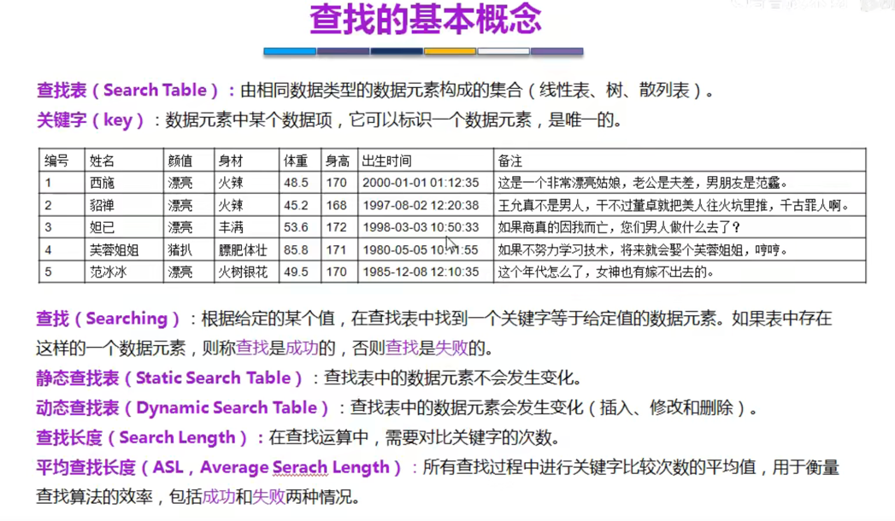

## 顺序查找

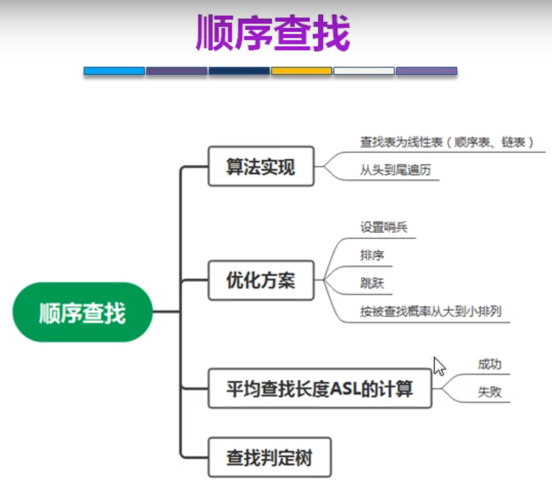

### 优化方式
1. 哨兵
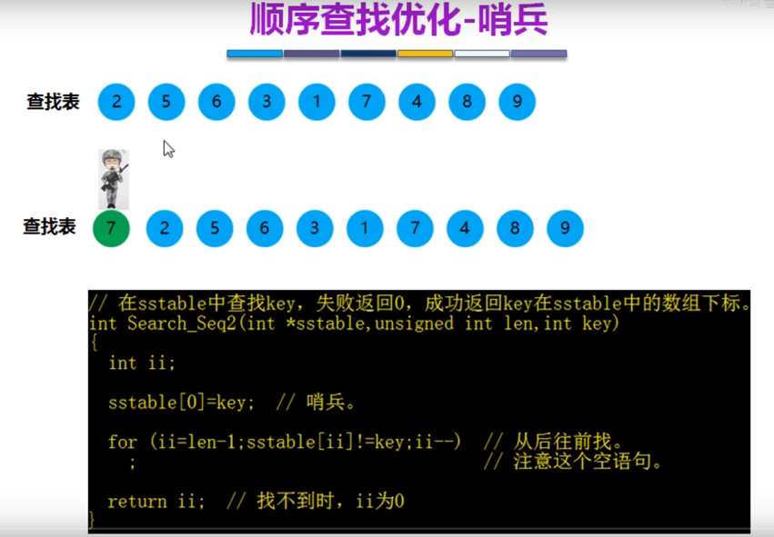
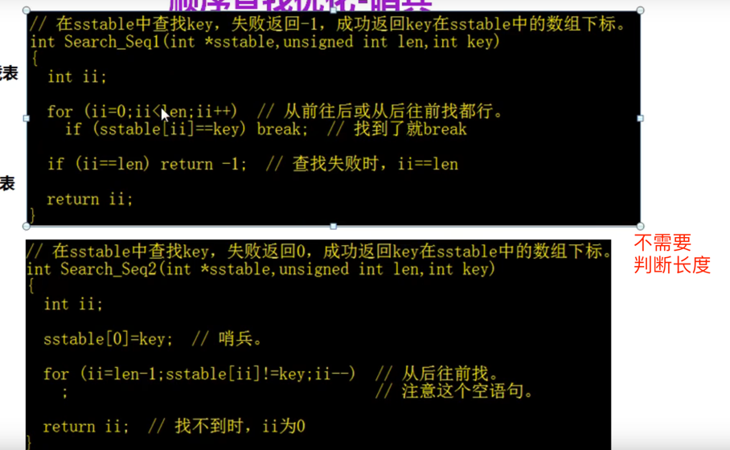

2. 先排序
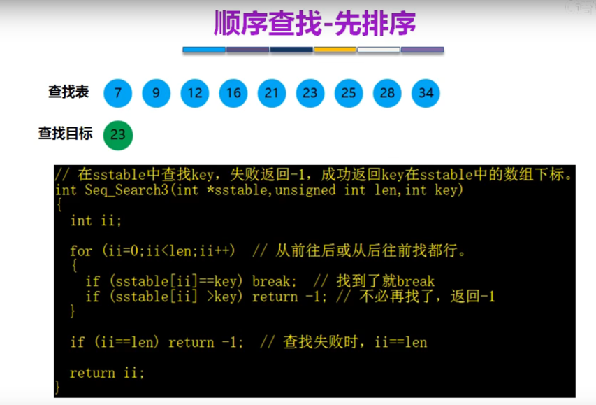

3. 跳跃
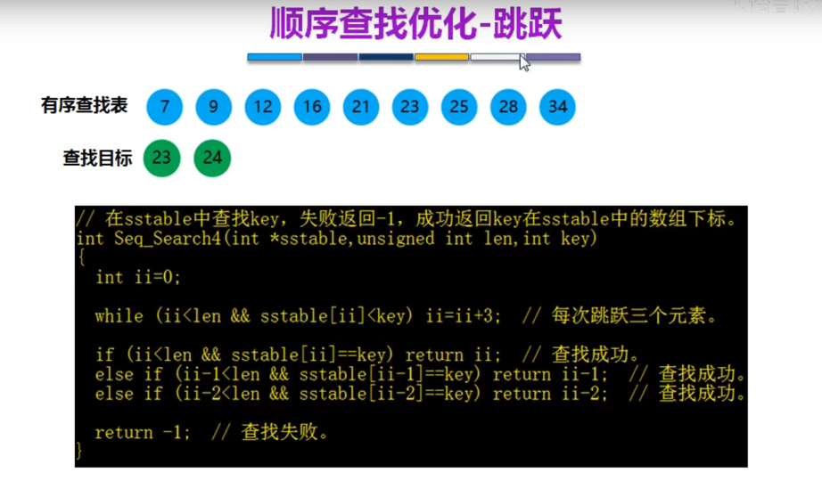

## 查找表的效率
1. 被查找的概率相同  
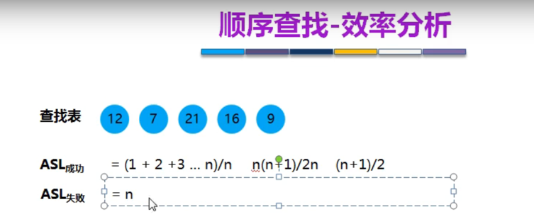
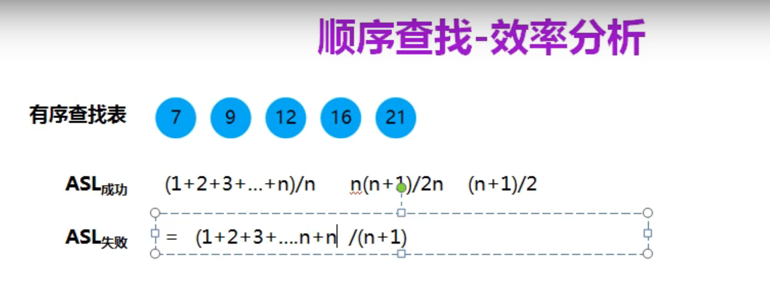

查找判定树来分析效率  
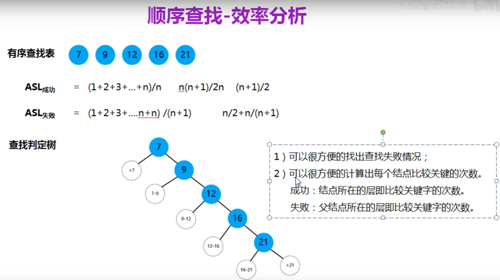

跳跃查找判定树
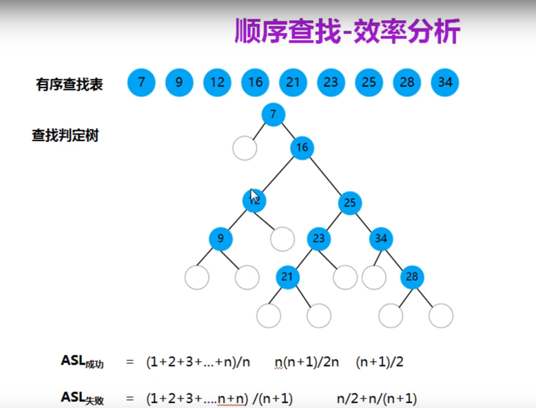
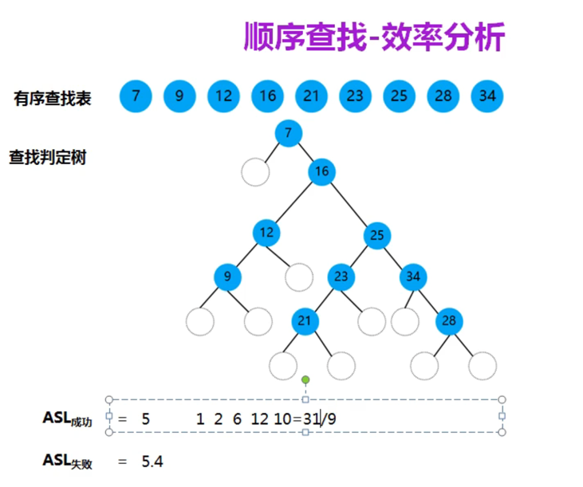
- ASL成功：没有跳跃5 跳跃3.44
- ASL失败：没有跳跃5.4 跳跃4

2. 被查找的概率不同
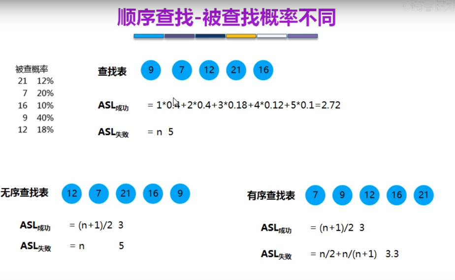

## 折半查找
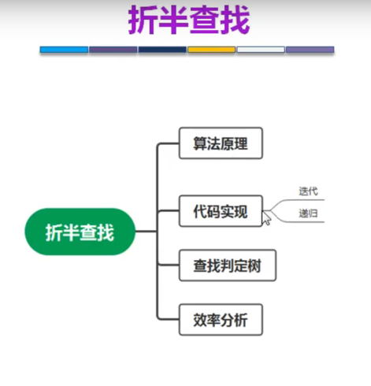
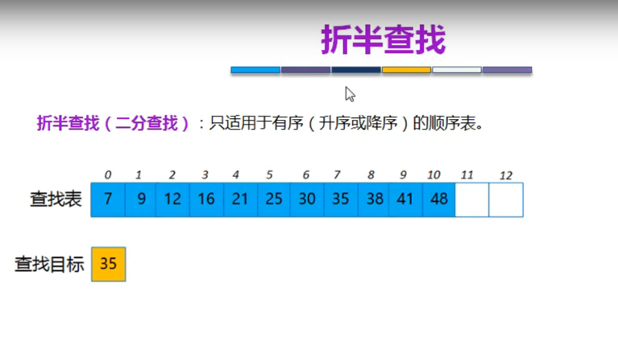
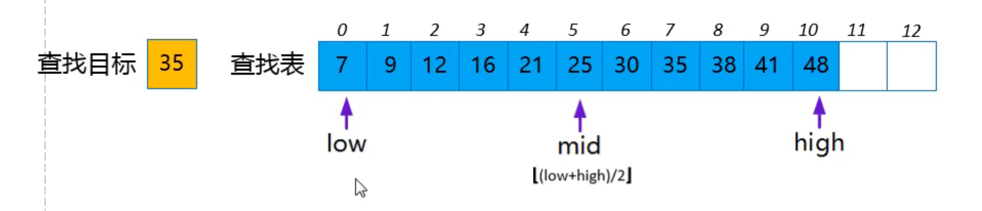
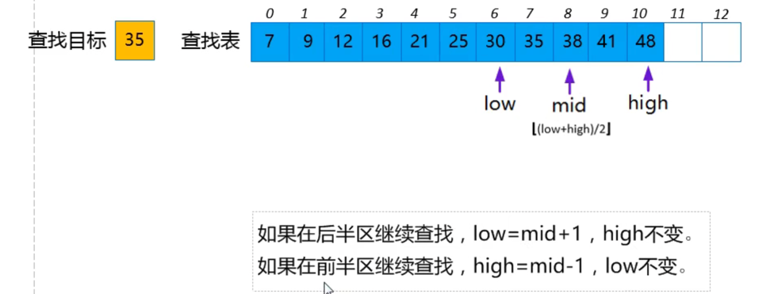
没有找到：high>low

### 效率分析
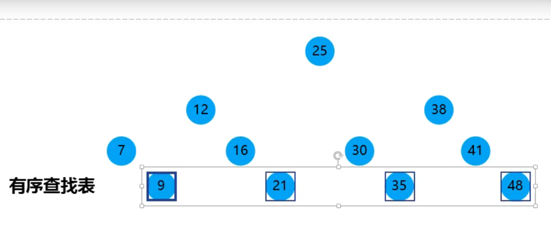
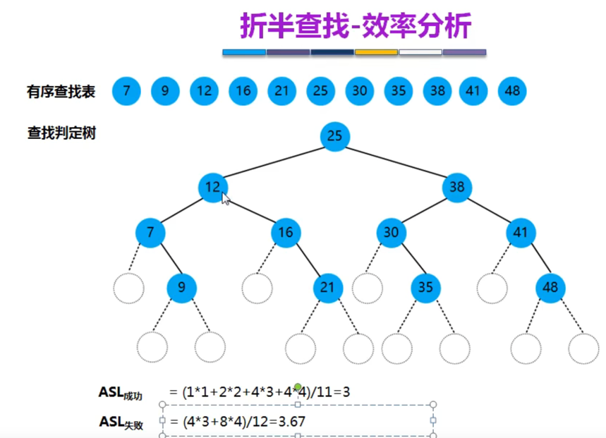 
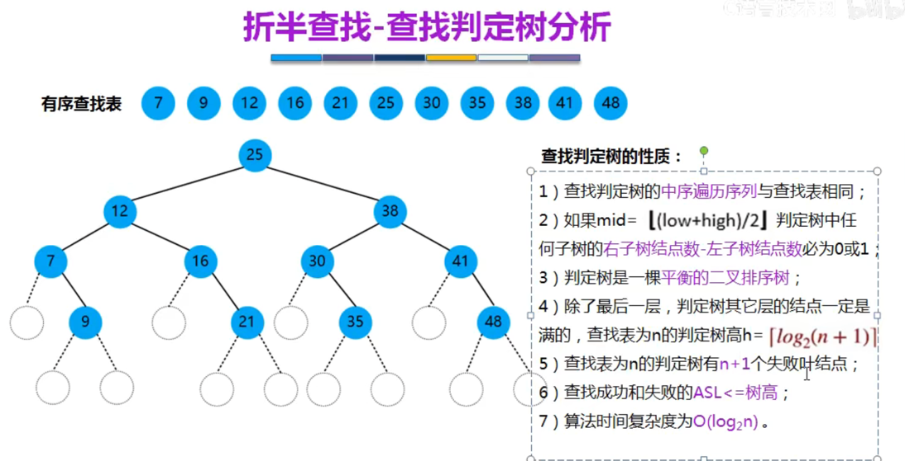

## 分块查找
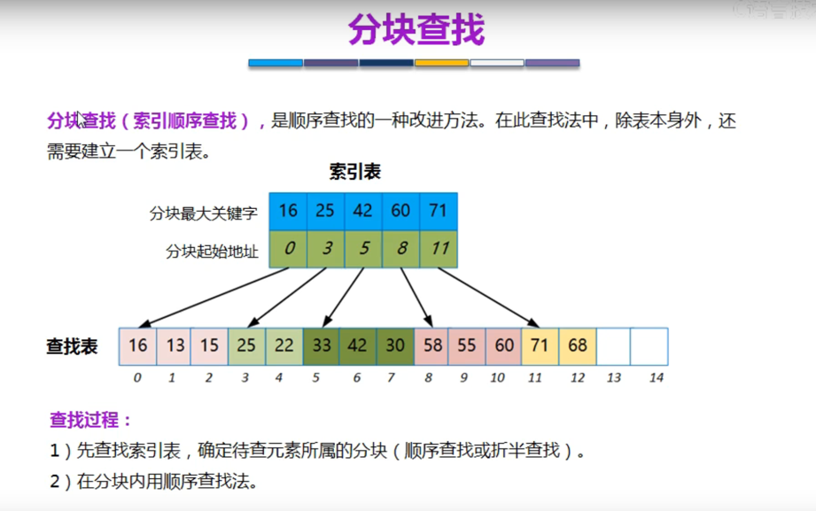
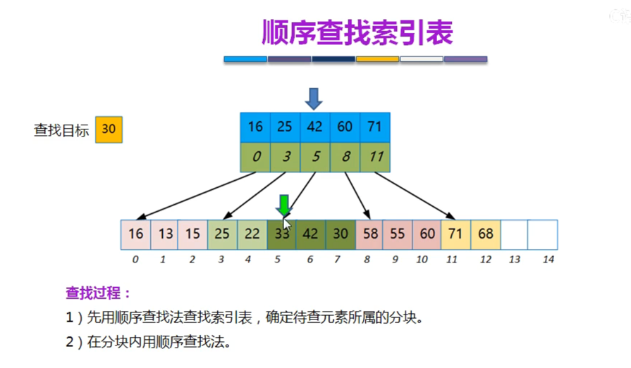
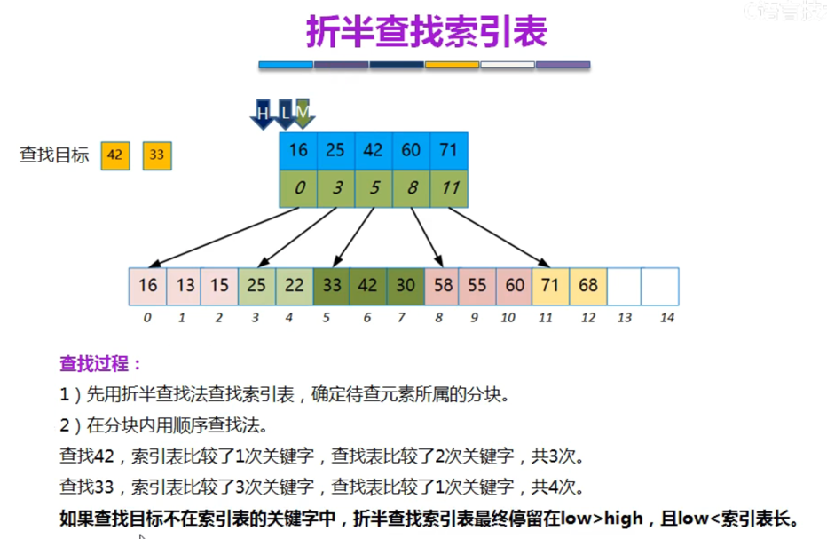
块内无序，块间有序

### 效率分析
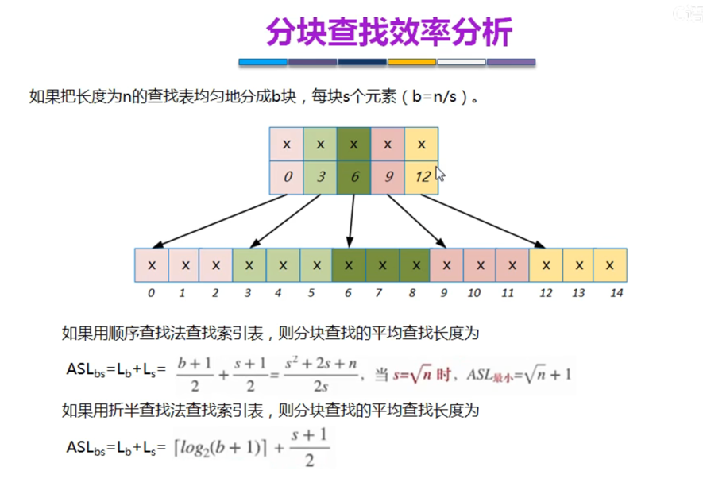
