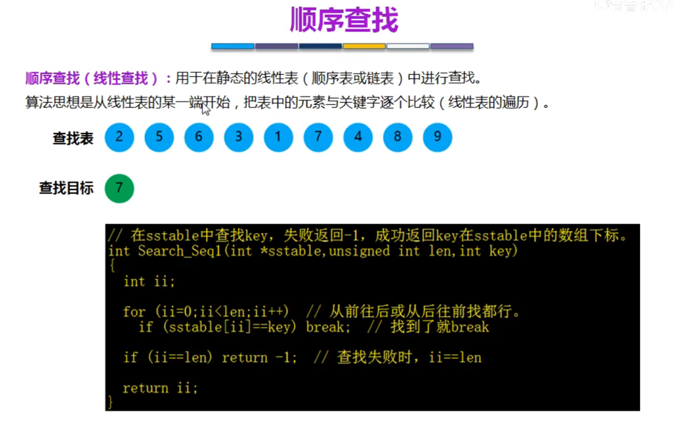

<!-- START doctoc generated TOC please keep comment here to allow auto update -->
<!-- DON'T EDIT THIS SECTION, INSTEAD RE-RUN doctoc TO UPDATE -->
**Table of Contents**  *generated with [DocToc](https://github.com/thlorenz/doctoc)*

- [查找](#%E6%9F%A5%E6%89%BE)
  - [常用查找](#%E5%B8%B8%E7%94%A8%E6%9F%A5%E6%89%BE)
    - [1 顺序查找](#1-%E9%A1%BA%E5%BA%8F%E6%9F%A5%E6%89%BE)
  - [查找表的效率](#%E6%9F%A5%E6%89%BE%E8%A1%A8%E7%9A%84%E6%95%88%E7%8E%87)
    - [2 折半查找(二分查找)](#2-%E6%8A%98%E5%8D%8A%E6%9F%A5%E6%89%BE%E4%BA%8C%E5%88%86%E6%9F%A5%E6%89%BE)
    - [6 分块查找](#6-%E5%88%86%E5%9D%97%E6%9F%A5%E6%89%BE)
  - [参考](#%E5%8F%82%E8%80%83)

<!-- END doctoc generated TOC please keep comment here to allow auto update -->

# 查找
查找是在大量的信息中寻找一个特定的信息元素。

## 常用查找

1. 顺序查找（Sequential Search）：逐个遍历数据集来查找目标元素，时间复杂度为O(n)。
2. 二分查找（Binary Search）：在有序数据集合中，从中间位置作为起点不断划分区间并查找，时间复杂度为O(log n)。
3. 插值查找（Interpolation Search）：在有序数据集合中，根据目标元素与数据集合首尾之间的差值，利用插值估算目标元素的位置
4. 斐波那契查找（Fibonacci Search）：在有序数据集合中，根据斐波那契数列调整中间点的位置来查找，时间复杂度为O(log n)
5. B树查找（B-Tree Search）：在平衡的B树中查找元素，时间复杂度为O(log n)。
6. 分块查找（Block Search）：将数据集合划分为若干块，在每个块中进行二分查找或顺序查找，时间复杂度为O(sqrt(n))
7. 哈希查找（Hash Search）：通过哈希函数将元素映射到哈希表中，并在哈希表中查找元素，时间复杂度为O(1)

二分查找、插值查找以及斐波那契查找都可以归为一类——插值查找。 插值查找和斐波那契查找是在二分查找的基础上的优化查找算法。

### 1 顺序查找
顺序查找也称为线形查找，属于无序查找算法。从数据结构线形表的一端开始，顺序扫描，依次将扫描到的结点关键字与给定值k相比较，若相等则表示查找成功；若扫描结束仍没有找到关键字等于k的结点，表示查找失败。

顺序查找算法适用于以下情况：

* 数据规模较小：顺序查找算法适用于数据规模较小的情况，因为时间复杂度为O(n)，当数据量较大时性能不佳。
* 数据无序：若数据是无序的，则顺序查找算法比较适合，因为无序数据无法进行二分查找或其他更高效的算法。
* 数据存储在链表结构中：由于顺序查找算法只需要访问每一个节点，因此适用于存储在链表结构中的数据。
* 查找概率较低：当查找某个元素的概率较低时，使用顺序查找算法可以在最坏情况下也不会造成太大的损失。

优化方式
1. 哨兵

2. 先排序

3. 跳跃

查找表的效率
1. 被查找的概率相同  

查找判定树来分析效率  

跳跃查找判定树

- ASL成功：没有跳跃5 跳跃3.44
- ASL失败：没有跳跃5.4 跳跃4

2. 被查找的概率不同

### 2 折半查找(二分查找)

用给定值k先与中间结点的关键字比较，中间结点把线形表分成两个子表，若相等则查找成功；若不相等，再根据k与该中间结点关键字的比较结果确定下一步查找哪个子表，这样递归进行，直到查找到或查找结束发现表中没有这样的结点。

> 折半查找的前提条件是需要有序表顺序存储（即顺序表），对于静态查找表，一次排序后不再变化，折半查找能得到不错的效率。
> 但对于需要频繁执行插入或删除操作的数据集来说，维护有序的排序会带来不小的工作量，那就不建议使用。——《大话数据结构》

没有找到的判断边界：high>low

效率分析

 

折半查找是一棵二叉排序树，每个根结点的值都大于左子树的所有结点的值，小于右子树所有结点的值。

### 3 插值查找

插值查找算法适用于以下情况：

* 数据分布均匀的有序数组，且数据量较大。
* 数组中的数据有序排列，但是数据之间的差值不是固定的。比如：学生成绩（90、92、95、96、98、98、99、100）。
* 由于每次查找前都会根据查找值的大小动态计算查找的位置，因此适用于数据频繁变动的场景，比如动态更新的数据库

### 4 斐波那契查找算法

斐波那契查找算法通常用于有序数列的查找操作，特别是针对大型有序数列的查找。这种算法常常被用于数据库索引、电话簿、目录和其他类似的应用程序中，因为它具有较好的时间复杂度和空间复杂度。具体应用场景如下：

* 在大型数据集中进行查找时，斐波那契查找算法比二分查找算法更快。
* 斐波那契查找算法可用于从有序数列中查找给定值的位置，这些数列可以是数组、链表、二叉搜索树或其他数据结构。
* 斐波那契查找算法可以优化对数据库索引的查找操作，这可以提高数据库查询的性能。
* 斐波那契查找算法还可以用于图形搜索，例如在网格或树形结构中查找最短路径。

复杂度分析

二叉树查找算法的复杂度分析取决于二叉树的结构和被查找的元素所在的位置。假设二叉树的节点个数为n，则二叉树的高度不超过log(n)，因此对于一棵平衡二叉树而言，时间复杂度为O(log(n))，是一种较高效的查找算法。

二叉树查找算法常用于数据的存储和查找。以下是一些应用场景：

* 字典查找：使用二叉查找树可以快速地查找到某个单词是否在字典中存在。
* 数据库索引：数据库中的索引和二叉查找树的结构非常相似，可以用二叉查找树来实现数据库的索引功能。
* 文件系统：文件系统中的目录树可以被看作是一种二叉查找树结构，可以使用二叉查找树来实现文件的查找、删除和修改等操作。
* 路由表：网络路由表中的路由器也可以被看作是一种二叉查找树结构，可以使用二叉查找树来实现路由表的查询。
* 游戏AI：在游戏中，可以使用二叉查找树来实现AI的行为决策，例如确定目标、寻找路径等

### 5 二叉树查找

### 6 分块查找

块内无序，块间有序

效率分析

## 参考
1 [七大查找算法(二)-二分查找](https://cloud.tencent.com/developer/article/2358860?areaId=106001)