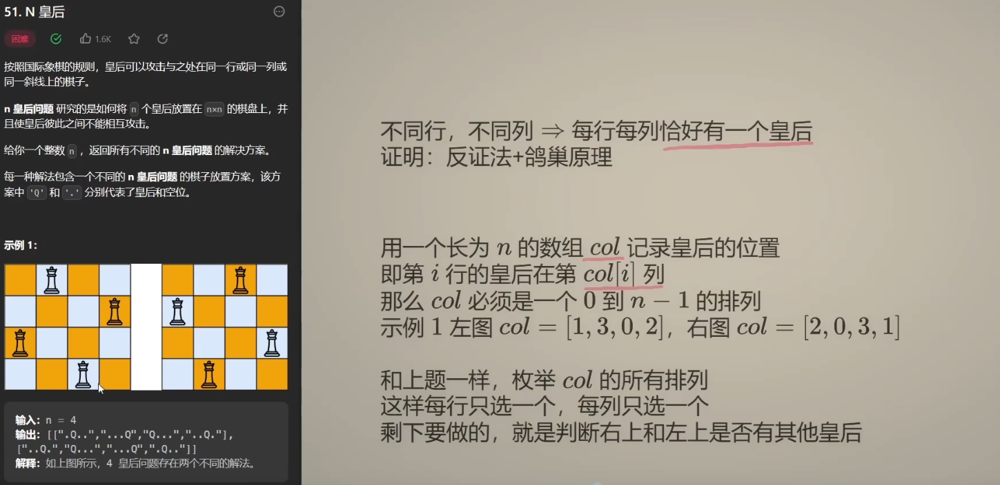
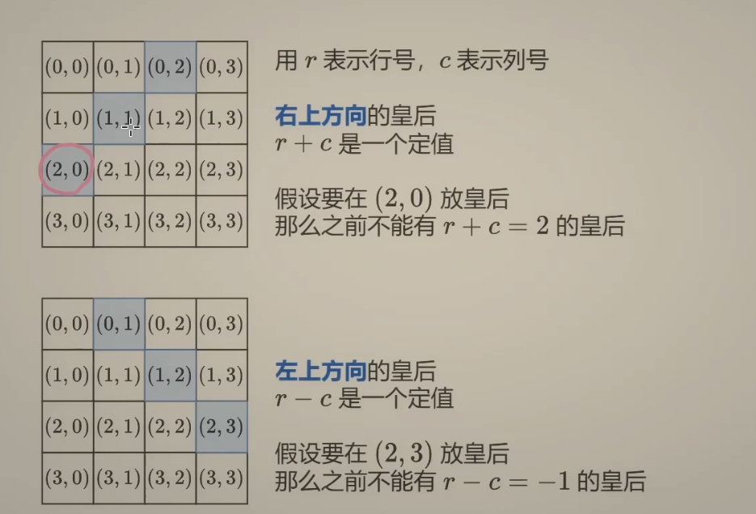
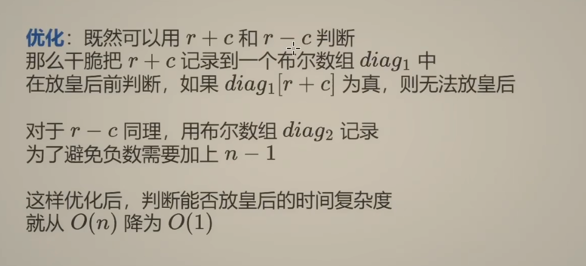

<!-- START doctoc generated TOC please keep comment here to allow auto update -->
<!-- DON'T EDIT THIS SECTION, INSTEAD RE-RUN doctoc TO UPDATE -->
**Table of Contents**  *generated with [DocToc](https://github.com/thlorenz/doctoc)*

- [Exhaustive Search 穷举法(Brute-Force蛮力法)](#exhaustive-search-%E7%A9%B7%E4%B8%BE%E6%B3%95brute-force%E8%9B%AE%E5%8A%9B%E6%B3%95)
  - [特点](#%E7%89%B9%E7%82%B9)
    - [优点](#%E4%BC%98%E7%82%B9)
    - [缺点](#%E7%BC%BA%E7%82%B9)
    - [剪枝策略](#%E5%89%AA%E6%9E%9D%E7%AD%96%E7%95%A5)
  - [应用](#%E5%BA%94%E7%94%A8)
  - [解决方式](#%E8%A7%A3%E5%86%B3%E6%96%B9%E5%BC%8F)

<!-- END doctoc generated TOC please keep comment here to allow auto update -->

# Exhaustive Search 穷举法(Brute-Force蛮力法)

穷举法是利用计算机运算速度快、精确度高的特点，对要解决问题的所有可能情况，一个不漏地进行检验，从中找出符合要求的答案，因此枚举法是通过牺牲时间来换取答案的全面性

## 特点
### 优点

由于穷举法一般是现实生活中问题的“直译”，因此比较直观，易于理解；穷举法建立在考察大量状态、甚至是穷举所有状态的基础上，所以算法的正确性比较容易证明。

### 缺点
用穷举法解题的最大的缺点是运算量比较大，解题效率不高，如果穷举范围太大（一般以不超过两百万次为限），在时间上就难以承受。

### 剪枝策略
对解空间穷举搜索时，如果有一些状态节点可以根据问题提供的信息明确地被判定为不可能演化出最优解，也就是说，从此节点开始遍历得到的子树，可能存在正确的解，但是肯定不是最优解，就可以跳过此状态节点的遍历，这将极大地提高算法的执行效率，这就是剪枝策略

## 应用
1. 排序
2. 顺序查找
3. 字符串匹配
4. 最近点对问题

5. 凸包问题

6. traveling salesman problem 

7. 背包问题--同理子集问题

8. 迷宫问题

9. N皇后问题

## 解决方式
多步决策-->空间状态搜索

- 线型

- 树型

- 图形

处理方式

1. DFS 深度优先搜索（回溯法）
