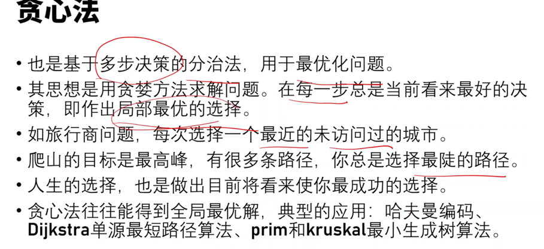
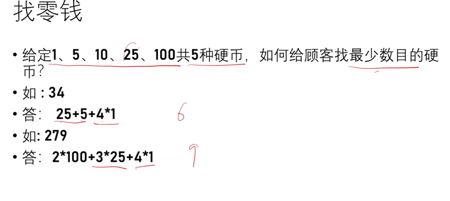

<!-- START doctoc generated TOC please keep comment here to allow auto update -->
<!-- DON'T EDIT THIS SECTION, INSTEAD RE-RUN doctoc TO UPDATE -->
**Table of Contents**  *generated with [DocToc](https://github.com/thlorenz/doctoc)*

- [贪心法（Greedy Method 贪婪法）](#%E8%B4%AA%E5%BF%83%E6%B3%95greedy-method-%E8%B4%AA%E5%A9%AA%E6%B3%95)
  - [步骤](#%E6%AD%A5%E9%AA%A4)
  - [应用](#%E5%BA%94%E7%94%A8)
    - [1 找零钱问题](#1-%E6%89%BE%E9%9B%B6%E9%92%B1%E9%97%AE%E9%A2%98)
    - [2 背包问题](#2-%E8%83%8C%E5%8C%85%E9%97%AE%E9%A2%98)

<!-- END doctoc generated TOC please keep comment here to allow auto update -->

# 贪心法（Greedy Method 贪婪法）

一般将求解过程分成若干个步骤，但每个步骤都应用贪心原则，选取当前状态下最好/最优的选择（局部最有利的选择），并以此希望最后堆叠出的结果也是最好/最优的解。

## 步骤
贪婪法的基本步骤：

步骤1：从某个初始解出发；
步骤2：采用迭代的过程，当可以向目标前进一步时，就根据局部最优策略，得到一部分解，缩小问题规模；
步骤3：将所有解综合起来。

## 应用
### 1 找零钱问题
假设1元、5元、10元、20元、50元、100元的纸币分别有c0, c1, c2, c3, c4, c5张。现在要用这些钱来支付K元，至少要用多少张纸币

### 2 背包问题

