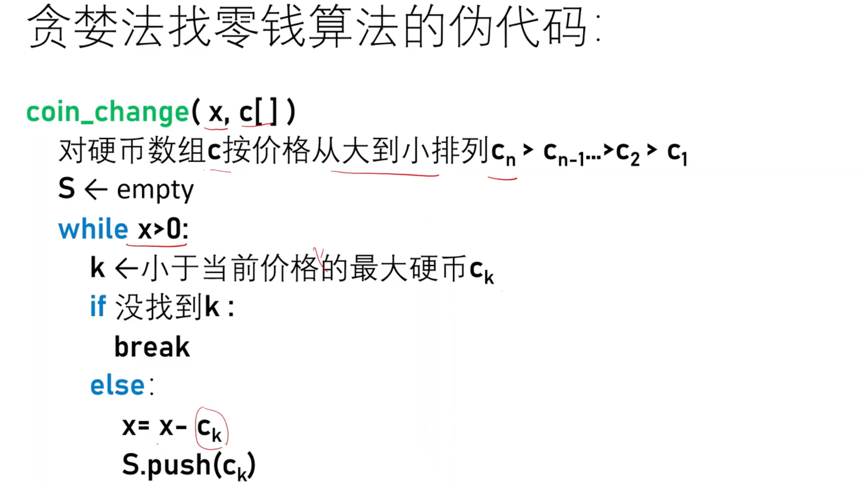
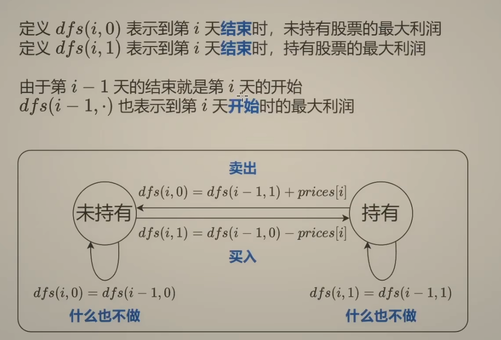

<!-- START doctoc generated TOC please keep comment here to allow auto update -->
<!-- DON'T EDIT THIS SECTION, INSTEAD RE-RUN doctoc TO UPDATE -->
**Table of Contents**  *generated with [DocToc](https://github.com/thlorenz/doctoc)*

- [贪心法（Greedy Method 贪婪法）](#%E8%B4%AA%E5%BF%83%E6%B3%95greedy-method-%E8%B4%AA%E5%A9%AA%E6%B3%95)
  - [步骤](#%E6%AD%A5%E9%AA%A4)
  - [应用](#%E5%BA%94%E7%94%A8)
    - [1 找零钱问题](#1-%E6%89%BE%E9%9B%B6%E9%92%B1%E9%97%AE%E9%A2%98)
    - [2 买卖股票](#2-%E4%B9%B0%E5%8D%96%E8%82%A1%E7%A5%A8)

<!-- END doctoc generated TOC please keep comment here to allow auto update -->

# 贪心法（Greedy Method 贪婪法）

一般将求解过程分成若干个步骤，但每个步骤都应用贪心原则，选取当前状态下最好/最优的选择（局部最有利的选择），并以此希望最后堆叠出的结果也是最好/最优的解。

## 步骤
贪婪法的基本步骤：

步骤1：从某个初始解出发；
步骤2：采用迭代的过程，当可以向目标前进一步时，就根据局部最优策略，得到一部分解，缩小问题规模；
步骤3：将所有解综合起来。

## 应用
### 1 找零钱问题
假设1元、5元、10元、20元、50元、100元的纸币分别有c0, c1, c2, c3, c4, c5张。现在要用这些钱来支付K元，至少要用多少张纸币

### 2 买卖股票 

1 [不限交易次数](03_greedy_method/122_best_time_to_buy_and_sell_stock_II_test.go)

prices = [7,1,5,3,6,4]

从第 0 天开始到第 5 天结束时的利润 = 从第 0 天开始到第 4 天结束时的利润 + 第 5 天的利润 

- 0：代表未持有
- 1：代表持有

状态转换: 
- 未持有 --(买入)--> 持有   dfs(i,1)=dfs(i-1,0)-price[i]
- 持有 --(卖出-)--> 未持有  dfs(i,0)=dfs(i-1,1)+price[i]
- 未持有(do nothing) dfs(i,0) = dfs(i-1,0)
- 持有(do nothing)  dfs(i,1) = dfs(i-1,1)

状态机：状态之间转换关系的图

由于第 i-1 天的结束是第i天的开始，所以 dfs(i-1,*)表示第i天开始时的最大利润。

最后一天肯定是卖出股票，获取最大利益, 所以入口 = dfs(n-1,0).

2 [冷冻期](03_greedy_method/122_best_time_to_buy_and_sell_stock_II_test.go)

3 限制交易次数

