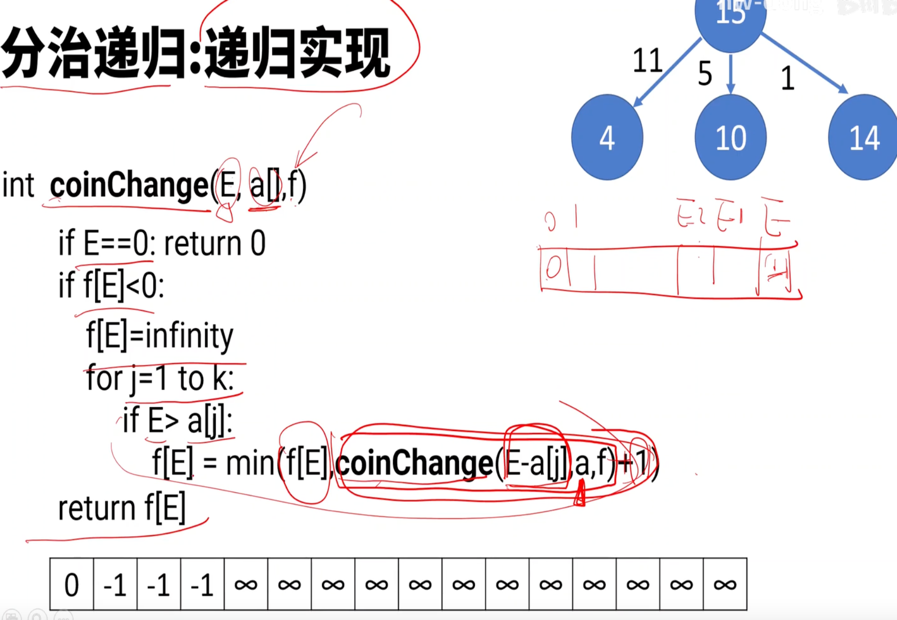
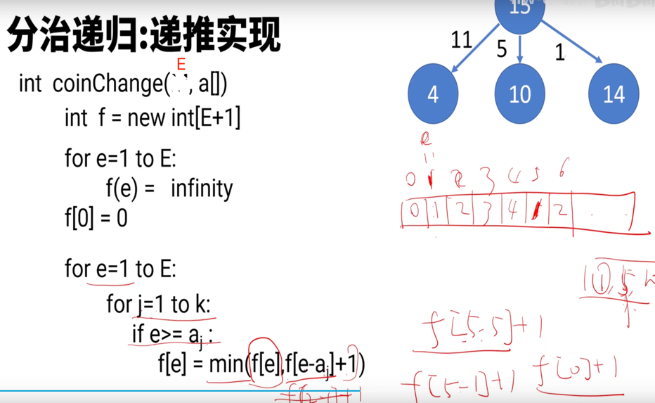
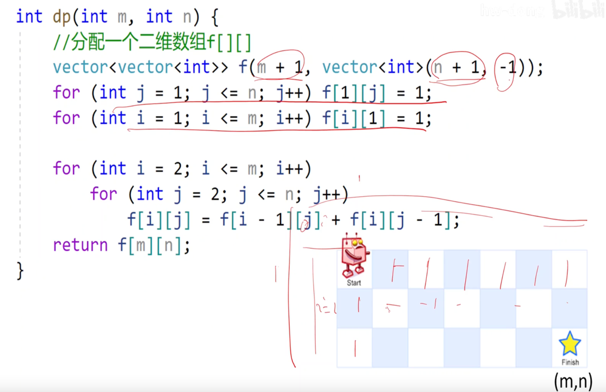

<!-- START doctoc generated TOC please keep comment here to allow auto update -->
<!-- DON'T EDIT THIS SECTION, INSTEAD RE-RUN doctoc TO UPDATE -->
**Table of Contents**  *generated with [DocToc](https://github.com/thlorenz/doctoc)*

- [dynamic programming 动态规划](#dynamic-programming-%E5%8A%A8%E6%80%81%E8%A7%84%E5%88%92)
  - [特征](#%E7%89%B9%E5%BE%81)
  - [场景](#%E5%9C%BA%E6%99%AF)
    - [1 编辑距离-->转成插入insert,删除delete，替换switch](#1-%E7%BC%96%E8%BE%91%E8%B7%9D%E7%A6%BB--%E8%BD%AC%E6%88%90%E6%8F%92%E5%85%A5insert%E5%88%A0%E9%99%A4delete%E6%9B%BF%E6%8D%A2switch)
    - [2 爬台阶](#2-%E7%88%AC%E5%8F%B0%E9%98%B6)
    - [3 找零钱](#3-%E6%89%BE%E9%9B%B6%E9%92%B1)
    - [4 0-1 背包](#4-0-1-%E8%83%8C%E5%8C%85)
    - [4 机器人走法](#4-%E6%9C%BA%E5%99%A8%E4%BA%BA%E8%B5%B0%E6%B3%95)
  - [解题思路](#%E8%A7%A3%E9%A2%98%E6%80%9D%E8%B7%AF)
  - [参考](#%E5%8F%82%E8%80%83)

<!-- END doctoc generated TOC please keep comment here to allow auto update -->

# dynamic programming 动态规划

将大规范的问题**转换**成小规模的问题，并且**缓存**中间结果。
动态规范 = 分治递归 + 记忆存储

## 特征

> leetcode原题：一只青蛙一次可以跳上1级台阶，也可以跳上2级台阶。求该青蛙跳上一个 10 级的台阶总共有多少种跳法。

动态规划有几个典型特征，最优子结构、状态转移方程、边界、重叠子问题。在青蛙跳阶问题中：

* f(n-1)和f(n-2) 称为 f(n) 的最优子结构
* f(n)= f（n-1）+f（n-2）就称为状态转移方程
* f(1) = 1, f(2) = 2 就是边界啦
* 比如f(10)= f(9)+f(8),f(9) = f(8) + f(7) ,f(8)就是重叠子问题。

动态规划的思路：

- 穷举分析
- 确定边界 
- 找出规律，确定最优子结构 
- 写出状态转移方程

## 场景
如果一个问题，可以把所有可能的答案穷举出来，并且穷举出来后，发现存在重叠子问题，就可以考虑使用动态规划。

比如一些求最值的场景，如最长递增子序列、最小编辑距离、背包问题、凑零钱问题等等，都是动态规划的经典应用场景。

### 1 编辑距离

### 2 爬台阶

要么n-1台阶上去，要么n-2台阶上去

### 3 找零钱

分治递归

递归实现  

递推实现

### 4 0-1 背包
[背包理论基础01背包-1.md](https://github.com/youngyangyang04/leetcode-master/blob/master/problems/%E8%83%8C%E5%8C%85%E7%90%86%E8%AE%BA%E5%9F%BA%E7%A1%8001%E8%83%8C%E5%8C%85-1.md)

- 最多装 capacity, 求最大值 dfs(i,c)=max(dfs(i-1.c),dfs(i-1,c-w[i],v[i])
- 正好装 capacity, 求方案数量 dfs(i,c)=dfs(i-1,c)+dfs(i-1,c-w[i])
- 至少装 capacity, 求最小值 dfs(i,c)=min(dfs(i-1.c),dfs(i-1,c-w[i],v[i])

### 5 机器人走法

递归算法：优化代码

递推算法

### 6 [打家劫舍](04_dynamic_programming/198_house_robber_test.go)

可以看到 01->2 ,12->3, 32->4, 所以留下归

## 解题思路

优化前代码: 递归自顶向下

优化后代码：递推自底向上

节省空间：交替滚动

## 参考
- [动态规划详解](https://juejin.cn/post/6951922898638471181)