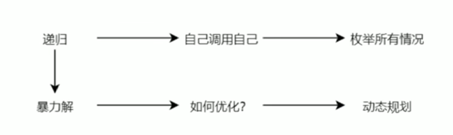
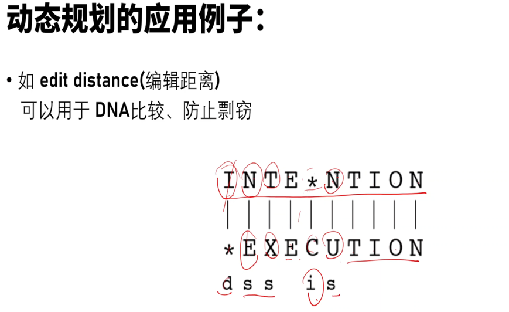
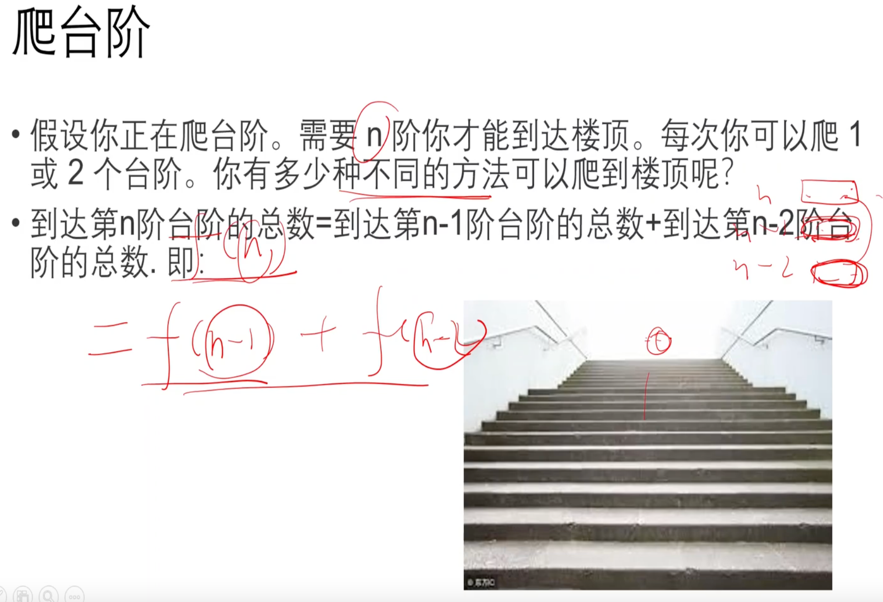
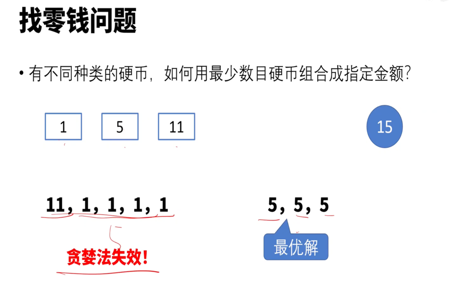
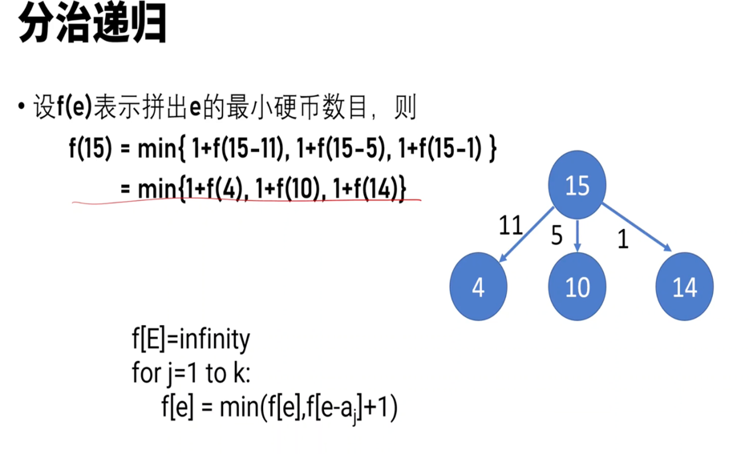
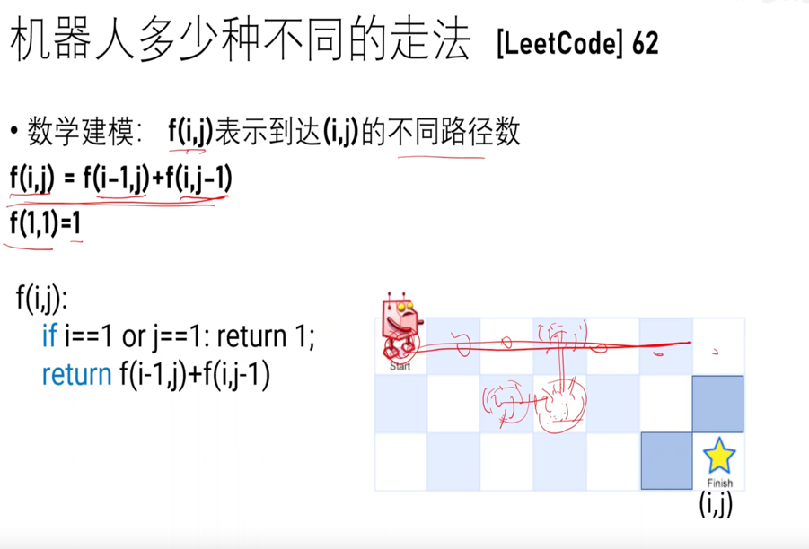
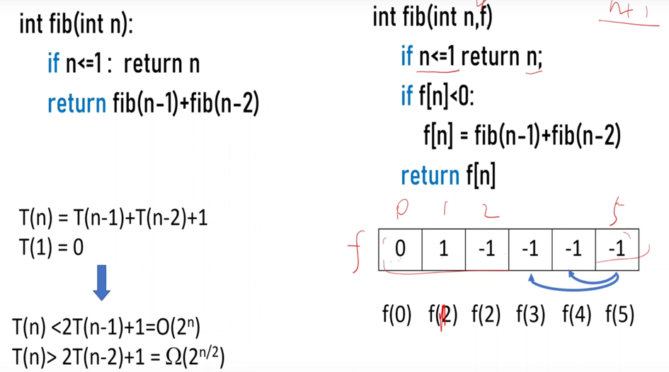

<!-- START doctoc generated TOC please keep comment here to allow auto update -->
<!-- DON'T EDIT THIS SECTION, INSTEAD RE-RUN doctoc TO UPDATE -->
**Table of Contents**  *generated with [DocToc](https://github.com/thlorenz/doctoc)*

- [dynamic programming 动态规划](#dynamic-programming-%E5%8A%A8%E6%80%81%E8%A7%84%E5%88%92)
  - [特征](#%E7%89%B9%E5%BE%81)
  - [场景](#%E5%9C%BA%E6%99%AF)
  - [分类](#%E5%88%86%E7%B1%BB)
    - [线性 DP](#%E7%BA%BF%E6%80%A7-dp)
      - [1 编辑距离](#1-%E7%BC%96%E8%BE%91%E8%B7%9D%E7%A6%BB)
      - [2 LCS 最长公共子序列--非连续](#2-lcs-%E6%9C%80%E9%95%BF%E5%85%AC%E5%85%B1%E5%AD%90%E5%BA%8F%E5%88%97--%E9%9D%9E%E8%BF%9E%E7%BB%AD)
    - [区间 DP](#%E5%8C%BA%E9%97%B4-dp)
      - [最长回文子序列](#%E6%9C%80%E9%95%BF%E5%9B%9E%E6%96%87%E5%AD%90%E5%BA%8F%E5%88%97)
    - [状态机 DP](#%E7%8A%B6%E6%80%81%E6%9C%BA-dp)
    - [树形 DP](#%E6%A0%91%E5%BD%A2-dp)
    - [2 爬台阶](#2-%E7%88%AC%E5%8F%B0%E9%98%B6)
    - [3 找零钱](#3-%E6%89%BE%E9%9B%B6%E9%92%B1)
    - [4 0-1 背包](#4-0-1-%E8%83%8C%E5%8C%85)
    - [5 机器人走法](#5-%E6%9C%BA%E5%99%A8%E4%BA%BA%E8%B5%B0%E6%B3%95)
    - [6 打家劫舍](#6-%E6%89%93%E5%AE%B6%E5%8A%AB%E8%88%8D)
    - [8 最长递增子序列](#8-%E6%9C%80%E9%95%BF%E9%80%92%E5%A2%9E%E5%AD%90%E5%BA%8F%E5%88%97)
  - [解题思路](#%E8%A7%A3%E9%A2%98%E6%80%9D%E8%B7%AF)
  - [参考](#%E5%8F%82%E8%80%83)

<!-- END doctoc generated TOC please keep comment here to allow auto update -->

# dynamic programming 动态规划

将大规范的问题**转换**成小规模的问题，并且**缓存**中间结果。
动态规范 = 分治递归 + 记忆存储

## 特征

> leetcode原题：一只青蛙一次可以跳上1级台阶，也可以跳上2级台阶。求该青蛙跳上一个 10 级的台阶总共有多少种跳法。

动态规划有几个典型特征，最优子结构、状态转移方程、边界、重叠子问题。在青蛙跳阶问题中：

* f(n-1)和f(n-2) 称为 f(n) 的最优子结构
* f(n)= f（n-1）+f（n-2）就称为状态转移方程
* f(1) = 1, f(2) = 2 就是边界啦
* 比如f(10)= f(9)+f(8),f(9) = f(8) + f(7) ,f(8)就是重叠子问题。

动态规划的思路：

- 穷举分析
- 确定边界 
- 找出规律，确定最优子结构 
- 写出状态转移方程

## 场景
如果一个问题，可以把所有可能的答案穷举出来，并且穷举出来后，发现存在重叠子问题，就可以考虑使用动态规划。

## 分类
- 线性动态规划：具有「线性」阶段划分的动态规划方法统称为线性动态规划（简称为「线性 DP」）

- DP 状态机：往往是强调某一个阶段和上一个阶段之间的联系，且一个阶段里面有多种状态（比如说“有”和“无”）。

- 区间 DP: 从小区间转移到大区间

- 树形 DP

### 线性 DP

#### 1 [编辑距离](04_dynamic_programming/72_edit_distance_test.go)

s = horse
t = ros 

dfs(i,j)= 
  - s[i]=s[j]: dfs[i-1,j-1]
  - s[i]!=s[j]: min(dfs(i,j-1),dfs(i-1,j),dfs(i-1,j-1))+1

#### [2 LCS 最长公共子序列--非连续](04_dynamic_programming/1143_longest_common_subsequence_test.go)
- 子数组/子串 subarray/substring 连续
- 子序列 subsequence  非连续

s: 第一个字符串， 长度为 n
t: 第二个字符串， 长度为 m

子问题：都选==都不选

dfs[i,j]=
- max(dfs[i-1,j-1]+1)   s[i]=t[j]
- max(dfs[i-1,j],dfs[i,j-1])   s[i]!=t[j]

  

### 区间 DP

#### [最长回文子序列](04_dynamic_programming/516_longest_palindromic_subsequence_test.go)

思路一： s 与 s反转后的 LCS(最长公共子序列)

- S1=eacbba
- S2=abbcae

思路二： 从两侧缩小问题规模

因为 最左e != 最右a：所以不能同时选

dfs(i,j)=
- dfs(i+1,j-1)+2   s[i]=s[j]
- max(dfs(i+1,j),dfs(i,j-1))  s[i]!=s[j]

递归边界
- 如果剩余一个字母,为回文 dfs(i,i)=1
- 两个字母相同时,比如bb dfs(i,i+1)-->dfs(i+1,i)

### 状态机 DP 

### 树形 DP

[二叉树的直径](04_dynamic_programming/543_diameter_of_binary_tree_test.go)

[二叉树的最大路径和](04_dynamic_programming/543_diameter_of_binary_tree_test.go)

### 2 爬台阶

要么n-1台阶上去，要么n-2台阶上去

### 3 [找零钱](04_dynamic_programming/322_coin_change_test.go)

分治递归

递归实现  

递推实现

### 4 0-1 背包
[背包理论基础01背包-1.md](https://github.com/youngyangyang04/leetcode-master/blob/master/problems/%E8%83%8C%E5%8C%85%E7%90%86%E8%AE%BA%E5%9F%BA%E7%A1%8001%E8%83%8C%E5%8C%85-1.md)

- 最多装 capacity, 求最大值 dfs(i,c)=max(dfs(i-1.c),dfs(i-1,c-w[i],v[i])
- 正好装 capacity, 求方案数量 dfs(i,c)=dfs(i-1,c)+dfs(i-1,c-w[i])
- 至少装 capacity, 求最小值 dfs(i,c)=min(dfs(i-1.c),dfs(i-1,c-w[i],v[i]) 

 
完全背包：物品可以重复选

-  dfs(i,c)=max(dfs(i-1.c),dfs(i,c-w[i],v[i])

### 5 机器人走法

递归算法：优化代码

递推算法

### 6 [打家劫舍](04_dynamic_programming/198_house_robber_test.go)

加*缓存*优化后

可以看到 01->2 ,12->3, 32->4, 所以留下归

从后面开始算: dfs[i] = max(dfs(i-1), dfs(i-2)+nums[i])

数组转换--> f[i]=max(f[i-1],f[i-2]+num[i])

因为防止负数 --> f[i+2]=max(f[i+1],f[i]+num[i])

### [8 最长递增子序列](04_dynamic_programming/300_longest_increasing_subsequence_test.go)

思路一：选 或 不选， 从后面往前

思路二：枚举选哪个，选比当前小的前面数据

dfs[i]= max{dfs[j}+1 j<i 且 nums[j]<nums[i]

思路三：LIS = nums 与排序去重后 nums 的 LCS 

思路四：交换状态与状态值

g[i] 表示 长度为 i+1 的IS 的末尾元素的最小值 

## 解题思路

优化前代码: 递归自顶向下

优化后代码：递推自底向上

节省空间：交替滚动

翻译成递推
f[i][j] =
- 0 i>j
- 1 i=j
- f[i+1][j-1]+2  s[i]=s[j]
- max(f[i+1][j],f[i+1][j-1]) s[i]!=s[j]

- 因为需要从 f[i+1]->f[i],所以 i 逆序，
- 因为从 s[i][j-1]->f[i][j], 所以 j 正序

答案是 f[0][n-1]

 

## 参考
- [动态规划详解](https://juejin.cn/post/6951922898638471181)
- [灵茶山艾府DP算法分类及题目](https://leetcode.cn/circle/discuss/tXLS3i/)