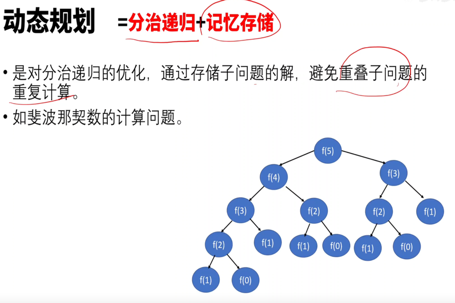
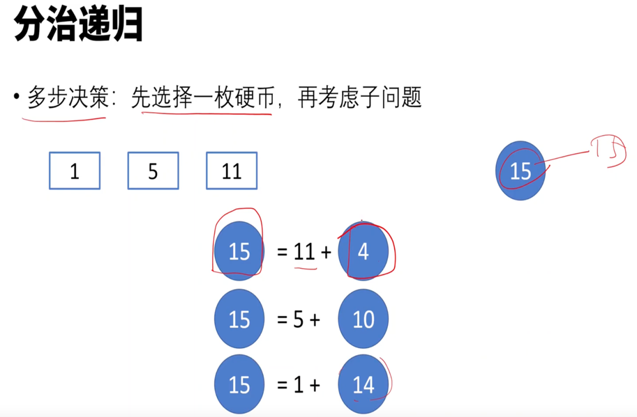
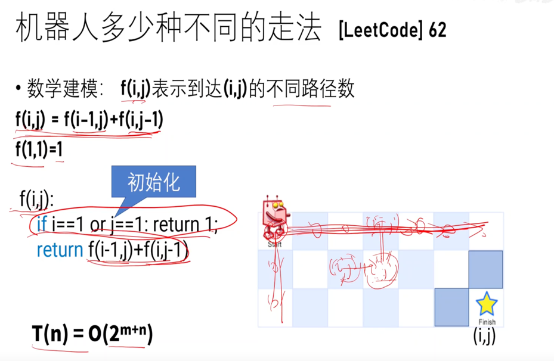
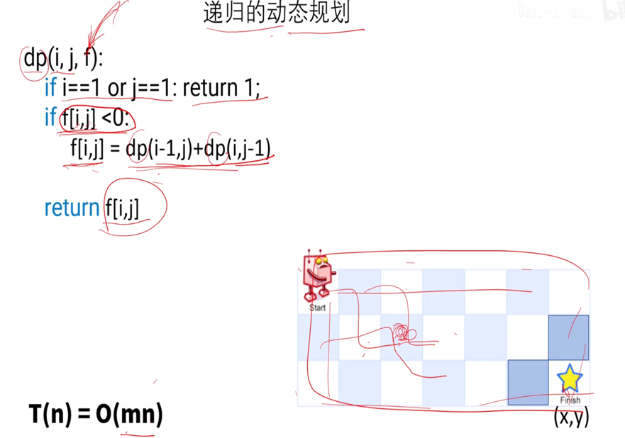
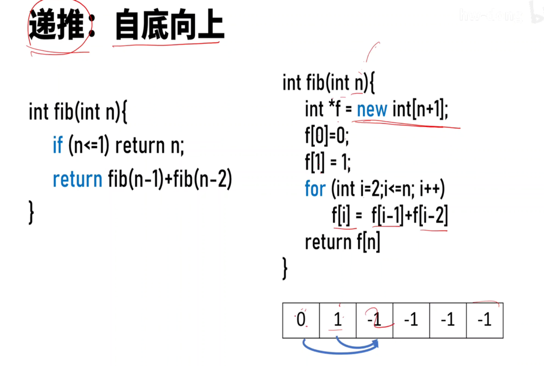

# dynamic programming 动态规划

将大规范的问题**转换**成小规模的问题，并且**缓存**中间结果。
动态规范 = 分治递归 + 记忆存储

## 特征

> leetcode原题：一只青蛙一次可以跳上1级台阶，也可以跳上2级台阶。求该青蛙跳上一个 10 级的台阶总共有多少种跳法。

动态规划有几个典型特征，最优子结构、状态转移方程、边界、重叠子问题。在青蛙跳阶问题中：

* f(n-1)和f(n-2) 称为 f(n) 的最优子结构
* f(n)= f（n-1）+f（n-2）就称为状态转移方程
* f(1) = 1, f(2) = 2 就是边界啦
* 比如f(10)= f(9)+f(8),f(9) = f(8) + f(7) ,f(8)就是重叠子问题。

动态规划的思路：

- 穷举分析
- 确定边界 
- 找出规律，确定最优子结构 
- 写出状态转移方程

## 场景
如果一个问题，可以把所有可能的答案穷举出来，并且穷举出来后，发现存在重叠子问题，就可以考虑使用动态规划。

比如一些求最值的场景，如最长递增子序列、最小编辑距离、背包问题、凑零钱问题等等，都是动态规划的经典应用场景。

### 1 编辑距离-->转成插入insert,删除delete，替换switch
   

### 2 爬台阶
   

要么n-1台阶上去，要么n-2台阶上去

### 3. 找零钱

分治递归

递归实现  

递推实现

### 4 机器人走法
   
   

递归算法：优化代码

递推算法

## 解题思路

优化前代码: 递归自顶向下

优化后代码：递推自底向上

节省空间：交替滚动

## 参考
- [动态规划详解](https://juejin.cn/post/6951922898638471181)