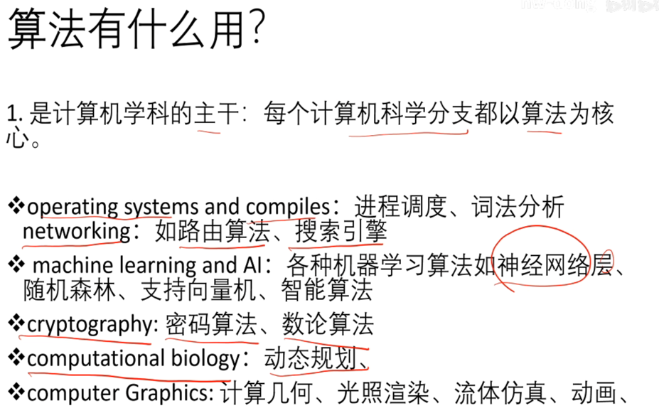
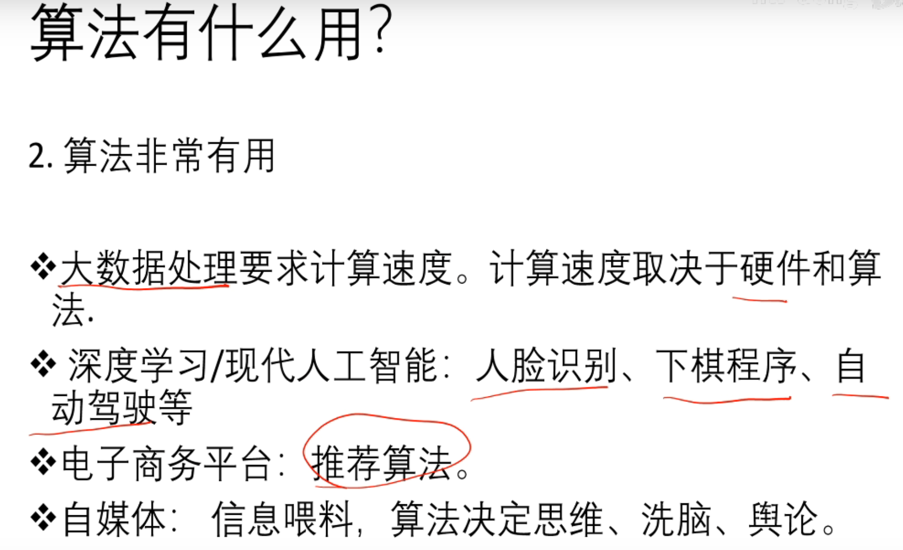
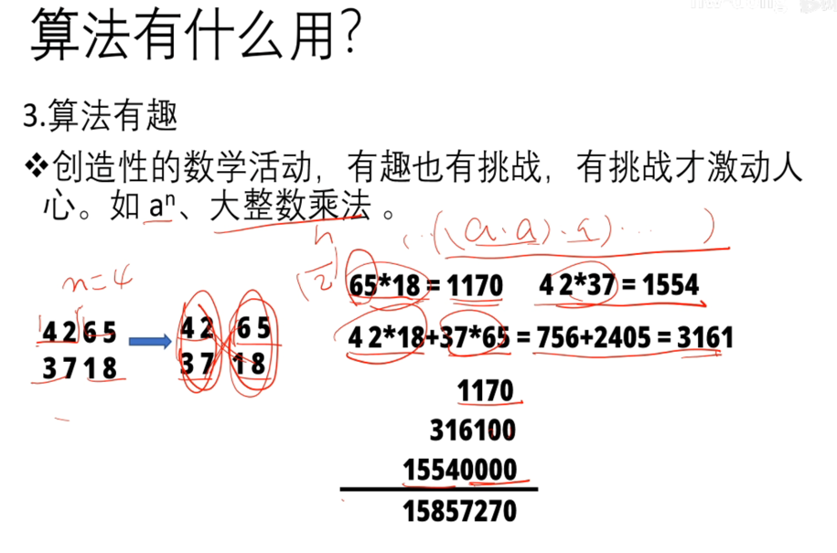
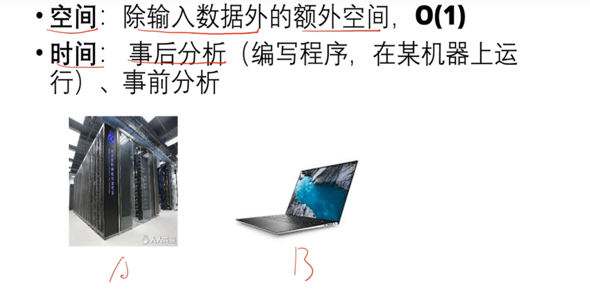

<!-- START doctoc generated TOC please keep comment here to allow auto update -->
<!-- DON'T EDIT THIS SECTION, INSTEAD RE-RUN doctoc TO UPDATE -->
**Table of Contents**  *generated with [DocToc](https://github.com/thlorenz/doctoc)*

- [algorithm算法](#algorithm%E7%AE%97%E6%B3%95)
  - [算法作用](#%E7%AE%97%E6%B3%95%E4%BD%9C%E7%94%A8)
  - [算法策略](#%E7%AE%97%E6%B3%95%E7%AD%96%E7%95%A5)
  - [算法表示](#%E7%AE%97%E6%B3%95%E8%A1%A8%E7%A4%BA)
  - [算法分析](#%E7%AE%97%E6%B3%95%E5%88%86%E6%9E%90)
  - [渐变分析asymptotic analysis](#%E6%B8%90%E5%8F%98%E5%88%86%E6%9E%90asymptotic-analysis)
  - [递归方程的求解](#%E9%80%92%E5%BD%92%E6%96%B9%E7%A8%8B%E7%9A%84%E6%B1%82%E8%A7%A3)
  - [数学知识](#%E6%95%B0%E5%AD%A6%E7%9F%A5%E8%AF%86)
    - [数列和](#%E6%95%B0%E5%88%97%E5%92%8C)

<!-- END doctoc generated TOC please keep comment here to allow auto update -->

# algorithm算法
参考链接：https://hwdong.net/2021/02/20/%E7%AE%97%E6%B3%95%E8%AE%BE%E8%AE%A1%E4%B8%8E%E5%88%86%E6%9E%90-%E6%95%99%E5%AD%A6%E5%A4%A7%E7%BA%B2/

## 算法作用

## 算法策略

1. 穷举法

2. 分治法
   
   
   
   
   

3. 贪婪法
   
   

4. 动态规划:存在备忘录

## 算法表示

## 算法分析

## 渐变分析asymptotic analysis

1. 上界O

2. 下界

## 递归方程的求解

## 数学知识
### 数列和

