<!-- START doctoc generated TOC please keep comment here to allow auto update -->
<!-- DON'T EDIT THIS SECTION, INSTEAD RE-RUN doctoc TO UPDATE -->
**Table of Contents**  *generated with [DocToc](https://github.com/thlorenz/doctoc)*

- [algorithm 算法](#algorithm-%E7%AE%97%E6%B3%95)
  - [算法作用](#%E7%AE%97%E6%B3%95%E4%BD%9C%E7%94%A8)
  - [复杂度分析](#%E5%A4%8D%E6%9D%82%E5%BA%A6%E5%88%86%E6%9E%90)
  - [算法策略](#%E7%AE%97%E6%B3%95%E7%AD%96%E7%95%A5)
    - [1. 穷举法](#1-%E7%A9%B7%E4%B8%BE%E6%B3%95)
    - [2. 分治法](#2-%E5%88%86%E6%B2%BB%E6%B3%95)
    - [3. 贪婪法](#3-%E8%B4%AA%E5%A9%AA%E6%B3%95)
    - [4. 动态规划:存在备忘录](#4-%E5%8A%A8%E6%80%81%E8%A7%84%E5%88%92%E5%AD%98%E5%9C%A8%E5%A4%87%E5%BF%98%E5%BD%95)
  - [算法表示](#%E7%AE%97%E6%B3%95%E8%A1%A8%E7%A4%BA)
  - [算法分析](#%E7%AE%97%E6%B3%95%E5%88%86%E6%9E%90)
    - [渐变分析 asymptotic analysis](#%E6%B8%90%E5%8F%98%E5%88%86%E6%9E%90-asymptotic-analysis)
  - [递归方程的求解](#%E9%80%92%E5%BD%92%E6%96%B9%E7%A8%8B%E7%9A%84%E6%B1%82%E8%A7%A3)
  - [数学知识](#%E6%95%B0%E5%AD%A6%E7%9F%A5%E8%AF%86)
    - [数列和](#%E6%95%B0%E5%88%97%E5%92%8C)
  - [参考链接](#%E5%8F%82%E8%80%83%E9%93%BE%E6%8E%A5)

<!-- END doctoc generated TOC please keep comment here to allow auto update -->

# algorithm 算法

算法是解决一类问题或某个计算的过程（方法），算法包含有限步可行的明确的操作。


## 算法作用
- 是计算机学科的主干：每个计算机科学分支都以算法为核心。 operating systems and compiles：进程调度、词法分析 networking：如路由算法、搜索引擎 machine learning and AI：各种机器学习算法如神经网络层、随机森林、支持向量机、智能算法 cryptography: 密码算法、数论算法 computational biology：动态规划、机器学习 computer Graphics: 计算几何、光照渲染、流体仿真、动画、
- 算法非常有用： 计算速度取决于硬件和算法。 深度学习/现代人工智能、电子商务/自媒体平台的推荐算法、算法决定思维（算法喂料洗脑）。
- 算法有趣： 创造性的数学活动，有趣也有挑战，有挑战才激动人心。如 a^n、大整数乘法 


## 复杂度分析

大 O 时间复杂度表示法。大 O 时间复杂度实际上并不具体表示代码真正的执行时间，而是表示代码执行时间随数据规模增长的变化趋势，所以，也叫作渐进时间复杂度（asymptotic time complexity），简称时间复杂度。


复杂度量级，我们可以粗略地分为两类，多项式量级和非多项式量级。其中，非多项式量级只有两个：O(2n) 和 O(n!)。

1. O(1)：常数时间复杂度。无论输入的规模如何，执行时间总是固定的。例如，数组的索引访问。
```cgo
int i = 8;
int j = 6;
int sum = i + j;
```

2. O(log n)：对数时间复杂度。随着输入规模的增大，执行时间会以对数的速度增加。例如，二分查找。
```cgo
i=1;
while (i <= n) {
  i = i * 2;
}
```

3. O(sqrt(n))：位于O(n)和O(log n)之间。虽然它比线性时间复杂度慢，但是对于非常大的n，O(sqrt(n))的增长速度会比O(n)慢很多。这种时间复杂度在某些特定的算法中会出现，例如检查一个数是否是素数的最简单方法就是试除法，时间复杂度为O(sqrt(n))，因为我们只需要检查到sqrt(n)就可以确定n是否是素数。

4. O(n)：线性时间复杂度。执行时间与输入规模成正比。例如，遍历一个数组或链表。

5. O(n log n)：线性对数时间复杂度。执行时间与输入规模成正比，但每次操作的复杂度为O(log n)。例如，快速排序和归并排序。

6. O(n^2)：平方时间复杂度。执行时间与输入规模的平方成正比。例如，冒泡排序和选择排序。

7. O(n^3)：立方时间复杂度。执行时间与输入规模的立方成正比。例如，三层嵌套循环的算法。

8. O(2^n)：指数时间复杂度。执行时间以2为底的指数增长。例如，计算斐波那契数列的递归实现。

9. O(n!)：阶乘时间复杂度。执行时间与输入规模的阶乘成正比。例如，旅行商问题的暴力解法。


空间复杂度全称就是渐进空间复杂度（asymptotic space complexity），表示算法的存储空间与数据规模之间的增长关系.

## 算法策略
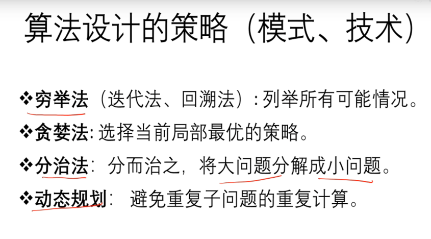

算法设计：技术（设计模式）、艺术（创造性思维）
算法设计的策略（模式、技术）：

- 穷举法（迭代法）: 列举所有可能情况。求最大值、n!、a^n、斐波拉契数列、平面点集的最近点对。
- 贪婪法: 找零钱、图的Dijsktra最短路径算法
- 分治法: 大问题分解成小问题（Divid），解决小问题(Conqour)、组合小问题解为大问题的解(Combine)
  - n!、斐波拉契数列、汉诺塔、大整数相乘、a^n、选择排序、冒泡排序、快速排序、归并排序
- 动态规划:避免重复子问题的重复计算

### 1. 穷举法
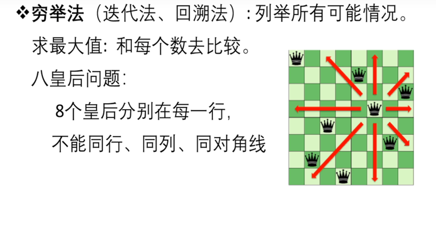
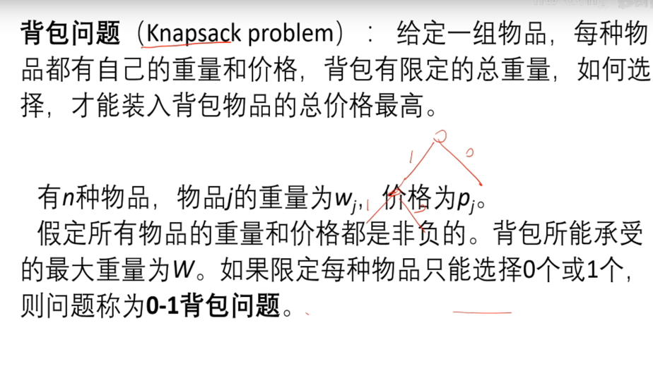

### 2. 分治法
   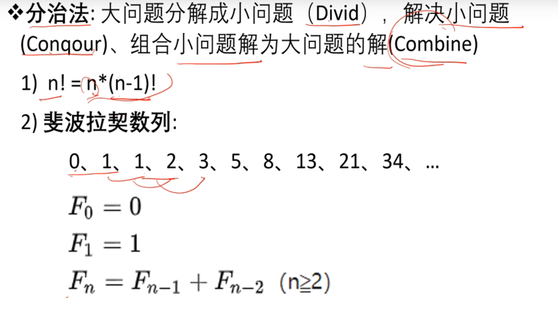
   
   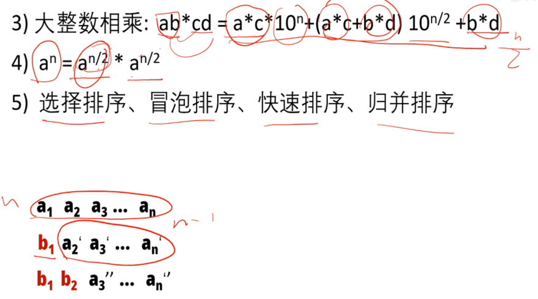
   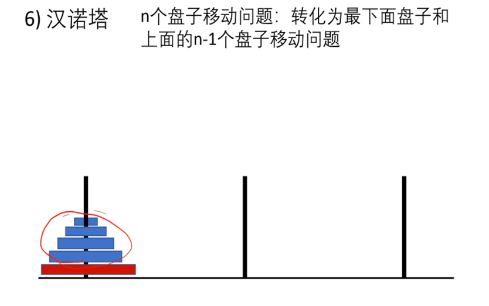
   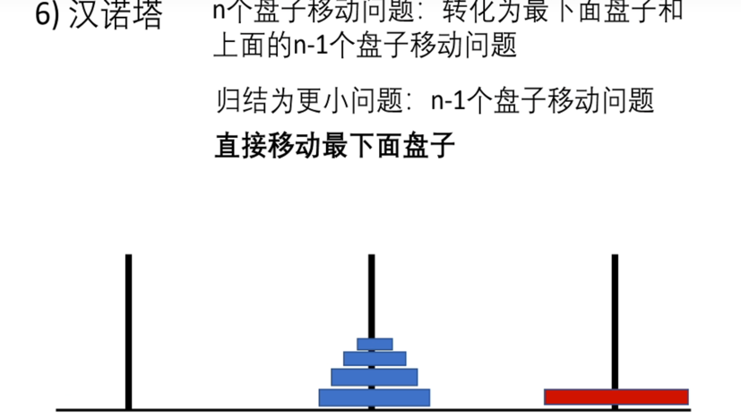

### 3. 贪婪法
   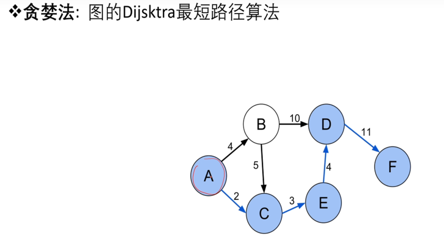
   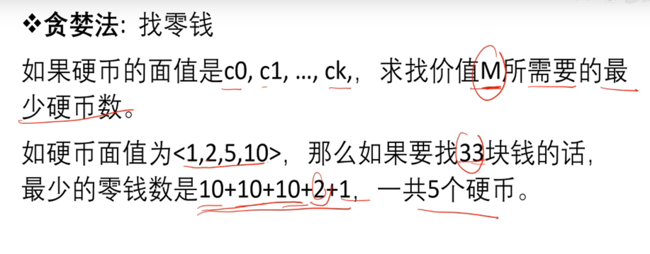


### 4. 动态规划:存在备忘录
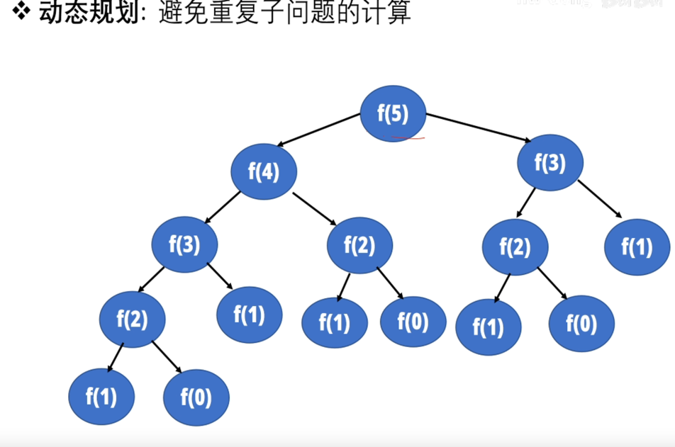

## 算法表示
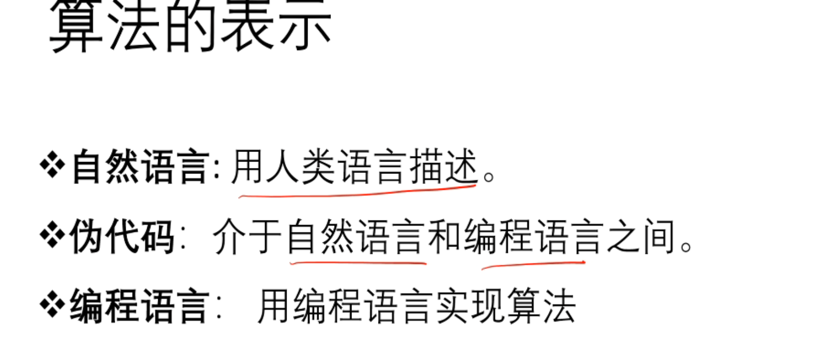

## 算法分析
主要还是从算法所占用的「时间」和「空间」两个维度去考量。

- 时间维度：是指执行当前算法所消耗的时间，我们通常用「时间复杂度」来描述。
- 空间维度：是指执行当前算法需要占用多少内存空间，我们通常用「空间复杂度」来描述。

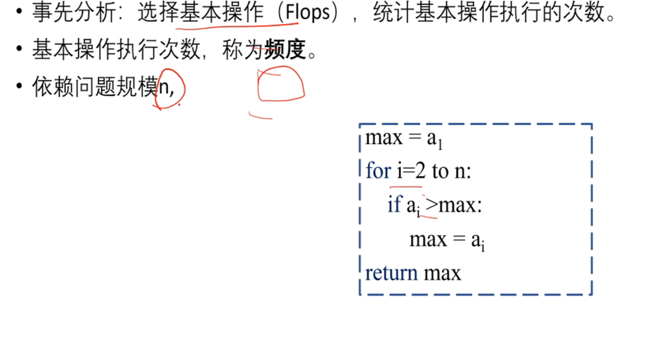

### 渐变分析 asymptotic analysis
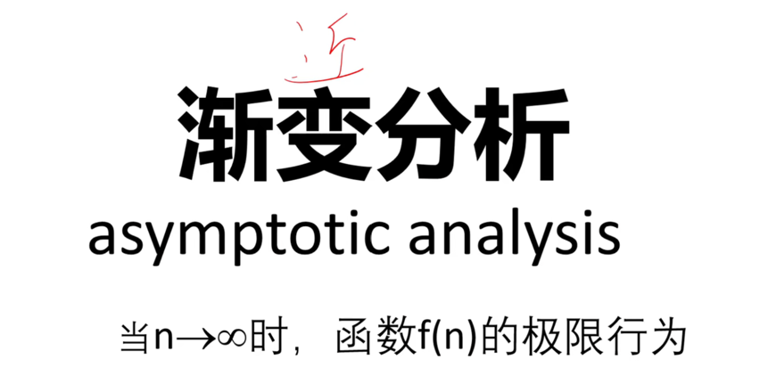
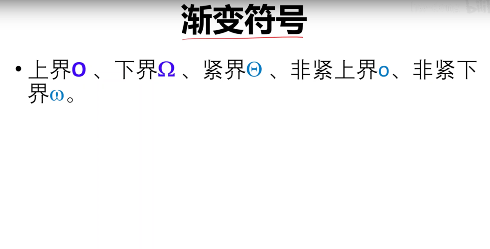

1. 上界 
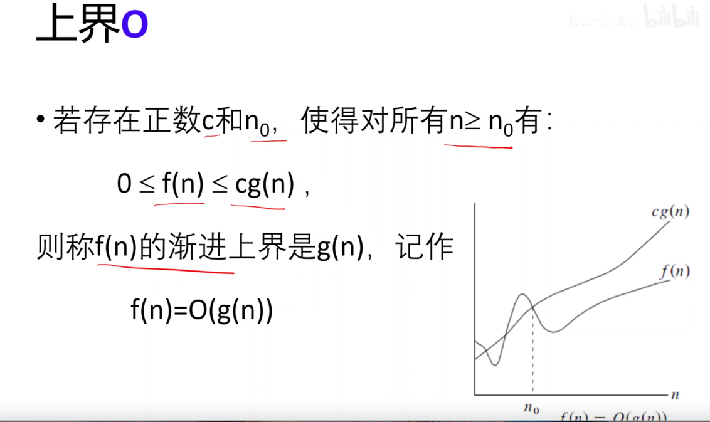

2. 下界
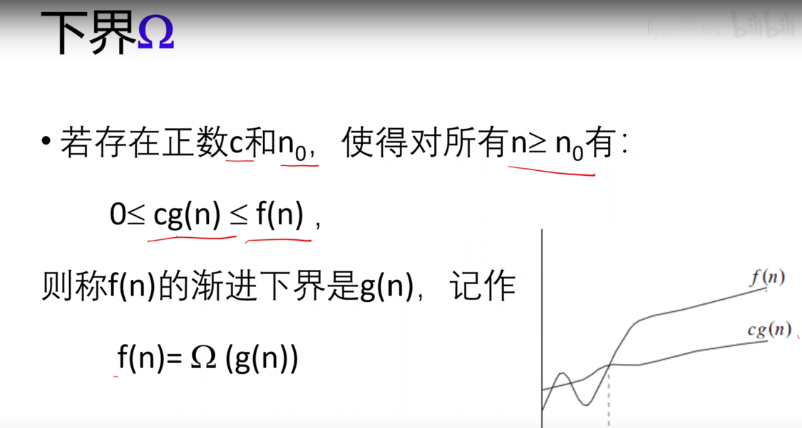


常见的时间复杂度量级有：

- 常数阶O(1)
```
int i = 1;
int j = 2;
++i;
j++;
int m = i + j;
```
- 对数阶O(logN)
```
int i = 1;
while(i<n)
{
// 将 i 乘以 2，乘完之后，i 距离 n 就越来越近
    i = i * 2;
}


```

- 线性阶O(n)
```
for(i=1; i<=n; ++i)
{
   j = i;
   j++;
}
```
- 线性对数阶O(nlogN)
```
for(m=1; m<n; m++)
{
    // 时间复杂度为O(logn)的代码循环N遍的话
    i = 1;
    while(i<n)
    {
        i = i * 2;
    }
}
```
- 平方阶O(n²)
```
for(x=1; i<=n; x++)
{
   for(i=1; i<=n; i++)
    {
       j = i;
       j++;
    }
}
```
- 立方阶O(n³)
- K次方阶O(n^k)
- 指数阶(2^n)
上面从上至下依次的时间复杂度越来越大，执行的效率越来越低。


## 递归方程的求解
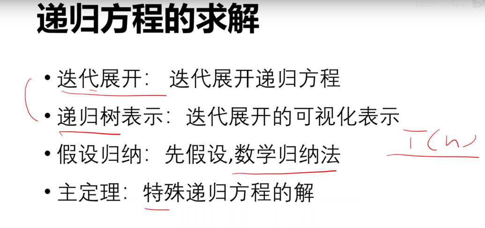

## 数学知识
### 数列和
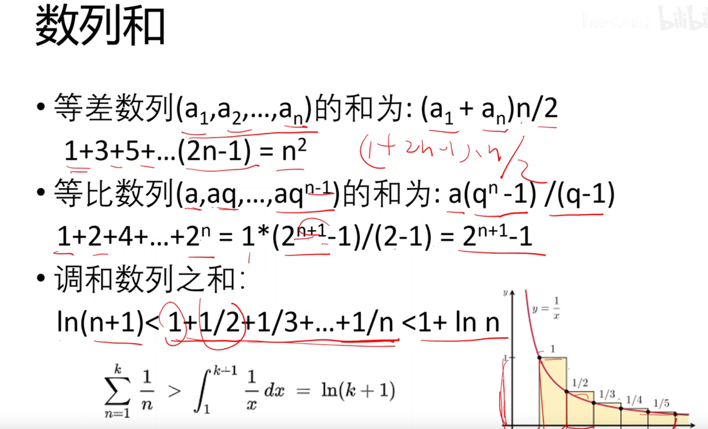
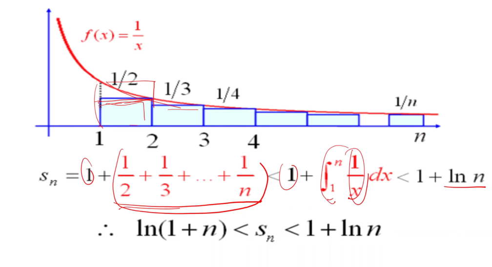
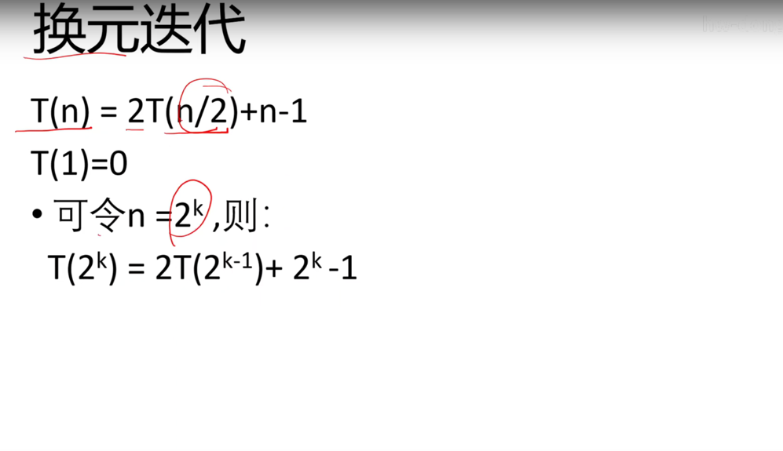

## 参考链接

- [算法设计与分析-教学大纲](https://hwdong.net/2021/02/20/%E7%AE%97%E6%B3%95%E8%AE%BE%E8%AE%A1%E4%B8%8E%E5%88%86%E6%9E%90-%E6%95%99%E5%AD%A6%E5%A4%A7%E7%BA%B2/)
