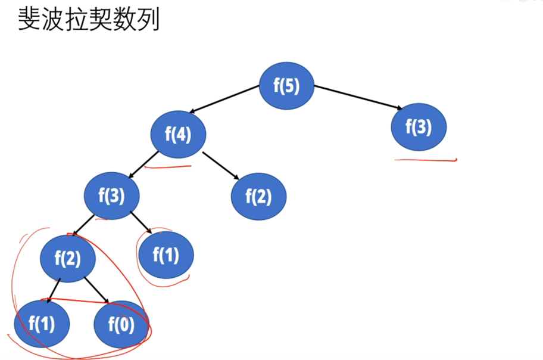

# algorithm算法
参考链接：https://hwdong.net/2021/02/20/%E7%AE%97%E6%B3%95%E8%AE%BE%E8%AE%A1%E4%B8%8E%E5%88%86%E6%9E%90-%E6%95%99%E5%AD%A6%E5%A4%A7%E7%BA%B2/

## 算法作用

## 算法策略

1. 穷举法

2. 贪婪法

3. 分治法

4. 动态规划:存在备忘录

## 算法表示

## 算法分析

## 渐变分析asymptotic analysis

1. 上界O

2. 下界

## 递归方程的求解

## 数学知识
### 数列和

