# dynamic programming 动态规划
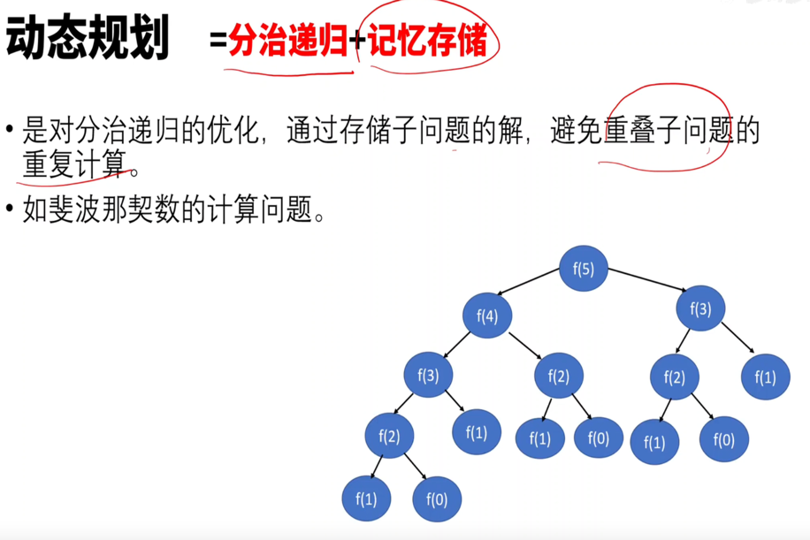
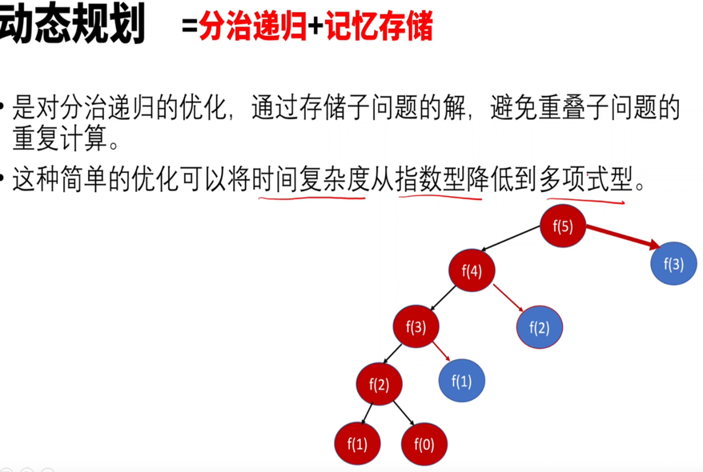

优化前代码:递归自顶向下
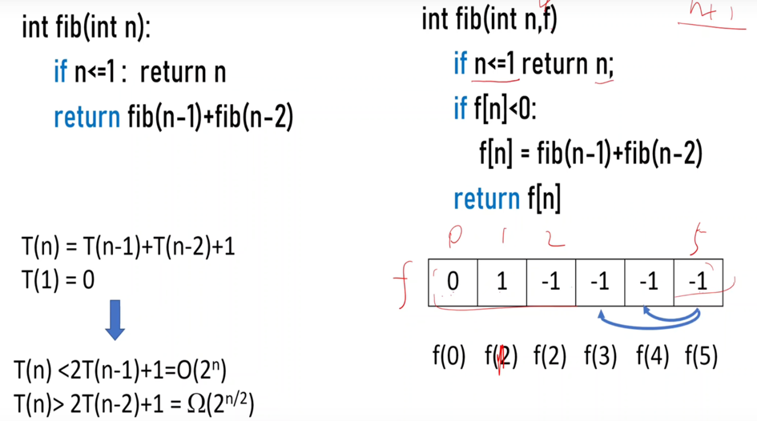

优化后代码：递推自底向上
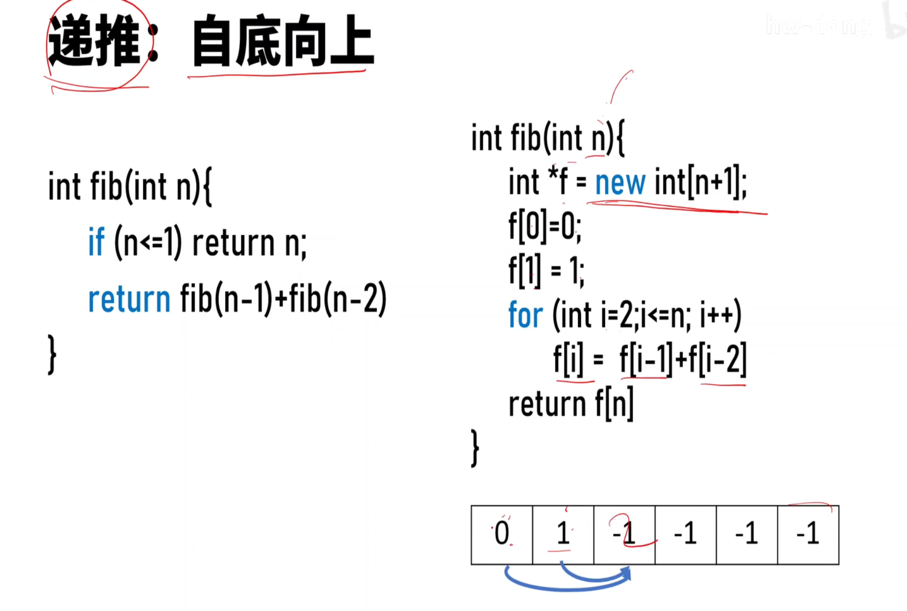
节省空间：交替滚动
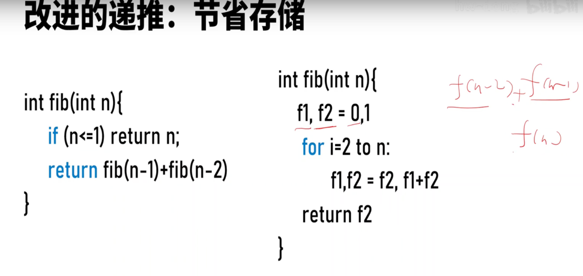

## 应用
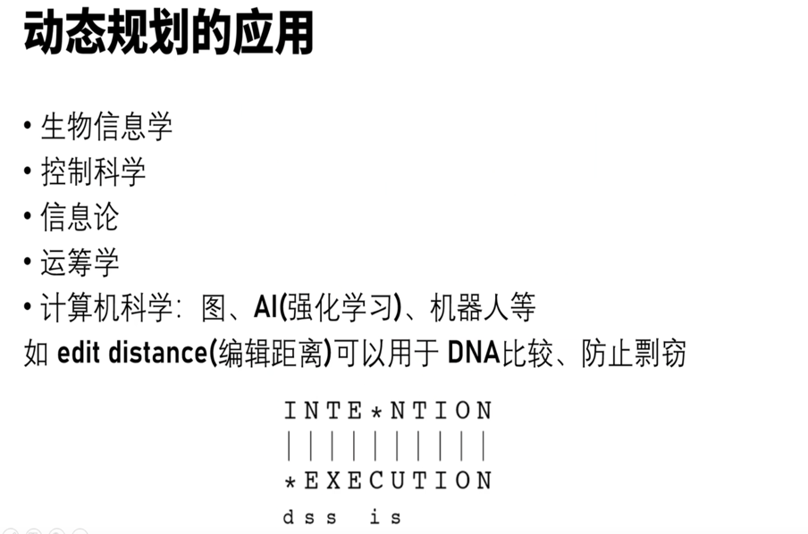

1. 编辑距离-->转成插入insert,删除delete，替换switch
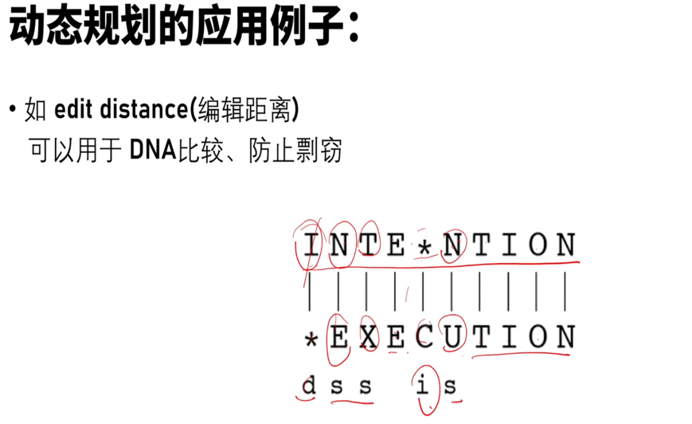

2. 爬台阶
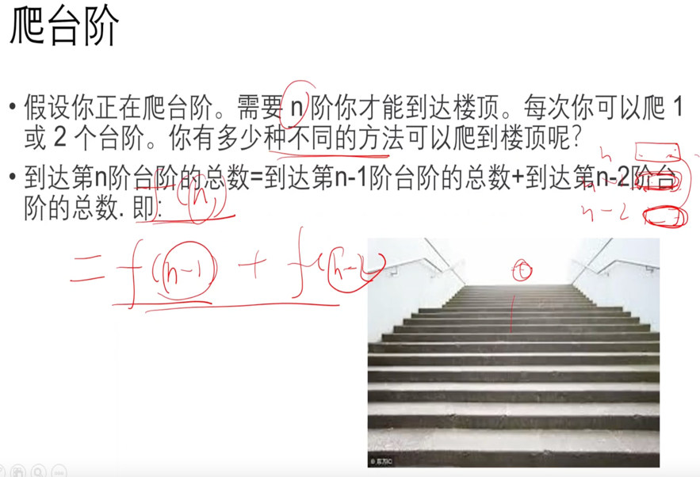
要么n-1台阶上去，要么n-2台阶上去 

3. 找零钱

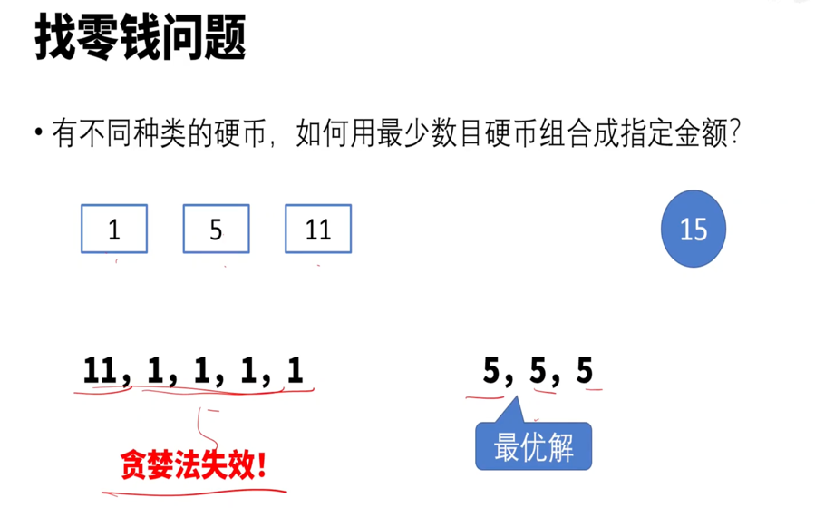    

分治递归
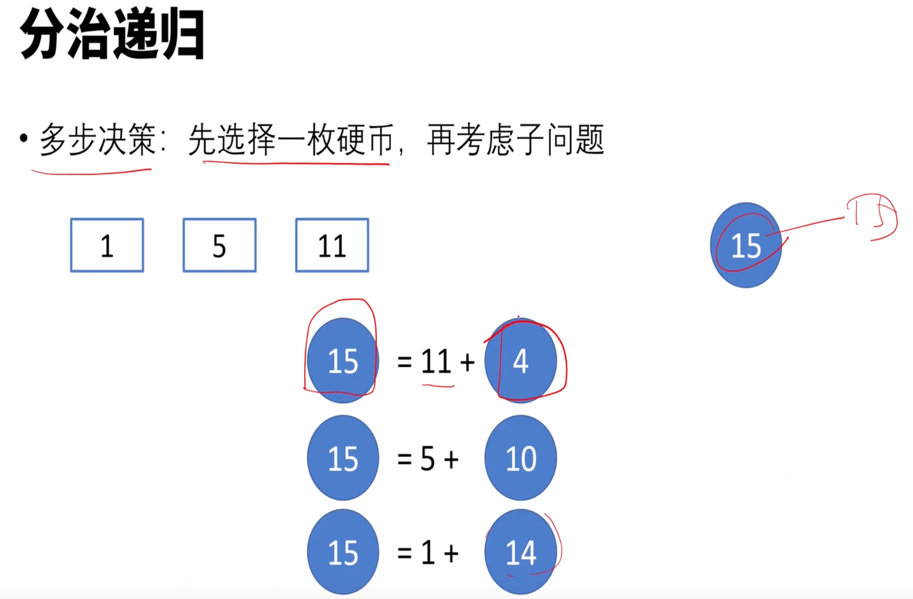
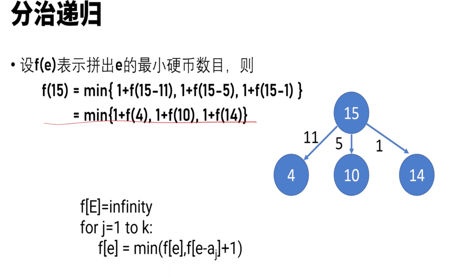

递归实现  
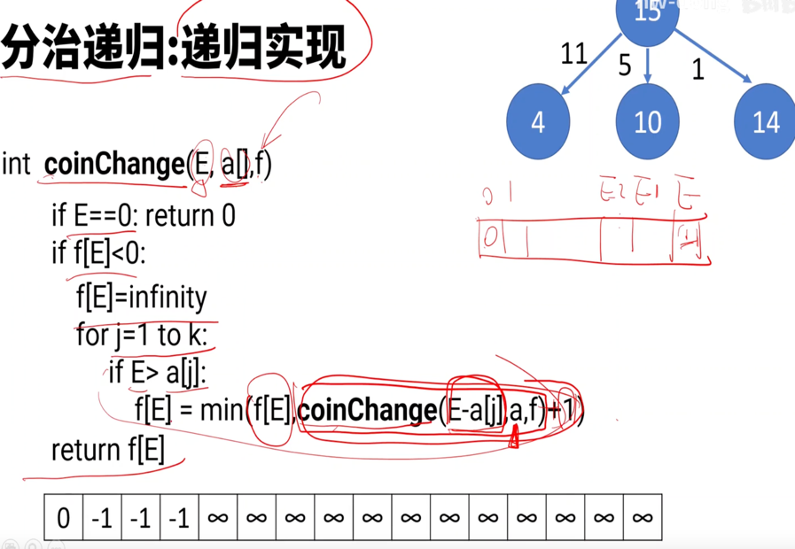

递推实现
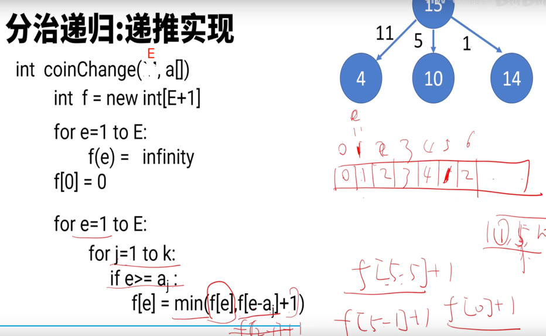

4. 机器人走法
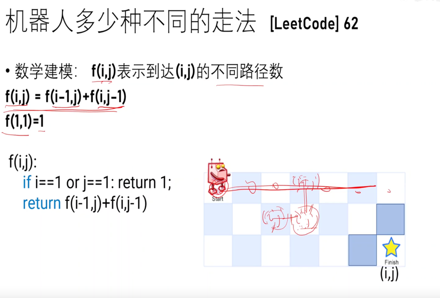
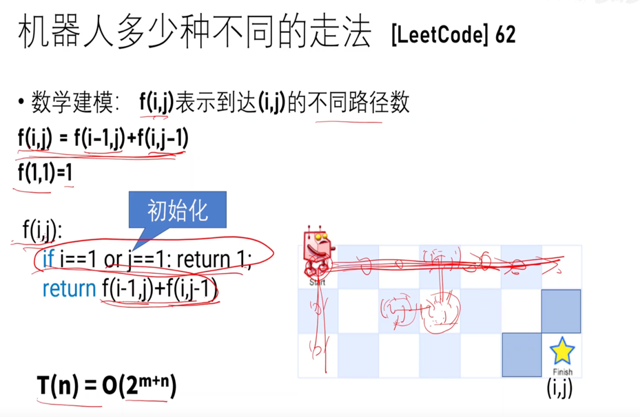

递归算法：优化代码
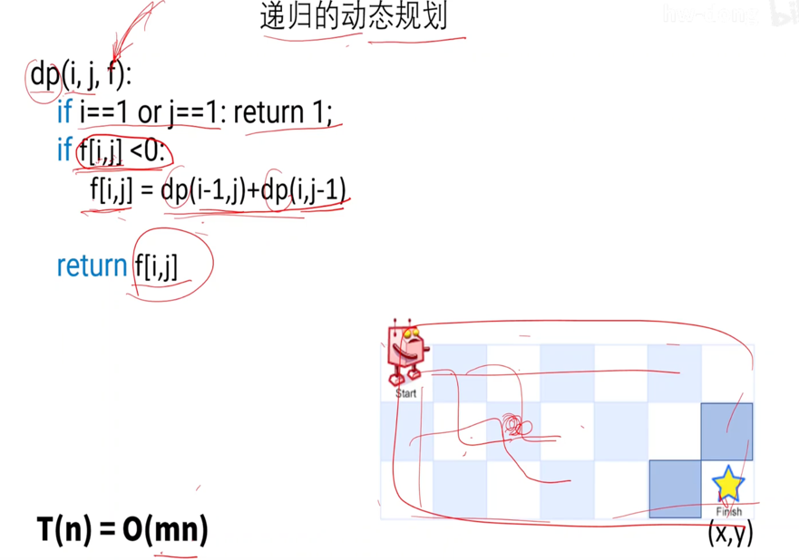

递推算法
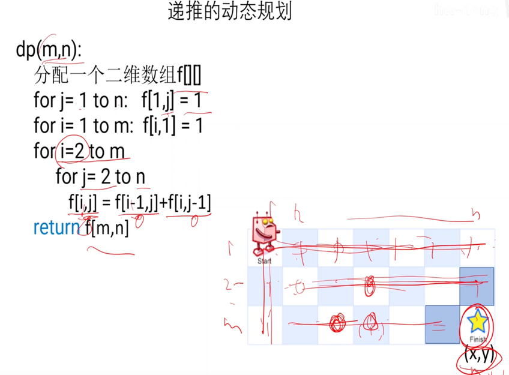

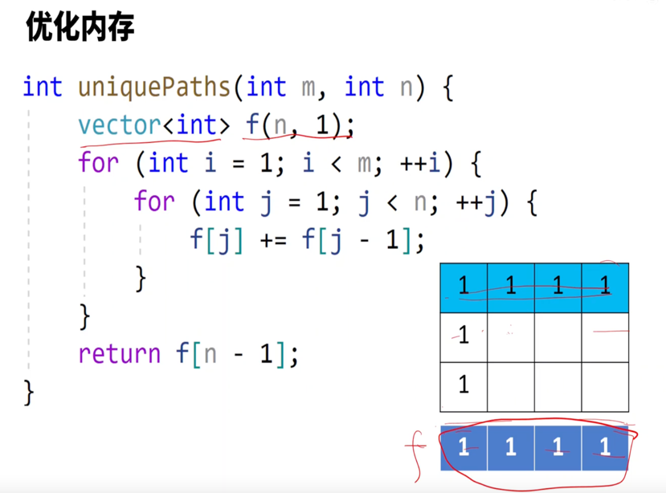