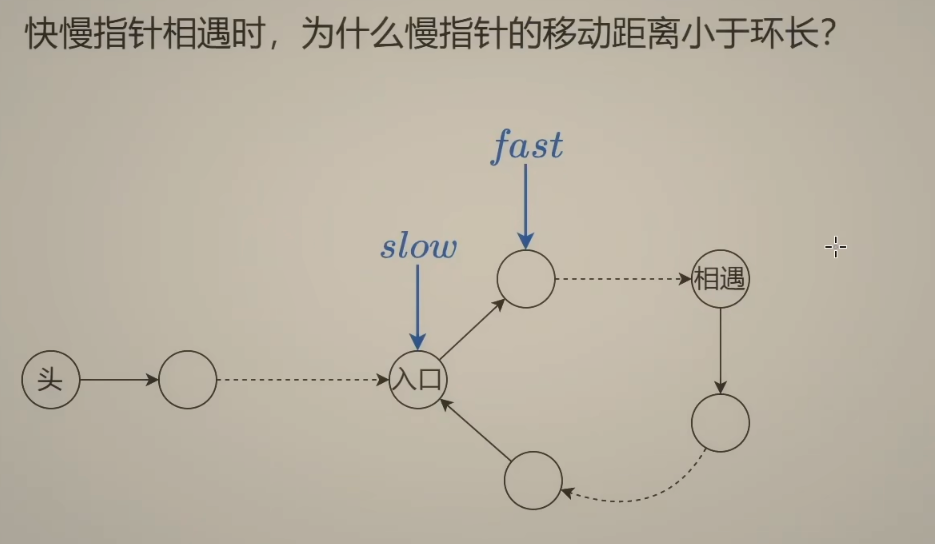

<!-- START doctoc generated TOC please keep comment here to allow auto update -->
<!-- DON'T EDIT THIS SECTION, INSTEAD RE-RUN doctoc TO UPDATE -->
**Table of Contents**  *generated with [DocToc](https://github.com/thlorenz/doctoc)*

- [链表](#%E9%93%BE%E8%A1%A8)
  - [206 反转链表](#206-%E5%8F%8D%E8%BD%AC%E9%93%BE%E8%A1%A8)
  - [反转中间链表](#%E5%8F%8D%E8%BD%AC%E4%B8%AD%E9%97%B4%E9%93%BE%E8%A1%A8)
  - [K 个一组翻转链表](#k-%E4%B8%AA%E4%B8%80%E7%BB%84%E7%BF%BB%E8%BD%AC%E9%93%BE%E8%A1%A8)
  - [双指针（two pointers)](#%E5%8F%8C%E6%8C%87%E9%92%88two-pointers)
    - [快慢指针](#%E5%BF%AB%E6%85%A2%E6%8C%87%E9%92%88)
      - [链表的中间节点](#%E9%93%BE%E8%A1%A8%E7%9A%84%E4%B8%AD%E9%97%B4%E8%8A%82%E7%82%B9)
      - [环形链表](#%E7%8E%AF%E5%BD%A2%E9%93%BE%E8%A1%A8)
      - [环形链表II](#%E7%8E%AF%E5%BD%A2%E9%93%BE%E8%A1%A8ii)
      - [重排链表](#%E9%87%8D%E6%8E%92%E9%93%BE%E8%A1%A8)

<!-- END doctoc generated TOC please keep comment here to allow auto update -->

# 链表

## [206 反转链表](./206_reverse_linked_list_test.go)

pre: 上一节点

cur: 遍历到的当前节点

链表最后一个节点：指向空

目的：将当前节点的下一个节点指向上一个节点，从图中，修改了当前节点的下一个节点，则不知道原先的下一个节点，所以两个变量 pre, cur 是不够的，因为需要记录到 cur 修改前的下一节点

1. 用 nxt 先记录 cur 的下个next
2. 再将 cur 指定 pre
3. 再将 pre 指定 cur
4. 将 cur 指定 nxt

循环结束: cur 指定 空,  pre 指定末尾,返回 pre

## [反转中间链表](./92_reverse_linked_list2_test.go)

注意性质： 
- pre 指定反转的末尾
- cur 指定反转这一段后续的下一个节点

- P0: 反转这一段的上一个节点

反转结束后 
- P0.next.next 指向 cur
- P0.next 指定 pre 

注意 left = 1 时：没有 P0， 需要使用哨兵

## [K 个一组翻转链表](25_reverse_nodes_in_k-Group_test.go)

步骤 
- 判断长度是否可以反转 
- 每次反转完，将 p0 更新成下一段的上一个节点，也就是图中的 3 的上一节点 1，其实就是p0.next
- 返回哨兵节点的next

## 双指针（two pointers)

通过设置两个指针不断移动来解决问题的，一般主要用来操作数组，链表以及字符串。
双指针的种类比较多，有相向双指针，两个指针从两边往中间移。
有背向双指针，两个指针从中间往两边移。
还有同向双指针，两个指针同时往一个方向移。还有快慢指针，一个指针每次移动的步数多，另一个指针每次移动的步数少。

- 相向双指针就是两个指针从两边往中间移动，大家最常见的可能就是二分法查找以及回文串的判断。相向是面对面的意思，
- 背向双指针是指两个指针往两边走，和相向双指针相反。
- 同向双指针
  1. 快慢指针：通过设置两指针的初始位置，移动步长，可实现两指针一快一慢遍历数组。
  
  2. 头尾指针：一个定义在头，一个在尾，可以两个方向同时处理。
  
  3. 滑动窗口：两个指针一前一后形成一个窗口，不满足条件时前面的不停扩大窗口，满足时后面指针前进，缩小窗口，由可行解寻找最优解。
  
  

### 快慢指针

#### [链表的中间节点](876_middle_of_the_linked_list_test.go)
奇数情况下：快指针的下一节点为空

偶数情况下：快指针为空

#### [环形链表](141_linked_list_cycle_test.go)
如果有环，慢指标到环里面，最终能赶上慢指针

#### [环形链表II](142_linked_list_cycle_II_test.go)
需要找到环的入口

环长= b + c
慢指针移动距离 = a +b
快指针移动距离 = a +  k( b +c ) + b

快指针移动距离时慢指针的两倍

a +  k( b +c ) + b  = 2 (a+b）

a + b + b +c + (k-1)(b+c) = 2a +2b
--> a-c =(k-1)(b+c)

slow 从相遇点出发，head 从头节点出发，两个都走c步，slow 到入口，head 到入口的距离正好是环长的倍数，所以两个都继续走，肯定在入口相遇

快慢指针相遇时，为了慢指针的移动距离小于环长？

下图为最坏情况，fast 刚好在 slow 前面-->fast 走的步数为 (环长-1)

#### 重排链表

- 首先找到中间链表
- 接着反转链表得到两段链表 
- 定义：head指左边头节点， head2指右边头节点
- 将 head 指向 head2 ,head2 指向 head.next
- 移动 head, 和 head2 , 需要提交记录 head.next 和 head2.next 