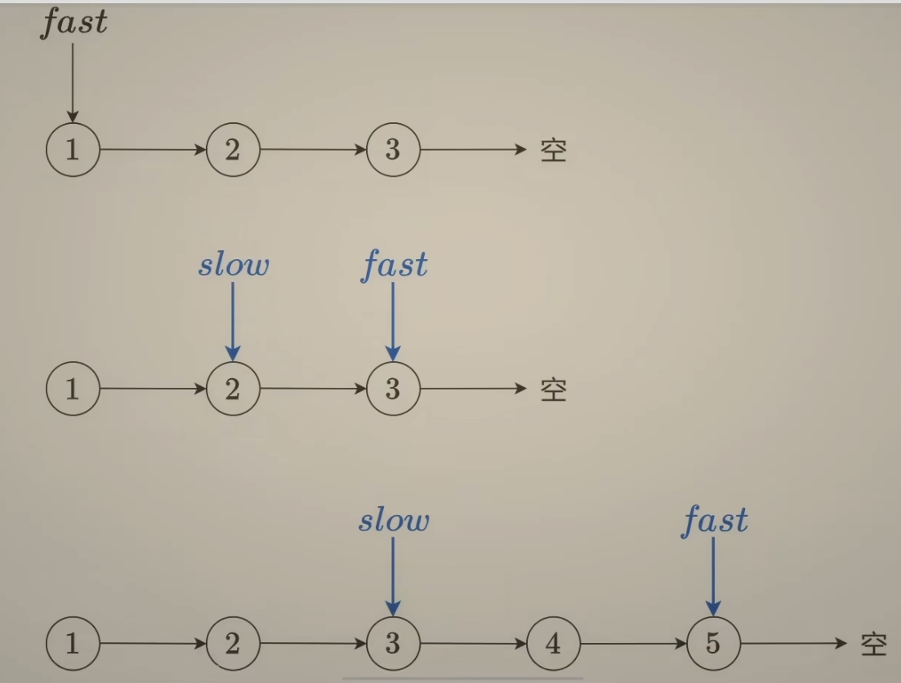
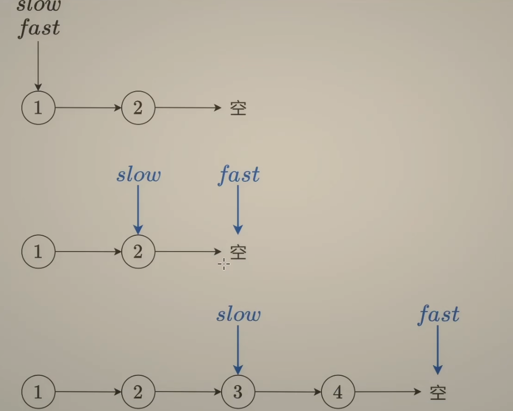
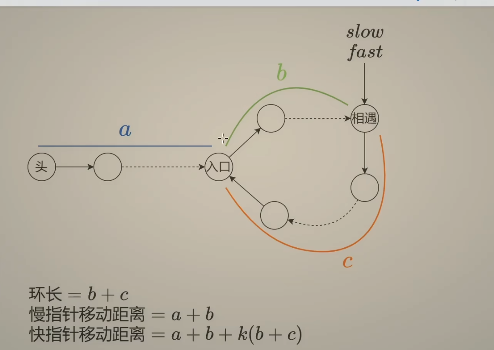
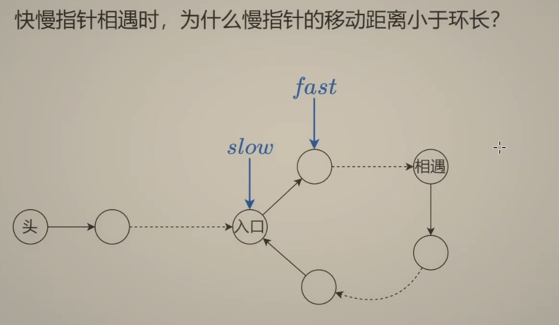
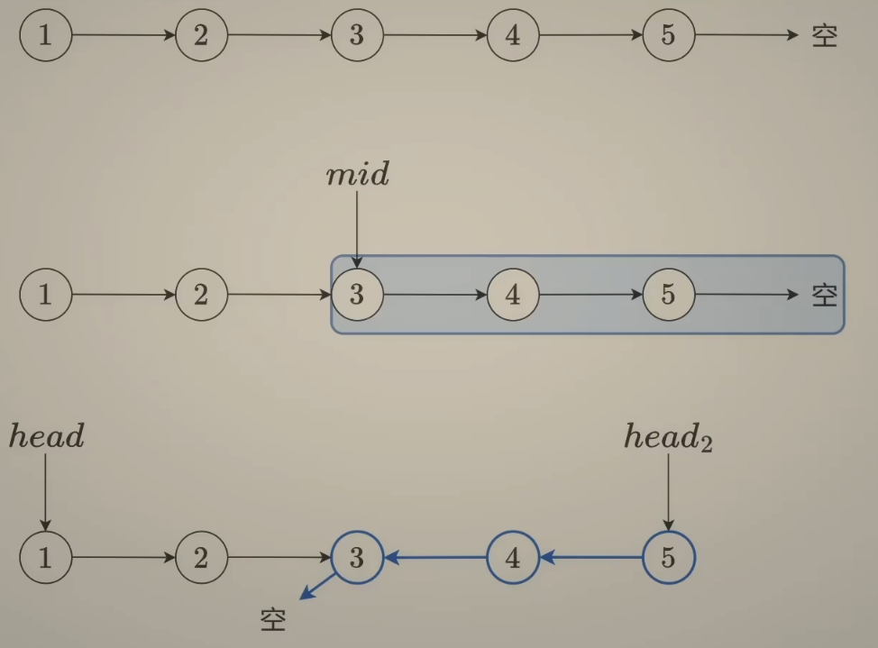
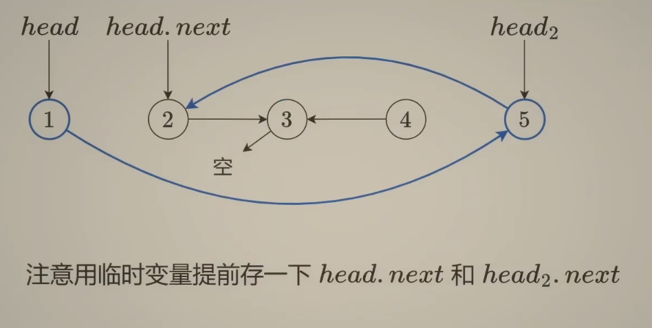
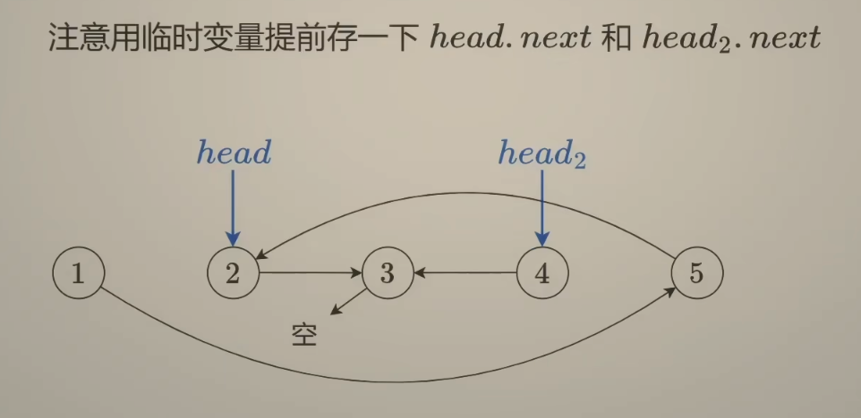
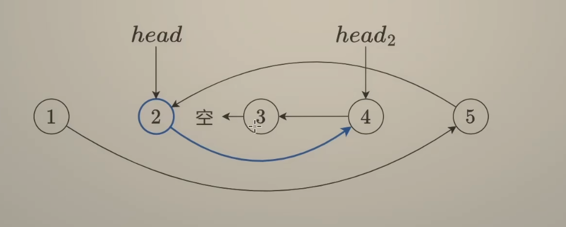

<!-- START doctoc generated TOC please keep comment here to allow auto update -->
<!-- DON'T EDIT THIS SECTION, INSTEAD RE-RUN doctoc TO UPDATE -->
**Table of Contents**  *generated with [DocToc](https://github.com/thlorenz/doctoc)*

- [双指针](#%E5%8F%8C%E6%8C%87%E9%92%88)
  - [快慢指针](#%E5%BF%AB%E6%85%A2%E6%8C%87%E9%92%88)

<!-- END doctoc generated TOC please keep comment here to allow auto update -->

# 双指针

双指针可以同向移动可以双向移动

双指针是我们在解决数组的相关题目时常用的方法，定义两个指针，以多种方式去处理一个数组。

常用的有：

1.快慢指针：通过设置两指针的初始位置，移动步长，可实现两指针一快一慢遍历数组。

2.头尾指针：一个定义在头，一个在尾，可以两个方向同时处理。

3.滑动窗口：两个指针一前一后形成一个窗口，不满足条件时前面的不停扩大窗口，满足时后面指针前进，缩小窗口，由可行解寻找最优解。

## 快慢指针

奇数情况下：快指针的下一节点为空
 

偶数情况下：快指针为空

环形链表

环长= b + c
慢指针移动距离 = a +b
快指针移动距离 = a +  k( b +c ) + b 

快指针移动距离时慢指针的两倍

a +  k( b +c ) + b  = 2 (a+b）
a + b + b +c + (k-1)(b+c) = 2a +2b 
--> a-c =(k-1)(b+c)

slow 从相遇点出发，head 从头节点出发，两个都走c步，slow 到入口，head 到入口的距离正好是环长的倍数，所以两个都继续走，肯定在入口相遇

快慢指针相遇时，为了慢指针的移动距离小于环长？

下图为最坏情况，fast 刚好在 slow 前面-->fast 走的步数为 (环长-1)

[环形链表II 代码](142_linked_list_cycle_II_test.go)

重排链表 

- 首先找到中间链表
- 接着反转链表 