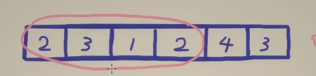

<!-- START doctoc generated TOC please keep comment here to allow auto update -->
<!-- DON'T EDIT THIS SECTION, INSTEAD RE-RUN doctoc TO UPDATE -->
**Table of Contents**  *generated with [DocToc](https://github.com/thlorenz/doctoc)*

- [滑动窗口](#%E6%BB%91%E5%8A%A8%E7%AA%97%E5%8F%A3)
  - [209 长度最小的子数组](#209-%E9%95%BF%E5%BA%A6%E6%9C%80%E5%B0%8F%E7%9A%84%E5%AD%90%E6%95%B0%E7%BB%84)
  - [乘积小于 K 的子数组](#%E4%B9%98%E7%A7%AF%E5%B0%8F%E4%BA%8E-k-%E7%9A%84%E5%AD%90%E6%95%B0%E7%BB%84)
  - [无重复字符的最长子串](#%E6%97%A0%E9%87%8D%E5%A4%8D%E5%AD%97%E7%AC%A6%E7%9A%84%E6%9C%80%E9%95%BF%E5%AD%90%E4%B8%B2)
  - [滑动窗口最大值](#%E6%BB%91%E5%8A%A8%E7%AA%97%E5%8F%A3%E6%9C%80%E5%A4%A7%E5%80%BC)

<!-- END doctoc generated TOC please keep comment here to allow auto update -->

# 滑动窗口
滑动窗口是一类特殊的双指针,两个指针同向移动，我们更关心两个指针内所包含的数据，这时就可以称为滑动窗口.

使用滑动窗口解决的问题通常是暴力解法的优化.

## [209 长度最小的子数组](209_minimum_size_subarray_sum_test.go)

可以向右或则像左扩展：
- 向右扩展：右端点同时把数加起来，如果没有达到 target, 继续向右

暴力： O(n^2)

要充分利用都是正数这个性质，记录上一次的结果。

即四个数>target, 那么五个数肯定>target,
不断向右缩小左端点，让其 <target 

## [乘积小于 K 的子数组](713_subarray_product_less_than_k_test.go)

左端点 left 

右端点 right 

如果 [left,right] 乘积小于 k, 那么 [left+1,right]也是小于 k ，所以元素个数 right- left +1

## [无重复字符的最长子串](03_longest_substring_without_repeating_characters_test.go)

每次接在没有重复的子串后面

哈希判断是否有重复的字符, key为数据 value出现次数

## [滑动窗口最大值](239_sliding_window_maximum_test.go)

 