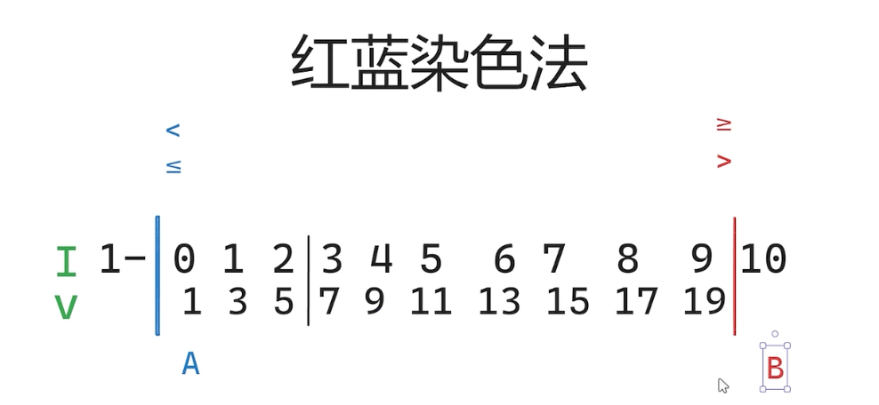

<!-- START doctoc generated TOC please keep comment here to allow auto update -->
<!-- DON'T EDIT THIS SECTION, INSTEAD RE-RUN doctoc TO UPDATE -->
**Table of Contents**  *generated with [DocToc](https://github.com/thlorenz/doctoc)*

- [Binary Search](#binary-search)
  - [二分法（红蓝染色）](#%E4%BA%8C%E5%88%86%E6%B3%95%E7%BA%A2%E8%93%9D%E6%9F%93%E8%89%B2)
  - [34 在排序数组中查找元素的第一个和最后一个位置](#34-%E5%9C%A8%E6%8E%92%E5%BA%8F%E6%95%B0%E7%BB%84%E4%B8%AD%E6%9F%A5%E6%89%BE%E5%85%83%E7%B4%A0%E7%9A%84%E7%AC%AC%E4%B8%80%E4%B8%AA%E5%92%8C%E6%9C%80%E5%90%8E%E4%B8%80%E4%B8%AA%E4%BD%8D%E7%BD%AE)
  - [162 寻找峰值](#162-%E5%AF%BB%E6%89%BE%E5%B3%B0%E5%80%BC)
  - [153 寻找旋转排序数组的最小值](#153-%E5%AF%BB%E6%89%BE%E6%97%8B%E8%BD%AC%E6%8E%92%E5%BA%8F%E6%95%B0%E7%BB%84%E7%9A%84%E6%9C%80%E5%B0%8F%E5%80%BC)
  - [参考](#%E5%8F%82%E8%80%83)

<!-- END doctoc generated TOC please keep comment here to allow auto update -->

# Binary Search

## 二分法（红蓝染色）

对于几乎所有有序数组，都可以划分成两块元素（红色 or 蓝色），针对条件取得红色、蓝色边界即可。


第一种写法：开区间 左开右开

   
left: -1   
right: length

一开始整个区间都是白区

   
移动到指针位置

```go
// (left,right)
func lowerBound3(nums []int, target int) int {
	left, right := -1, len(nums) // 左开右开 (left,right)
	for left+1 < right {
		mid := (right-left)/2 + left // 溢出处理
		if nums[mid] < target {
			left = mid // 闭区间 (mid,right)
		} else {
			right = mid // 闭区间 (left,mid)
		}
	}
	return right
}

```


第二种： 闭区间 左闭右闭
   
left:0  
right: length-1


移动指针超过一位


```go
// [left,right]
func lowerBound(nums []int, target int) int {
	left, right := 0, len(nums)-1 // 闭区间 [left,right]
	for left <= right {
		// 循环不变量：
		// nums[left-1] < target
		// nums[right+1] >= target
		mid := left + (right-left)/2 // 溢出处理，注意这里是下取整
		if nums[mid] < target {      // L 左边为 小于8的
			left = mid + 1 // 闭区间 [mid+1,right]
		} else {
			right = mid - 1 // 闭区间 [left,mid-1]
		}
	}
	return left // right 右边是 》=target，即 right+1 = left
}
```

第三种： 左闭右开



left:0  
right: length


A移动指针超过一位, B 落到指针处


AB 会在一起

```go
// 左端点 方式二 [left,right)
func lowerBound2(nums []int, target int) int {
	left, right := 0, len(nums) // 左闭右开 [left,right)
	for left < right {
		mid := left + (right-left)/2 // 溢出处理
		if nums[mid] < target {
			left = mid + 1 // 闭区间 [mid+1,right)
		} else {
			right = mid // 闭区间 [left,mid)
		}
	}
	return left
}
```


## [34 在排序数组中查找元素的第一个和最后一个位置](./34_find_first_and_last_position_of_element_in_sorted_array_test.go)

题目：返回有序数组 >= 8 的第一个位置

这里代码有三种情况代码  


* [left,right]
* (left,right)
* [left,right)
处理 >=,>,<, <= 四种情况

这里使用闭区间


循环不变量：
- L-1 红色：小于 8 
- R+1 蓝色：大于等于8

循环结束后，因为 R+1 = L，所以也可以用 L 表示


四种情况
* 大于等于 x
* 大于-->大于等于x+1
* 小于-->(大于等于x)-1
* 小于等于-->(大于x)-1


## [162 寻找峰值](162_find_peak_element_test.go)


- 红色：峰顶左侧元素
- 蓝色：峰顶及其右侧元素
- 白色：不确定

根据此定义，最右侧 6 肯定是蓝色。

题目nums[i] != nums[i + 1]  任意两个相邻数不相同

初始化：左指针 =0, 右指针 n-2

比较 nums[m] 和 nums[m+1]

- nums[m] < nums[m+1] m在峰顶左侧，hong色
- nums[m] >= nums[m+1] m 为峰顶，或则m 在峰顶右侧，蓝色

## [153 寻找旋转排序数组的最小值](153_find_minimum_in_rotated_sorted_array_test.go)


由于一定在数组中，我们与最后一个对比
- 是最小值
- 最后一个值 在最小值右侧

两段式递增，寻找最小值。

蓝色： 最小值及其右侧
红色：最小者左侧


关键判断逻辑：

- nums[mid] > nums[right]：如果中间值大于右边界值，说明最小值一定在中间值的右侧。这是因为数组的左侧依然是“旋转前”的较大元素，所以我们将 left 移动到 mid + 1，缩小范围。
- nums[mid] <= nums[right]：如果中间值小于或等于右边界值，则最小值在左侧或者就是中间值。因此我们将 right 移动到 mid，继续缩小范围。
循环终止条件：

当 left == right 时，循环结束，left 和 right 都指向数组中的最小值。


假设输入旋转排序数组 
```shell
 0, 1, 2, 3, 4, 5, 6
[4, 5, 6, 7, 0, 1, 2]

```

初始状态：left = 0, right = 6  左闭右开
第一次迭代：mid = 3, nums[mid] = 7, nums[right] = 2，由于 7 > 2，最小值在右侧，left = mid + 1 = 4。
第二次迭代：mid = 5, nums[mid] = 1, nums[right] = 2，由于 1 <= 2，最小值在左侧或中间，right = mid = 5。
第三次迭代：mid = 4, nums[mid] = 0, nums[right] = 1，由于 0 <= 1，继续缩小范围，right = mid = 4。
最终，left == right == 4，nums[left] = 0 即为最小值。


## 参考
- [【算法题单】二分算法（二分答案/最小化最大值/最大化最小值/第K小）](https://leetcode.cn/discuss/post/3579164/ti-dan-er-fen-suan-fa-er-fen-da-an-zui-x-3rqn/)
- [二分查找——红蓝染色法](https://blog.csdn.net/qq_45808700/article/details/129247507)