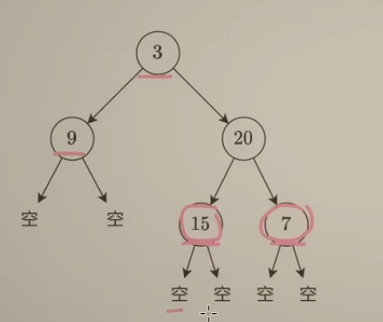
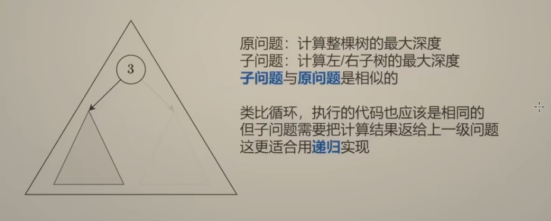
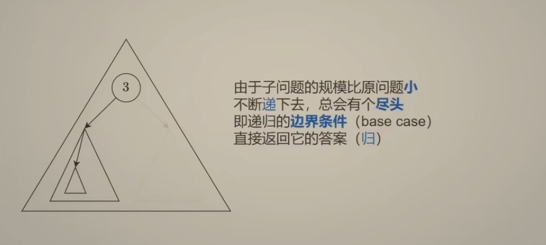
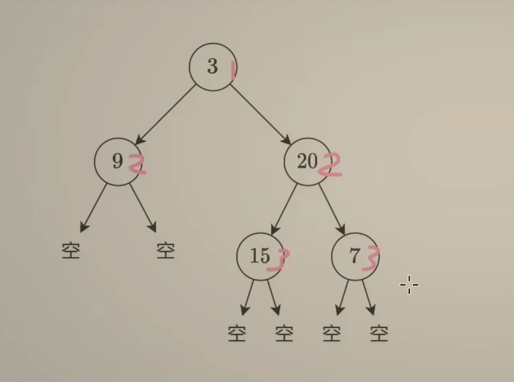
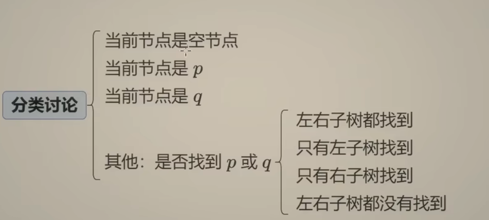
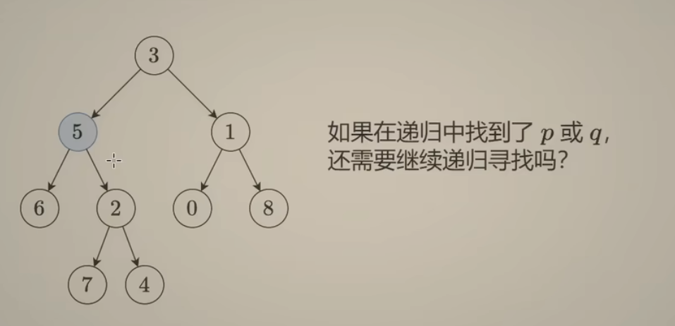
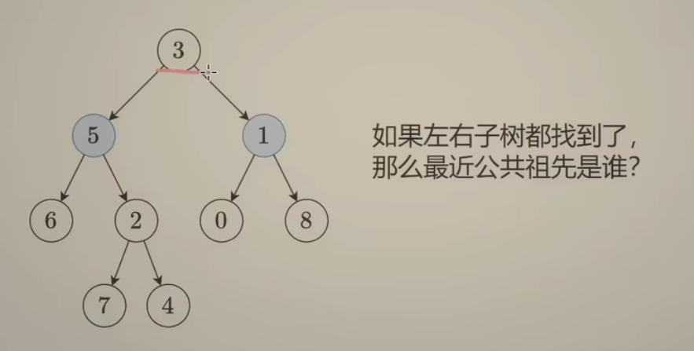
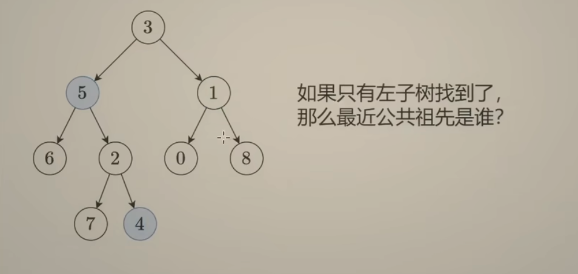
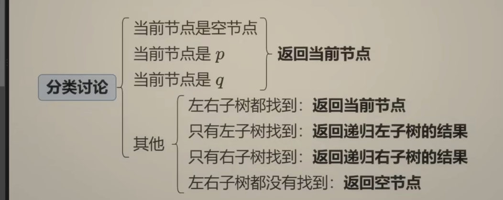
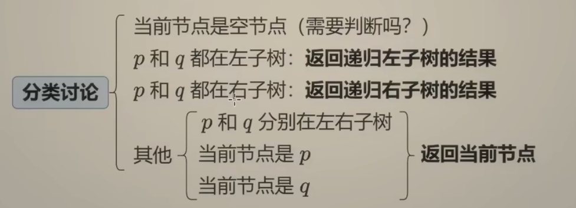

<!-- START doctoc generated TOC please keep comment here to allow auto update -->
<!-- DON'T EDIT THIS SECTION, INSTEAD RE-RUN doctoc TO UPDATE -->
**Table of Contents**  *generated with [DocToc](https://github.com/thlorenz/doctoc)*

- [二叉树](#%E4%BA%8C%E5%8F%89%E6%A0%91)
  - [二叉树的最大深度](#%E4%BA%8C%E5%8F%89%E6%A0%91%E7%9A%84%E6%9C%80%E5%A4%A7%E6%B7%B1%E5%BA%A6)
  - [相同的树](#%E7%9B%B8%E5%90%8C%E7%9A%84%E6%A0%91)
  - [平衡二叉树](#%E5%B9%B3%E8%A1%A1%E4%BA%8C%E5%8F%89%E6%A0%91)
  - [二叉树的右视图](#%E4%BA%8C%E5%8F%89%E6%A0%91%E7%9A%84%E5%8F%B3%E8%A7%86%E5%9B%BE)
  - [验证二叉搜索树](#%E9%AA%8C%E8%AF%81%E4%BA%8C%E5%8F%89%E6%90%9C%E7%B4%A2%E6%A0%91)
    - [第一种做法：前序遍历](#%E7%AC%AC%E4%B8%80%E7%A7%8D%E5%81%9A%E6%B3%95%E5%89%8D%E5%BA%8F%E9%81%8D%E5%8E%86)
  - [二叉树的最近公共祖先](#%E4%BA%8C%E5%8F%89%E6%A0%91%E7%9A%84%E6%9C%80%E8%BF%91%E5%85%AC%E5%85%B1%E7%A5%96%E5%85%88)
  - [二叉搜索树的最近公共祖先](#%E4%BA%8C%E5%8F%89%E6%90%9C%E7%B4%A2%E6%A0%91%E7%9A%84%E6%9C%80%E8%BF%91%E5%85%AC%E5%85%B1%E7%A5%96%E5%85%88)

<!-- END doctoc generated TOC please keep comment here to allow auto update -->

# 二叉树

## [二叉树的最大深度](104_maximum_depth_of_binary_tree_test.go)

整个树的最大深度 = max(左子树最大深度,右子树最大深度)+1

类比循环，执行的代码相同，但是子问题的计算结果要返回给上一级问题，所以用递归 

边界调节：空节点

- 方式一：传递节点
- 方式二：传递节点个数

## [相同的树](100_same_tree_test.go)

子问题：
- 左边子树是否相同
- 右边子树是否相同

边界条件：其中一个子树为空进行相等判断

变形题目:[对称二叉树](101_symmetric_tree_test.go)

## [平衡二叉树](110_balanced_binary_tree_test.go)

高度为正值，这里假设高度是 -1 ，如果不等于-1可以提前返回

## [二叉树的右视图](199_binary_tree_right_side_view_test.go)
取每一层的最后一个节点：先递归右子树，再递归左子树（如果递归深度==答案的长度，说明可以记录）

## [验证二叉搜索树](98_validate_binary_search_tree_test.go)

### 第一种做法：前序遍历
对于每个节点，还需要提供开闭区间的范围。
- 向左：右边界修改
- 向右：左边界修改

## [二叉树的最近公共祖先](236_lowest_common_ancestor_of_a_binary_tree_test.go)

## [二叉搜索树的最近公共祖先](235_lowest_common_ancestor_of_a_binary_search_tree_test.go)

