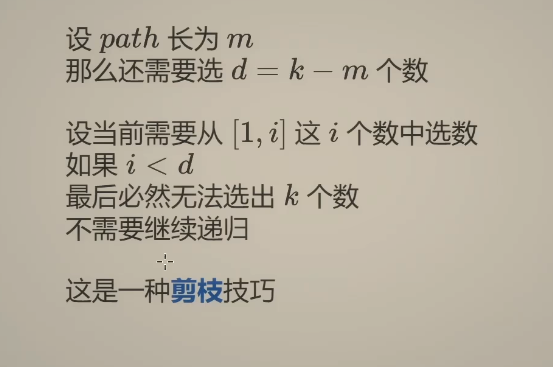

<!-- START doctoc generated TOC please keep comment here to allow auto update -->
<!-- DON'T EDIT THIS SECTION, INSTEAD RE-RUN doctoc TO UPDATE -->
**Table of Contents**  *generated with [DocToc](https://github.com/thlorenz/doctoc)*

- [回溯法（back tracking）（探索与回溯法](#%E5%9B%9E%E6%BA%AF%E6%B3%95back-tracking%E6%8E%A2%E7%B4%A2%E4%B8%8E%E5%9B%9E%E6%BA%AF%E6%B3%95)
  - [分类](#%E5%88%86%E7%B1%BB)

<!-- END doctoc generated TOC please keep comment here to allow auto update -->

# 回溯法（back tracking）（探索与回溯法

是一种选优搜索法，又称为试探法，按选优条件向前搜索，以达到目标。但当探索到某一步时，发现原先选择并不优或达不到目标，就退回一步重新选择，
这种走不通就退回再走的技术为回溯法，而满足回溯条件的某个状态的点称为“回溯点.

 

dfs(i)-->dfs(i+1)
注意：参数 i 的含义不是第 i 个，而是 >= i 的部分

## 分类
[电话号码的字母组合](17_letter_combinations_of_a_phone_number_test.go)
- 子集型回溯: 每个元素选或不选

  - [子集](78_subsets_test.go)
    
    
  - [分割回文串](131_palindrome_partition_test.go)
    

- 组合型回溯：可以减枝优化

- 排列型回溯

