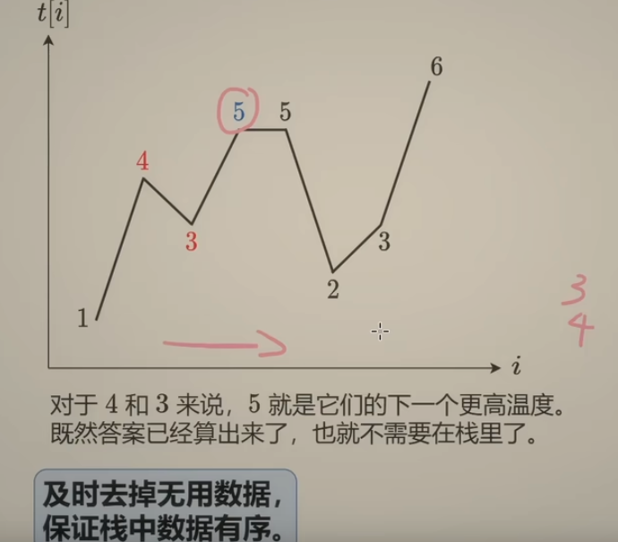

<!-- START doctoc generated TOC please keep comment here to allow auto update -->
<!-- DON'T EDIT THIS SECTION, INSTEAD RE-RUN doctoc TO UPDATE -->
**Table of Contents**  *generated with [DocToc](https://github.com/thlorenz/doctoc)*

- [Monotone Stack 单调栈](#monotone-stack-%E5%8D%95%E8%B0%83%E6%A0%88)
  - [单调栈适用场景](#%E5%8D%95%E8%B0%83%E6%A0%88%E9%80%82%E7%94%A8%E5%9C%BA%E6%99%AF)
  - [每日温度](#%E6%AF%8F%E6%97%A5%E6%B8%A9%E5%BA%A6)
  - [接雨水](#%E6%8E%A5%E9%9B%A8%E6%B0%B4)

<!-- END doctoc generated TOC please keep comment here to allow auto update -->

# Monotone Stack 单调栈

单调栈（Monotone Stack）：一种特殊的栈。在栈的「先进后出」规则基础上，要求 从 栈顶 到 栈底 的元素是单调递增（或者单调递减）

其中满足从栈顶到栈底的元素是单调递增的栈，叫做「单调递增栈」。满足从栈顶到栈底的元素是单调递减的栈，叫做「单调递减栈」
注意：这里定义的顺序是从「栈顶」到「栈底」。有的文章里是反过来的.

## 单调栈适用场景
单调栈可以在时间复杂度为 O(n) 的情况下，求解出某个元素左边或者右边第一个比它大或者小的元素。

所以单调栈一般用于解决一下几种问题：

寻找左侧第一个比当前元素大的元素。
寻找左侧第一个比当前元素小的元素。
寻找右侧第一个比当前元素大的元素。
寻找右侧第一个比当前元素小的元素
  

做法：及时去掉无用数据，保证栈内元素有序

## [每日温度](739_daily_temperatures_test.go)

从右到左: 栈中记录下一个更大元素的「候选项」
- 首先记录6
- 遍历3, 发现6比3大,记录下一个更大,栈内 6,3
- 遍历2,发现3比2大,记录下一个更大,栈内 6,3,2
- 遍历5,遍历站内元素,发现6比5大,去除栈内小于5的元素3,2,栈内 6,5
- 遍历5,同理,去除栈内5, 写入新5,栈内 6,5(相同元素保留左边)

从左往右：站内是还没有找到更大的数

## [接雨水](42_trapping_rain_water_test.go)

- 需要知道栈顶及栈顶下面一个元素

方式一：

前缀最大值：preMax
后缀最大值: suffixMax

1* (min(preMax,suffixMax)-height)