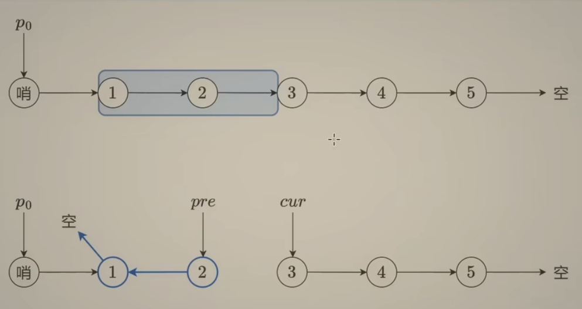
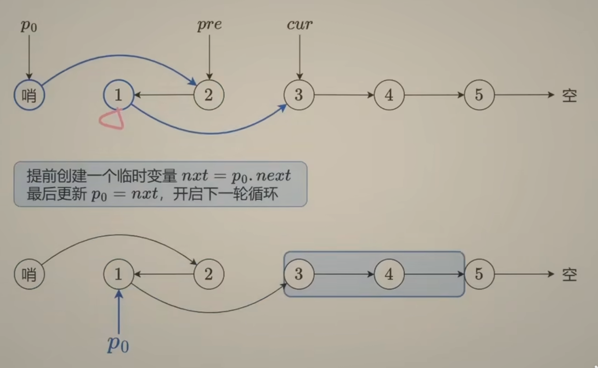
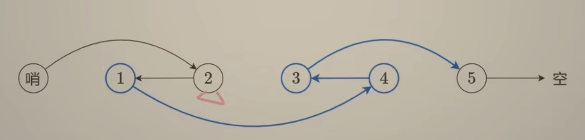

<!-- START doctoc generated TOC please keep comment here to allow auto update -->
<!-- DON'T EDIT THIS SECTION, INSTEAD RE-RUN doctoc TO UPDATE -->
**Table of Contents**  *generated with [DocToc](https://github.com/thlorenz/doctoc)*

- [Reverse Linked List](#reverse-linked-list)
  - [反转中间链表](#%E5%8F%8D%E8%BD%AC%E4%B8%AD%E9%97%B4%E9%93%BE%E8%A1%A8)
  - [K 个一组翻转链表](#k-%E4%B8%AA%E4%B8%80%E7%BB%84%E7%BF%BB%E8%BD%AC%E9%93%BE%E8%A1%A8)

<!-- END doctoc generated TOC please keep comment here to allow auto update -->

# 链表

## [206 反转链表](./206_reverse_linked_list_test.go)

pre: 上一节点

cur: 遍历到的当前节点

链表最后一个节点：指向空

目的：将当前节点的下一个节点指向上一个节点，从图中，修改了当前节点的下一个节点，则不知道原先的下一个节点，所以两个变量 pre, cur 是不够的，因为需要记录到 cur 修改前的下一节点

1. 用 nxt 先记录 cur 的下个next
2. 再将 cur 指定 pre
3. 再将 pre 指定 cur
4. 将 cur 指定 nxt

循环结束: cur 指定 空,  pre 指定末尾,返回 pre

## [反转中间链表](./92_reverse_linked_list2_test.go)

注意性质： 
- pre 指定反转的末尾
- cur 指定反转这一段后续的下一个节点

- P0: 反转这一段的上一个节点

反转结束后 
- P0.next.next 指向 cur
- P0.next 指定 pre 

注意 left = 1 时：没有 P0， 需要使用哨兵

## [K 个一组翻转链表](25_reverse_nodes_in_k-Group_test.go)

步骤 
- 判断长度是否可以反转
- 每次反转完，将 p0 更新成下一段的上一个节点，也就是图中的 3 的上一节点 1，其实就是p0.next
- 返回哨兵节点的next