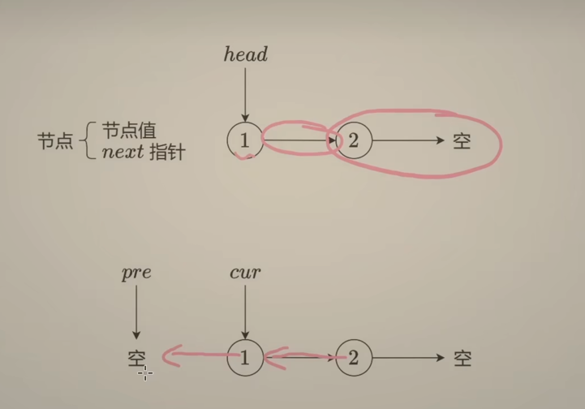
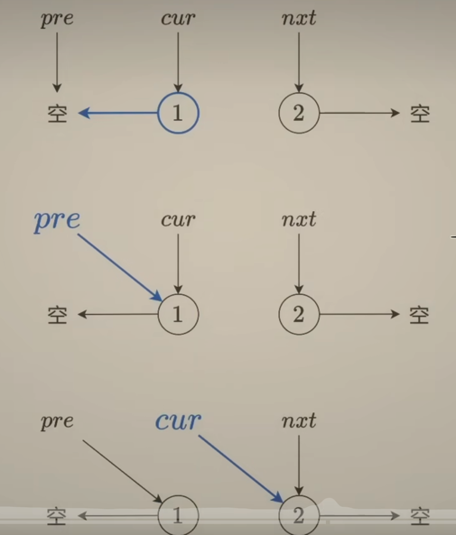
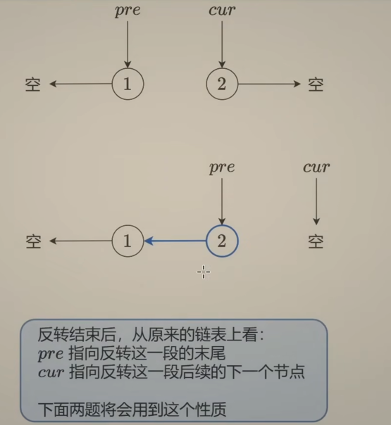
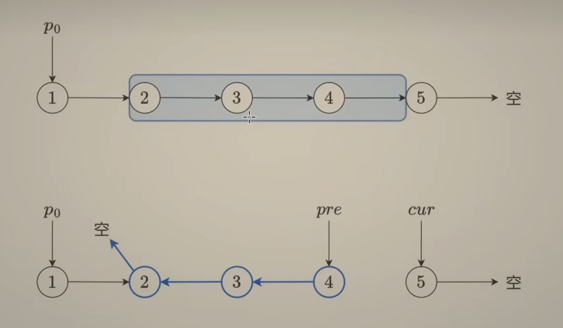
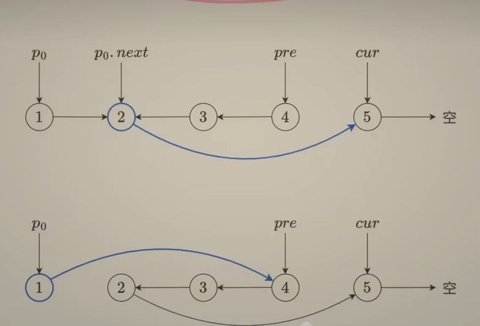
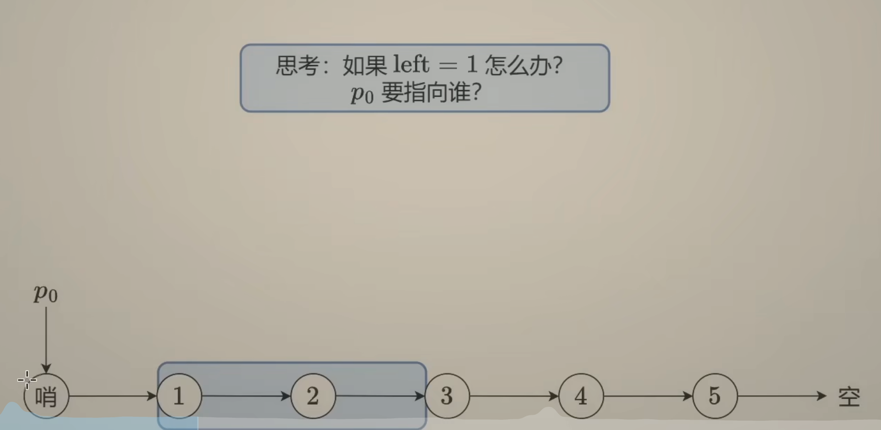

# Reverse Linked List

pre: 上一节点

cur: 遍历到的当前节点

链表最后一个节点：指向空

从图中，两个变量 pre, cur 是不够的，因为需要记录到 cur 修改前的下一节点

1. 用 nxt 先记录 cur 的下个next
2. 再将 cur 指定 pre
2. 再将 pre 指定 cur
3. 将 cur 指定 nxt 

循环结束

cur 指定 空

pre 指定末尾

返回 pre

- [206 反转链表](./206_reverse_linked_list_test.go)

## [反转中间链表](./92_reverse_linked_list_test.go)

注意性质：
- pre 指定反转的末尾
- cur 指定反转这一段后续的下一个节点

P0: 反转这一段的上一个节点

P0.next 指向 cur

P0 指定 pre 

注意 left = 1 时：没有 P0， 需要使用哨兵

## [K 个一组翻转链表](25_reverse_nodes_in_k-Group_test.go)

